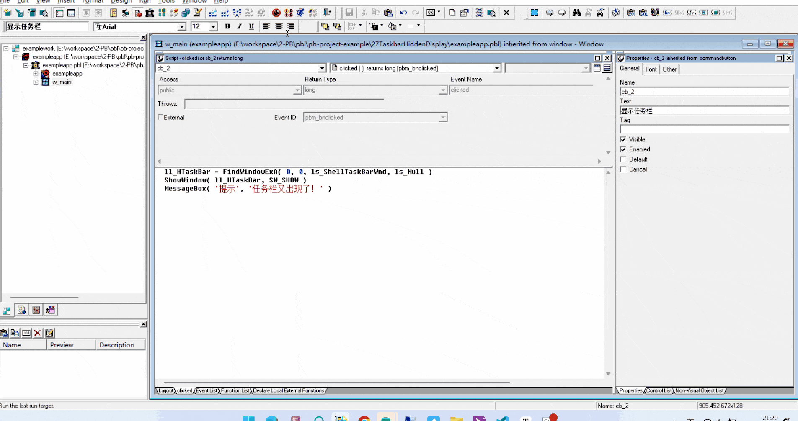
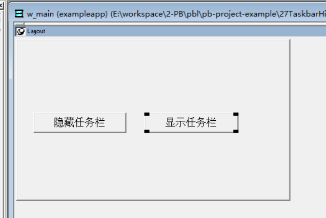

### 写在前面

这是PB案例学习笔记系列文章的第27篇，该系列文章适合具有一定PB基础的读者。

通过一个个由浅入深的编程实战案例学习，提高编程技巧，以保证小伙伴们能应付公司的各种开发需求。

文章中设计到的源码，小凡都上传到了gitee代码仓库[https://gitee.com/xiezhr/pb-project-example.git](https://gitee.com/xiezhr/pb-project-example.git)


需要源代码的小伙伴们可以自行下载查看，后续文章涉及到的案例代码也都会提交到这个仓库【**[pb-project-example](https://gitee.com/xiezhr/pb-project-example)**】

如果对小伙伴有所帮助，希望能给一个小星星⭐支持一下小凡。

### 一、小目标

通过本案例我们将制作一个能够隐藏任务栏和显示任务栏的小程序。最终效果如下所示



### 二、创作思路

`Windwos`操作系统的任务栏是以`Shell_TrayWnd`为名称的窗口对象，利用`user32.dll`提供的`FindWindowExA`外部扩展函数

可以获取任务栏的句柄，在利用外部函数`ShowWindow`外部扩展函数就可以控制任务栏的隐藏和显示。

### 三、创建程序基本框架

① 新建`examplework`工作区

② 新建`exampleapp`应用

③ 新建`w_main`窗口，并将其`Title`设置为“隐藏和显示任务栏”

由于文章篇幅原因，以上步骤不再赘述。如果小伙伴忘记怎么操作，可以翻一翻该系列第一篇文章复习一下

④ 布局控件

在`w_main`窗口上新建2个`CommandButton`控件，名称依次为`cb_1`和`cb_2`.其`Text`值分别为"隐藏任务栏"和“显示任务栏”

调整位置，使其布局如下图所示



⑤ 保存窗口

### 四、编写代码

① 定义实例变量

```java
Constant Long SW_HIDE = 0 
Constant Long SW_NORMAL = 1 
Constant Long SW_SHOWMINIMIZED = 2 
Constant Long SW_SHOWMAXIMIZED = 3 
Constant Long SW_SHOWNOACTIVATE = 4 
Constant Long SW_SHOW = 5 
Constant Long SW_MINIMIZE = 6 
Constant Long SW_SHOWMINNOACTIVE = 7 
Constant Long SW_SHOWNA = 8 
Constant Long SW_RESTORE = 9 
Constant Long SW_SHOWDEFAULT = 10 

String ls_ShellTaskBarWnd = "Shell_TrayWnd" 
String ls_null

Long ll_HTaskBar, ll_HDeskTop 
```

② 定义外部函数

```java
//获取窗口句柄
Function long FindWindowExA ( long hWnd, long hWndChild, ref string lpszClassName, ref string lpszWindow) library 'user32' 
//根据窗口句柄设置任务栏状态
Function long ShowWindow (long hWnd, long nCmdShow ) library 'user32' 
```

③ 在按钮`cb_1`的`clicked`事件中添加如下代码

```java
ll_HTaskBar = FindWindowExA( 0, 0, ls_ShellTaskBarWnd, ls_Null ) 
ShowWindow( ll_HTaskBar, SW_HIDE ) 
MessageBox( '提示', '任务栏不见了！' ) 
```

④ 在按钮`cb_2`的`clicked`事件中添加如下代码

```java
ll_HTaskBar = FindWindowExA( 0, 0, ls_ShellTaskBarWnd, ls_Null ) 
ShowWindow( ll_HTaskBar, SW_SHOW ) 
MessageBox( '提示', '任务栏又出现了！' ) 
```

⑤ 在开发界面左边的`System Tree`窗口中双击`exampleapp`应用对象，并在其`open`事件中添加如下代码

```java
open(w_main)
```

### 五、运行程序

经过一波操作，我们来检验下最终的劳动成果


本期内容到这儿就结束了 *★,°*:.☆(￣▽￣)/$:*.°★* 。  希望对您有所帮助

我们下期再见 ヾ(•ω•`)o (●'◡'●)