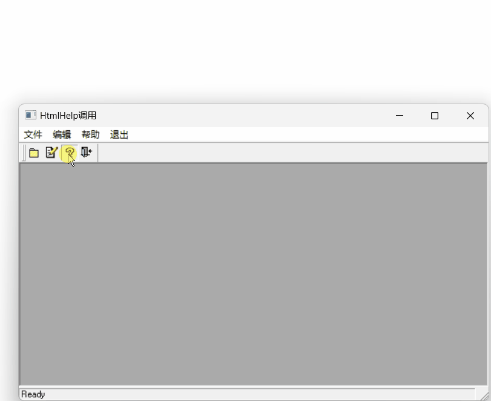
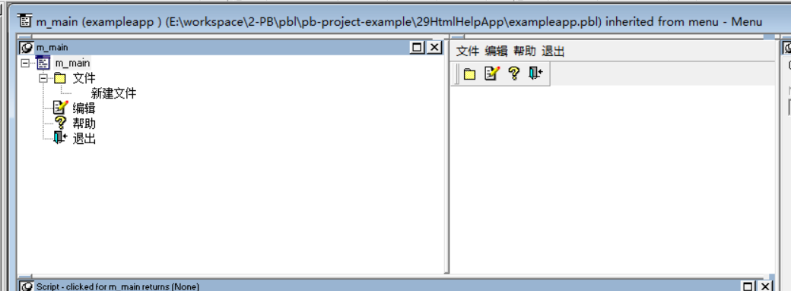
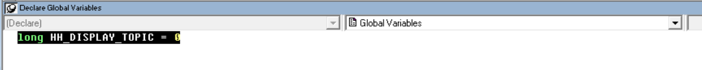
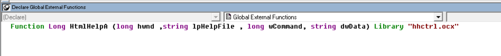
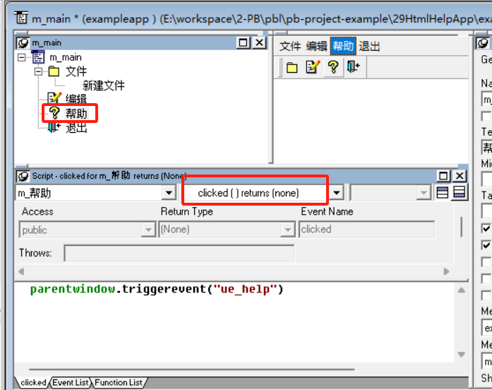
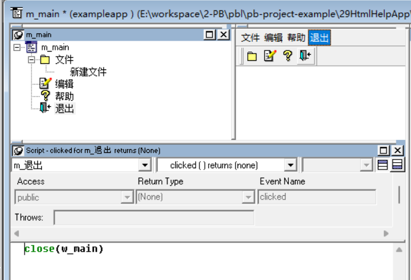

### 写在前面

这是PB案例学习笔记系列文章的第29篇，该系列文章适合具有一定PB基础的读者。

通过一个个由浅入深的编程实战案例学习，提高编程技巧，以保证小伙伴们能应付公司的各种开发需求。

文章中设计到的源码，小凡都上传到了gitee代码仓库[https://gitee.com/xiezhr/pb-project-example.git](https://gitee.com/xiezhr/pb-project-example.git)


需要源代码的小伙伴们可以自行下载查看，后续文章涉及到的案例代码也都会提交到这个仓库【**[pb-project-example](https://gitee.com/xiezhr/pb-project-example)**】

如果对小伙伴有所帮助，希望能给一个小星星⭐支持一下小凡。

### 一、小目标

通过本案例我们将制作一个点击菜单，然后调用帮助文档的小功能。这个在日常开发中是一个非常实用的小功能，我们可以将

我们开发好的程序的帮助文档制作成`chm`格式的文档，然后通过点击【帮助】菜单打开chm帮助文档，这可以大大提供用户体验感。

最终实现功能如下



### 二、创作思路

我们通过调用`hhctrl.ocx`库中的`HtmlHelpA`函数来实现其功能

`hhctrl.ocx` 是一个 `ActiveX `控件，主要用于显示 HTML 帮助文件（.chm 文件）

① **函数原型**

```java
DWORD HtmlHelpA(
  HWND hWnd,
  LPCSTR pszFile,
  UINT uCommand,
  DWORD dwData
);
```

② **参数说明**

- `hWnd`: 指向窗口句柄的指针，该窗口将接收帮助对话框的 WM_HELP 消息。
- `pszFile`: 帮助文件的路径，通常是 .chm 文件。
- `uCommand`: 指定要执行的操作，如 HH_DISPLAY_TOPIC 显示特定主题，HH_DISPLAY_INDEX 显示索引等。
- `dwData`: 根据 `uCommand` 参数的不同，此参数可能包含主题 ID 或其他数据。

③ 返回值

返回值通常是一个 `DWORD`，其含义取决于 `uCommand` 参数

④ 调用示例

如果x想打开一个特定的帮助主题，你可以这样调用 `HtmlHelpA`：

```java
HtmlHelpA(hWnd, "myhelpfile.chm", HH_DISPLAY_TOPIC, MAKEINTRESOURCE(IDH_MyTopic));
```


### 三、创建程序基本框架

① 创建`examplework`工作区

② 新建`exampleapp`应用

③ 新建`w_main` 窗口，将`Title`设置为"HtmlHelp调用"

由于文章篇幅原因，以上步骤不再赘述，如果忘记了的小伙伴可以翻一翻该系列文章的第一篇复习一下


### 四、创建菜单

① 新建菜单对象，并添加菜单项如下图所示



② 将菜单保存为`m_menu`

### 五、编写代码

① 定义全局变量，代码如下

```java
long HH_DISPLAY_TOPIC = 0
```



② 定义全局扩展函数,代码如下

```java
Function Long HtmlHelpA (long hwnd ,string lpHelpFile , long wCommand, string dwData) Library "hhctrl.ocx" 
```



③ 在`w_main`窗口中新建`ue_help returns(none)`函数，函数体代码如下

```java
htmlhelpA(handle(this), "pb90.chm" + ">" + "main", HH_DISPLAY_TOPIC, "wbtargetp1.htm")
```

我们在根目录下准备`pb90.chm`文件

④ 在`m_menu`菜单的“帮助”菜单命名中的`Clicked`事件中添加如下代码

```java
parentwindow.triggerevent("ue_help")
```



⑤  在`m_menu`菜单的“退出”菜单命名中的`Clicked`事件中添加如下代码

```java
close(w_main)
```



⑥ 在开发界面左边的`System Tree`中双击`exampleapp`应用，并在其`Open`事件中添加如下代码

```java
open(w_main)
```


### 六、运行程序

经过一波代码编写之后，来检验下我们的劳动成果


本期内容到这儿就结束了 *★,°*:.☆(￣▽￣)/$:*.°★* 。希望对您有所帮助

我们下期再见ヾ(•ω•`)o (●'◡'●)