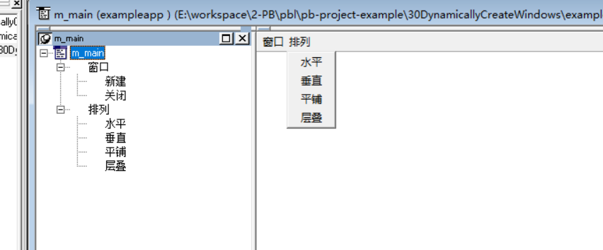

### 写在前面

这是PB案例学习笔记系列文章的第30篇，该系列文章适合具有一定PB基础的读者。

通过一个个由浅入深的编程实战案例学习，提高编程技巧，以保证小伙伴们能应付公司的各种开发需求。

文章中设计到的源码，小凡都上传到了gitee代码仓库[https://gitee.com/xiezhr/pb-project-example.git](https://gitee.com/xiezhr/pb-project-example.git)


需要源代码的小伙伴们可以自行下载查看，后续文章涉及到的案例代码也都会提交到这个仓库【**[pb-project-example](https://gitee.com/xiezhr/pb-project-example)**】

如果对小伙伴有所帮助，希望能给一个小星星⭐支持一下小凡。

### 一、小目标

通过本案例我们将学会动态创建窗口，并根据不同的排列方式排列窗口。这在日常开发中也是经常遇到的需求，

我们需要根据不同条件，动态的创建窗口。最终效果如下所示


### 二、实现思路

我们通过`OpenSheet()`函数打开新建的窗口，使用`ArrangeSheet()`函数来布局窗口的排列方式。

① OpenSheet函数

```java
opensheet(sheetrefvar[, windowtype][, mdiframe][, position][, arrangeopen])
```

- `sheetrefvar`: 这个参数是用来接收窗口句柄的变量，通常是一个与窗口类型匹配的变量。
- `windowtype`: 可选参数，定义窗口的类型，如`PBWT_NORMAL`表示标准窗口。
- `mdiframe`: 可选参数，如果是在MDI环境下，这个参数指定MDI框架窗口的名称。
- `position`: 可选参数，指定窗口的位置。
- `arrangeopen`: 可选参数，如果设置为`TRUE`，则在打开新窗口时会重新排列所有打开的窗口。

② ArrangeSheet 函数

```vb
arrangesheet([arrangement][, zorder])
```

- arrangement

  : 可选参数，指定窗口的排列方式。可以是以下常量之一：

  - `PBAR_NONE`：不重新排列窗口（默认）。
  - `PBAR_TILED`：平铺显示所有窗口。
  - `PBAR_CASCADE`：层叠显示所有窗口。
  - `PBAR_ICONS`：将所有窗口最小化为图标。

- `zorder`: 可选参数，如果设置为`TRUE`，则按Z顺序（即最后激活的窗口位于最上面）重新排列窗口；如果设置为`FALSE`，则忽略Z顺序。

### 三、创建程序基本框架

① 新建`examplework`工作区

② 新建`exampleapp`应用

③ 新建`w_main`窗口，将窗口设置成主窗口

④ 新建`w_child`窗口

⑤ 新建`m_menu`菜单，结构如下所示



⑥ 将`w_main`窗口的菜单设置位`m_main`

由于文章篇幅原因，以上步骤不再赘述。如果忘记了的小伙伴可以翻一翻该系列前面文章复习一下

### 四、编写事件代码

① 在`w_main`窗口中定义实例变量

```java
long ilnum
```

② 在`w_main`窗口中新建`ue_new() returns(none)`事件，代码如下

```java
w_child lw
OpenSheet(lw,w_main, 2, Original!)
ilnum = ilnum + 1
lw.title = "第" + string(ilnum) + "个窗口"
```

③ 在`w_main`窗口中新建`ue_close()returns(long)`事件，代码如下

```java
window	lw_sheet

lw_sheet = this.GetActiveSheet ( )

If IsValid ( lw_sheet ) Then 
	Return Close ( lw_sheet )
Else
	Return -1
End If
```

④ 在`m_main`菜单的“新建”命令的`Clicked`事件中添加如下代码

```java
w_main.triggerevent("ue_new")
```

⑤ 在`m_main`菜单的“关闭”命令的`Clicked`事件中添加如下代码

```java
w_main.triggerevent("ue_close")
```

⑥ 在`m_main`菜单的“水平”命令的`Clicked`事件中添加如下代码

```java
w_main.ArrangeSheets ( Tile! )
```

⑦ 在`m_main`菜单的“垂直”命令的`Clicked`事件中添加如下代码

```java
w_main.ArrangeSheets ( TileHorizontal! )
```

⑧ 在`m_main`菜单的“平铺”命令的`Clicked`事件中添加如下代码

```java
w_main.ArrangeSheets ( Layer! )
```

⑨在`m_main`菜单的“层叠”命令的`Clicked`事件中添加如下代码

```java
w_main.ArrangeSheets ( Cascade! )
```

⑩ 在开发界面左边的`System Tree`窗口中双击`exampleapp`应用对象，并在其`Open`事件中添加如下代码

```java
open(w_main)
```

### 五、运行程序

一波代码敲完之后，我们开检验下劳动成果


本期内容到这儿就要结束了 *★,°*:.☆(￣▽￣)/$:*.°★* 。 希望对您有所帮助

我们下期再见ヾ(•ω•`)o (●'◡'●)