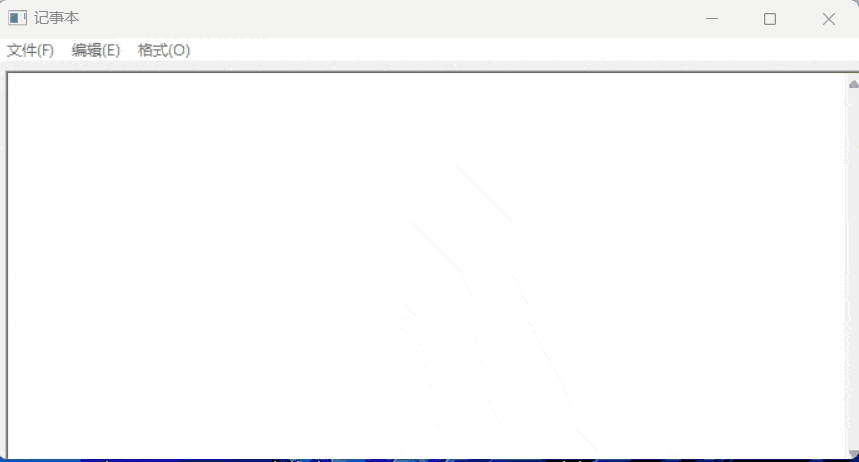
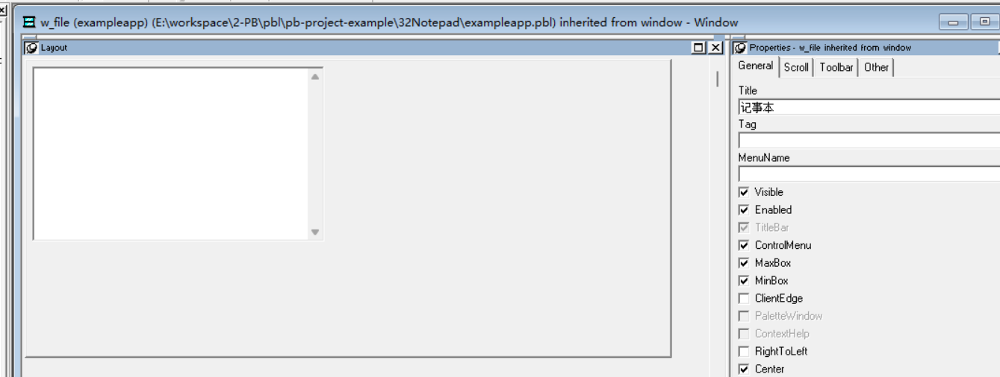
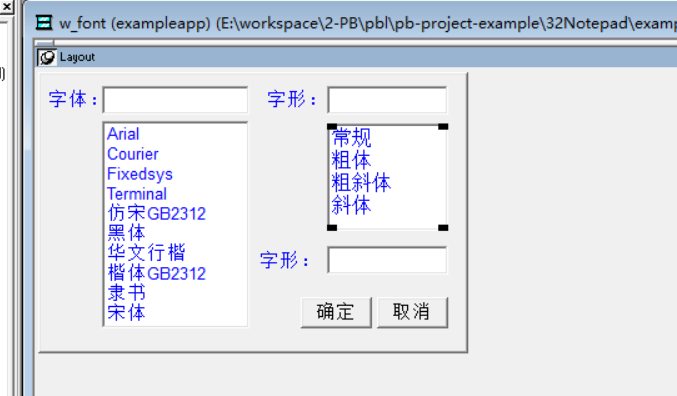
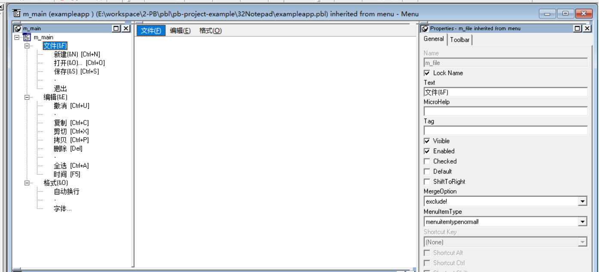

### 写在前面

这是PB案例学习笔记系列文章的第32篇，该系列文章适合具有一定PB基础的读者。

通过一个个由浅入深的编程实战案例学习，提高编程技巧，以保证小伙伴们能应付公司的各种开发需求。

文章中设计到的源码，晓凡都上传到了gitee代码仓库[https://gitee.com/xiezhr/pb-project-example.git](https://gitee.com/xiezhr/pb-project-example.git)


需要源代码的小伙伴们可以自行下载查看，后续文章涉及到的案例代码也都会提交到这个仓库【**[pb-project-example](https://gitee.com/xiezhr/pb-project-example)**】

如果对小伙伴有所帮助，希望能给一个小星星⭐支持一下小凡。

### 一、小目标

本案例我们将制作一个类似于windows 自带的记事本程序。

程序包含了记事本的打开、保存、编辑、复制、剪切、删除、设置字体等功能。

为了能实现上述功能，我们需要借助对文件进行操作的`GetFileOpenName()`、`FileLength()`、`FileOpen()`、`FileRead()`、`GetFileSaveName()`、`FileWrite()`等文件操作函数。

同时为了实现文本的编辑功能，我们还需要使用到`Clare()`、`Copy`、`Cut`、`Paste()`、`Undo()`等多行编辑框函数。

为了实现文本格式的设置，我们需要用到`CreateFile()`全局扩展函数

希望小伙伴能和我一样，通过本案例熟练掌握文件相关操作

最终实现效果如下



### 二、函数简介

#### 2.1 GetFileOpenName函数

> 用于显示一个标准的文件打开对话框，让用户选择要打开的文件，并返回用户选择的文件路径

**使用示例：**

```java
string ls_fileName

ls_fileName = GetFileOpenName("请选择要打开的文件", "C:\", "Text Files (*.txt),*.txt")

IF Len(ls_fileName) > 0 THEN
    MessageBox("选择文件", "你选择的文件是: " + ls_fileName)
ELSE
    MessageBox("未选择文件", "你没有选择文件")
END IF
```

调用GetFileOpenName函数会弹出一个文件打开对话框，标题为"请选择要打开的文件"，初始文件夹路径为"C:\"，并且只显示文本文件（.txt）类型的文件。

用户选择文件后，将返回选中文件的路径，并显示在消息框中。

如果用户取消选择文件，则会显示"你没有选择文件"的消息框。

#### 2.2 FileLength函数

> 用于获取指定文件的长度（以字节为单位）。通过这个函数，您可以快速了解文件的大小

**使用示例：**

```java
string ls_filePath
long ll_fileLength

ls_filePath = 'C:\test\file.txt'

ll_fileLength = FileLength(ls_filePath)

MessageBox("文件长度", "文件的长度是: " + string(ll_fileLength) + " bytes")
```

在上面的示例中，首先设置要获取长度的文件路径为 `ls_filePath` 。然后使用 `FileLength` 函数来获取该文件的长度，并将结果存储在 `ll_fileLength` 中。最后使用 `MessageBox` 函数显示文件的长度，以字节为单位。

#### 2.3 FileOpen 函数

> 用于打开一个文件并返回文件句柄，以便进行读取或写入操作

**使用示例：**

```java
long ll_fileHandle
string ls_filePath, ls_fileContent, ls_line
integer li_fileNum

ls_filePath = 'C:\test\file.txt'
ll_fileHandle = FileOpen(ls_filePath, LineMode!)

IF ll_fileHandle > 0 THEN
    li_fileNum = 1
    ls_fileContent = ""

    DO WHILE FileRead(ll_fileHandle, li_fileNum, ls_line) > 0
        ls_fileContent += ls_line + "~r~n"
        li_fileNum++
    LOOP

    FileClose(ll_fileHandle)

    MessageBox("文件内容", ls_fileContent)
ELSE
    MessageBox("文件打开错误", "文件打开错误")
END IF
```

首先设置要打开的文件路径为 `ls_filePath` ，然后使用 `FileOpen` 函数打开该文件，并将返回的文件句柄存储在 `ll_fileHandle` 中。如果文件成功打开（文件句柄大于0），则使用 `FileRead` 函数逐行读取文件内容，并将内容存储在 `ls_fileContent` 中。最后关闭文件并显示文件内容。如果文件打开失败，则显示相应的错误消息。

#### 2.4 FileRead 函数

> 用于从已打开的文件中读取指定行的内容。通过这个函数，您可以逐行读取文件的内容并进行处理。

这个函数，我们在上面已经使用过


#### 2.5 FileClose 函数

> 用于关闭先前通过FileOpen函数打开的文件。通过这个函数，您可以确保在完成文件操作后正确关闭文件句柄，释放资源。 

这个函数，我们在上面已经使用过，一般`FileOpen `、`FileRead `、`FileClose `这三个函数我们都是配套使用的

#### 2.6 GetFileSaveName 函数

> 用于显示一个标准的文件保存对话框，让用户选择要保存的文件路径和名称，并返回用户选择的文件路径。 

**使用示例：**

```java
string ls_fileName

ls_fileName = GetFileSaveName("请选择文件保存路径", "C:\", "Text Files (*.txt),*.txt", "txt")

IF Len(ls_fileName) > 0 THEN
    MessageBox("选择文件", "你选择保存文件路径是: " + ls_fileName)
ELSE
    MessageBox("未选择", "你没有选择文件保存路径.")
END IF
```

调用`GetFileSaveName`函数会弹出一个文件保存对话框，标题为"请选择文件保存路径"，初始文件夹路径为"C:\"，并且只显示文本文件（.txt）类型的文件。

用户选择保存文件的路径和名称后，将返回选中的文件路径，并显示在消息框中。

如果用户取消选择文件保存位置，则会显示"你没有选择文件保存路径"的消息框。

#### 2.7 Filewrite 函数

> 用于向已打开的文件中写入内容。通过这个函数，您可以将数据写入文件中，可以是文本、二进制等格式的数据。 

**使用示例：**

```java
long ll_fileHandle
string ls_filePath, ls_content

ls_filePath = 'C:\test\output.txt'
ll_fileHandle = FileOpen(ls_filePath, LineMode!)

IF ll_fileHandle > 0 THEN
    ls_content = "hello ! 我是程序员晓凡"

    FileWrite(ll_fileHandle, ls_content)

    FileClose(ll_fileHandle)
    MessageBox("文件写入", "内容写入成功")
ELSE
    MessageBox("文件打开错误", "文件打开失败")
END IF
```

首先使用FileOpen函数打开文件并获取文件句柄。如果文件成功打开（文件句柄大于0），

则使用FileWrite函数向文件中写入“hello ! 我是程序员晓凡”内容。

在示例中，我们写入了一个简单的文本内容。

最后关闭文件并显示消息框表示内容已成功写入文件。

如果文件打开失败，则显示相应的错误消息。

#### 2.8 Clare函数

> 用于清除一个字符串中的空格和控制字符。

```java
string ls_text, ls_cleanText

ls_text = " Hello,我是程序员晓凡，   	我的博客是：	www.xiezhrspace.cn  "
ls_cleanText = Clare(ls_text)

MessageBox("清除文本", "原始字符串: " + ls_text + "~n~n清除后的字符串是: " + ls_cleanText)
```

我们定义了一个包含空格和控制字符的字符串 `ls_text` 。

然后使用Clare函数清除该字符串中的空格和控制字符，并将结果存储在 `ls_cleanText` 中。

最后使用MessageBox显示原始文本和清理后的文本。

#### 2.9 Copy 函数

> 用于复制一个字符串的一部分到另一个字符串中

**使用示例：**

```java
string ls_source, ls_target

ls_source = "Hello, World!"
ls_target = ""

Copy(ls_source, 8, 5, ls_target)

MessageBox("复制文本", "原始文本: " + ls_source + "~n~n复制后文本: " + ls_target)
```

我们定义了一个原始字符串 `ls_source` ，然后使用Copy函数从第8个字符开始复制长度为5的子字符串到目标字符串 `ls_target` 中。

最后使用MessageBox显示原始字符串和复制后的字符串。

#### 2.10 Paste 函数

> 用于将一个字符串粘贴（插入）到另一个字符串的指定位置。通过这个函数，您可以方便地在一个字符串中插入另一个字符串

**使用实例：**

```java
string ls_source, ls_target

ls_source = "World!"
ls_target = "Hello, "

Paste(ls_target, 7, ls_source)

MessageBox("粘贴后", "原始文本: " + ls_target)
```

我们定义了一个源字符串 `ls_source` ，一个目标字符串 `ls_target` 。

然后使用Paste函数将源字符串插入到目标字符串的第7个位置之后。

最后使用MessageBox显示插入后的目标字符串。

#### 2.11 Undo 函数

> 用于撤消最近的文本编辑操作。通过这个函数，您可以在文本框或富文本控件中撤消用户最后一次的编辑操作，恢复到之前的状态。

**使用示例：**

```java
// 假设有一个文本框控件名为te_text
te_text.Undo()
```

假设存在一个名为 `te_text` 的文本框控件。通过调用 `Undo` 函数，可以撤消用户最近的文本编辑操作。

#### 2.12 CreateFile 函数

> Windows API中的一个函数，用于创建或打开一个文件，并返回一个文件句柄。

**使用示例：**

```java
CONSTANT LONG GENERIC_WRITE = 1073741824
CONSTANT LONG CREATE_ALWAYS = 2

FUNCTION long CreateFile( &
    string lpFileName, &
    long dwDesiredAccess, &
    long dwShareMode, &
    long lpSecurityAttributes, &
    long dwCreationDisposition, &
    long dwFlagsAndAttributes, &
    long hTemplateFile) Library "kernel32.dll"

long ll_fileHandle
string ls_filePath

ls_filePath = 'C:\test\newfile.txt'
ll_fileHandle = CreateFile(ls_filePath, GENERIC_WRITE, 0, 0, CREATE_ALWAYS, 0, 0)

IF ll_fileHandle > 0 THEN
    MessageBox("提示信息", "一个文件创建成功")
    CloseHandle(ll_fileHandle)
ELSE
    MessageBox("提示信息", "文件创建失败.")
END IF
```

我们使用CreateFile函数创建了一个名为 `newfile.txt` 的新文件，并获取了文件句柄。

如果文件成功创建（文件句柄大于0），则显示消息框表示文件已成功创建。

最后使用CloseHandle函数关闭文件句柄。

如果文件创建失败，则显示相应的错误消息。

### 三、创建程序基本框架

上一小节中我们介绍了接下来程序中需要使用到的函数，接下来就该实操了

① 创建`examplework`工作空间

② 创建`exampleapp`创建应用

③ 新建`w_file`窗口，并将`Title`设置成“记事本”

④ 新建`w_font`窗口，并将`Title`设置为“字体”

⑤ 新建`Menu`菜单，并将其保存为`m_main`

由于文字篇幅原因，以上步骤不再赘述，如果忘记了的小伙伴可以翻一翻之前的文字复习一下

### 四、设置`w_file`窗口

① 建立控件

在窗口中添加两个`MultiLineEdit`控件，分别命名为`mle_edit`、`mle_time`。 

勾选`mle_edit`控件的`VScrollBar`属性，并将两个控件`Position`属性中的`X`和`Y`都设置成0



② 创建全局变量

```java
string current_file_name
```

③ 创建全局扩展函数

```java
Function string CreateFile(char FileName) LIBRARY "user32.dll"
```

④ 在窗口`w_file` 的`Resize`事件 中输入如下脚本

```java
mle_edit.width  = this.workspacewidth()
mle_edit.height = this.workspaceheight()
```

### 五、设置w_font窗口

> 这个窗口用了选择字体

① 新建控件

在窗口中添加3个`StaticEdit`控件、3个`SingleLineEdit`控件、2个`ListBox`控件和2个`CommandButton`控件

各个控件名称分别为`st_1`、`st_2`、`st_size`、`sle_font`、`sle_style`、`sle_size`、`lb_font`、`lb_style`、`cb_ok`和`cb_cancel`

② 设置各控件属性

设置`lb_font`的`Items`属性


设置`lb_style`的`Items`属性


其余控件如下所示



③ 在`cb_cancel`按钮的`clicked`事件中输入如下脚本

```java
close(w_font)
```

④ 在`cb_ok`按钮的`clicked`事件中输入如下代码

```java
if sle_font.text <> "" then w_file.mle_edit.facename = sle_font.text          //字形
if sle_size.text <> "" then w_file.mle_edit.textsize = integer(sle_size.text) //大小

if sle_style.text <> "" then //风格
	if sle_style.text = "常规"   then 
		w_file.mle_edit.weight = 400
		w_file.mle_edit.italic = false
		return
	end if
	if sle_style.text = "斜体"   then 
		w_file.mle_edit.italic = true		
	end if
	if sle_style.text = "粗体"   then 
		w_file.mle_edit.weight = 700		
	end if
	if sle_style.text = "粗斜体" then 
		w_file.mle_edit.weight = 700
		w_file.mle_edit.italic = true		
	end if
end if

close(w_font)
```

⑤ 在`lb_font`控件的`selectionchanged`事件中输入如下代码

```java
int i , j
i = lb_font.selectedindex()
sle_font.text = lb_font.selecteditem()
//sle_font.text = lb_font.text(i)
j = lb_font.setstate(i,false)

```

⑥ 在`lb_style`控件的`selectionchanged`事件中输入如下代码

```java
int i , j
i = lb_style.selectedindex()
sle_style.text = lb_style.selecteditem()
//sle_font.text = lb_font.text(i)
j = lb_style.setstate(i,false)
```

### 六、设置m_main菜单

#### 6.1 新建m_main菜单基本框架



#### 6.2 文件相关菜单

① 在新建菜单中添加如下代码

```java
//清空编辑区内容
w_file.mle_edit.text = ""
//新建文件的统一名称为Untitle
current_file_name = "无标题"
//修改窗口标题
w_file.title = current_file_name+" - 记事本"
```

② 在打开菜单中添加如下代码

```java
string docname,named
integer value,rc,fd
long ll_Flength
//选择要打开的文件
value = GetFileOpenName("选择要打开的文件",docname,named,"TXT","文本文件(*.txt),*.txt,所有文件(*.*),*.*")
							  
if value = 1 then
	//获取文件长度
	ll_Flength = FileLength(docname)
	//打开文件
	fd = FileOpen(docname,StreamMode!)
	if ll_Flength < 32767 then
		//读取文件内容到多行编辑框中
		rc = FileRead(fd,w_file.mle_edit.text)
		FileClose(fd)
		//保存文件名，用于将来保存文件
		current_file_name = docname
		//修改窗口标题
		w_file.title = "记事本__文件" + current_file_name
	end if
end if
```

③ 在保存中添加如下代码

```java
string docname,named
integer value,rc,fd,ret
long ll_Flength
boolean file_exist

value = GetFileSaveName("保存为",docname,named,"TXT","文本文件(*.txt),*.txt,所有文件(*.*),*.*")
if value = 1 then
	ll_Flength = FileLength(docname)
	fd = FileOpen(docname,StreamMode!)
	if ll_Flength < 32767 then
		file_exist = FileExists(docname)
		IF file_exist THEN ret = MessageBox("保存", &
		"按OK按钮覆盖所选文件" + docname, &
		Question!, YesNo!)
		rc = Filewrite(fd,w_file.mle_edit.text)
		FileClose(fd)
		current_file_name = docname
		w_file.title = current_file_name + " - 记事本__文件"  
	end if
end if
fd = FileOpen(current_file_name,StreamMode!,Write!,LockWrite!,Replace!)
//将多行编辑框mle_edit中的内容写入文件
FileWrite(fd,w_file.mle_edit.text)
FileClose(fd)

```

④ 在退出菜单中添加如下代码

```java
close(w_file)
```

#### 6.3 编辑相关菜单

①在撤销菜单中添加如下代码

```java
w_file.mle_edit.undo()
```

② 在复制菜单中添加如下代码

```java
w_file.mle_edit.copy()
```

③ 在剪切中菜单添加如下代码

```java
w_file.mle_edit.cut()
```

④ 在拷贝菜单中添加如下代码

```java
w_file.mle_edit.paste()
```

⑤ 在删除菜单中添加如下代码

```java
w_file.mle_edit.clear()
```

⑥ 在全选菜单中添加如下代码

```java
w_file.mle_edit.setfocus()
w_file.mle_edit.selecttext(1,888888)
```

⑦ 在时间菜单中添加如下代码

```java
w_file.mle_time.text = string(now()) + " " + string(today())
w_file.mle_time.setfocus()
w_file.mle_time.selecttext(1,20)
w_file.mle_time.copy()
w_file.mle_edit.setfocus()
w_file.mle_edit.paste()
```


#### 6.4 格式相关菜单

① 在自动换行菜单中添加如下代码

```java
if m_main.m_option.m_retuen.checked = true then
	m_main.m_option.m_retuen.checked = false
	w_file.mle_edit.hScrollBar = true
else
	m_main.m_option.m_retuen.checked = true
	w_file.mle_edit.hScrollBar = false
end if
```

② 在字体菜单中添加如下代码

```java
open(w_font)
```

#### 6.5 窗口设置

①将`w_file`窗口的`MenuName`设置为`m_main`

② 在开发界面左边的`System Tree`窗口中双击`exampleapp`应用，并在其`Open`事件中添加如下代码

```java
open(w_file)
```


### 七、运行程序

经过上面的代码编码，接下来检验下我们的劳动成果


本期内容到这儿就结束了 *★,°*:.☆(￣▽￣)/$:*.°★* 。 希望对您有所帮助

我们下期再见 ヾ(•ω•`)o (●'◡'●)