大家好，我是**晓凡**。
### 写在前面

这是PB案例学习笔记系列文章的第一篇，也是最基础的一篇。后续文章中【创建程序基本框架】部分操作都跟这篇文章一样，

将不再重复。该系列文章是针对具有一定PB基础的读者，通过一个个由浅入深的编程实战案例学习，提高编程技巧，以保证

小伙伴们能应付公司的各种开发需求。

文章中设计到的源码，小凡都上传到了gitee代码仓库[https://gitee.com/xiezhr/pb-project-example.git](https://gitee.com/xiezhr/pb-project-example.git)


需要源代码的小伙伴们可以自行下载查看，后续文章涉及到的案例代码也都会提交到这个仓库【**[pb-project-example](https://gitee.com/xiezhr/pb-project-example)**】

如果对小伙伴有所帮助，希望能给一个小星星⭐支持一下小凡。

### 一、小目标

掌握`pb`应用程序的创建、运行、中止等最基本操作。学会使用`Static Text`控件、`CommandButton`控件和`MessageBox`函数

上面说的控件和函数都是实际开发中最常用的

### 二、控件及函数简介

#### 2.1 Static Text 控件

- 用于显示静态文本内容（通常用于显示标题、标签、说明文字等静态信息）
- 用户无法对其进行编辑或交互操作
- 在界面设计中起到了信息展示和界面美化的作用

① 常用属性

| 属性          | 描述                                                         |
| ------------- | ------------------------------------------------------------ |
| `Name`        | 控件唯一标识，用于获取控件                                   |
| `Text`        | 控件显示的文本内容。可以通过该属性设置控件上显示的文字       |
| `Tag`         | 可以将控件的Tag属性设置为一个唯一的标识符，以便在程序中识别和操作特定的控件 |
| `Visible`     | 控制按钮是否可见,勾选可见，值为true ,不勾选不可见，值为false |
| `Enabled`     | 控制按钮是否可用,勾选可见，值为true ,不勾选不可见，值为false |
| `Border`      | 是否有边框                                                   |
| `BorderStyle` | 边框样式                                                     |
| `Alignment`   | 文本对齐方式                                                 |
| `BorderColor` | 边框颜色                                                     |
| `FillPattern` | 填充样式                                                     |
| `FaceName`    | 字体样式设置                                                 |
| `TextSize`    | 字体大小设置                                                 |
| `Bold`        | 是否加粗                                                     |
| `Italic`      | 是否斜体                                                     |
| `Underline`   | 是否下划线                                                   |
| `TextColor`   | 文本颜色设置                                                 |
| `BackColor`   | 控件背景色设置                                               |
| `X和Y`        | 控件x,y坐标                                                  |
| `Width`       | 控件宽度                                                     |
| `Height`      | 控件高度                                                     |


#### 2.2 CommandButton控件

- 用于触发特定操作或事件的按钮
- 用于添加交互性，提供用户操作界面的按钮

① 常用属性

> 按钮有 24 个属性  

| 属性              | 描述                                                         |
| ----------------- | ------------------------------------------------------------ |
| `name` 例如：cb_1 | 按钮唯一标识                                                 |
| `Text`            | 按钮上显示的文本内容。可以通过该属性设置按钮上显示的文字     |
| `Tag`             | 可以将控件的Tag属性设置为一个唯一的标识符，以便在程序中识别和操作特定的控件 |
| `Visible`         | 控制按钮是否可见,勾选可见，值为true ,不勾选不可见，值为false |
| `Enabled`         | 控制按钮是否可用,勾选可见，值为true ,不勾选不可见，值为false |
| `Default`         | 表示按钮是默认按钮，当用户没有选择控件，按Enter键时，触发该按钮得Cliced事件 |
| `Cancel`          | Cancel 取值为 True 时，表示当用户单击 Esc 键时，可以触发按钮的 Clicked 事件 |
| `FaceName`        | 设置按钮上显示文本字体                                       |
| `TextSize`        | 设置按钮上显示文本字体大小                                   |
| `Bold`            | 设置按钮上显示文本是否加粗                                   |
| `Italic`          | 设置按钮上显示文本是否斜体                                   |
| `Underline`       | 设置按钮上显示文本是否下划线                                 |
| `X`               | 按钮横坐标                                                   |
| `Y`               | 按钮纵坐标                                                   |
| `Width`           | 按钮宽度                                                     |
| `Height`          | 按钮高度                                                     |

② 事件和脚本

| 事件          | 触发时机                               |
| ------------- | -------------------------------------- |
| `Clicked`     | 控件单击时                             |
| `Constructor` | 在窗口的打开事件之**前**立即触发       |
| `Destructor`  | 在窗口的打开事件之**后**立即触发       |
| `DragDrop`    | 当被拖放对象释放时触发                 |
| `DragEnter`   | 被拖放对象的中心**通过边缘**进入时触发 |
| `DragLeave`   | 被拖放对象的中心**离开**时触发         |
| `DragWithin`  | 被拖放对象的中心位于其内时触发         |
| `GetFocus`    | 在接受焦点之前（在选中并激活之前）触发 |
| `LoseFocus`   | 当失去焦点时触发                       |
| `Other`       | 当非 PowerBuilder 事件消息发生时触发   |
| `RButtonDown` | 鼠标右键按下时触发                     |

#### 2.3 MessageBox

> 函数可以打开一个小信息窗口 ,不仅可以以多种方式给用户显示提示信息，还可以将用户的选择信息返回  

①语法

小信息窗口有标题、提示信息、图标、按钮等 4 个元素  

```vb
MessageBox ( title, text {, icon {, button {, default } } } )
```

- title : 必选参数，提示框标题
- text: 必选参数，提示框内容
- icon: 可选参数，提示框图标
- button: 提示框按钮

② icon 参数的可用值和对应的图标样式  

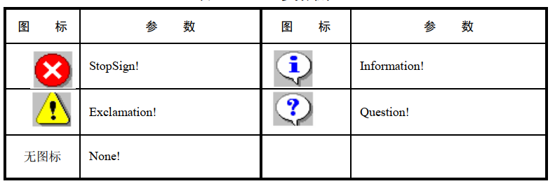

③button 的可用取值和返回值的意义  

| 参数取值             | 显示样式                                    | 返回值意义                           |
| -------------------- | ------------------------------------------- | ------------------------------------ |
| `OK!`                | 显示 【确定】 按钮，该取值为默认值          | 总返回 1                             |
| `OKCancel!`          | 显示 【确定】和 【取消】按钮                | 1-【确定】， 2-【取消】              |
| `YesNo!`             | 显示 【是】 和 【否】 按钮                  | 1-【是】， 2-【否】                  |
| `YesNoCancel!`       | 显示 【是】、 【否】 和 【取消】 三个按钮   | 1-【是】， 2-【否】， 3-【取消】     |
| `RetryCancel!`       | 显示 【重试】和 【取消】按钮                | 1-【重试】， 2-【取消】              |
| `AbortRetryIgnore! ` | 显示 【放弃】、 【重试】和 【忽略】三个按钮 | 1-【放弃】， 2-【重试】， 3-【忽略】 |

### 三、创建程序基本框架

① 建立工作区

单击工具栏上的File→New命令，在弹出的New对话框中选择Workspace选项框中的Workspace图标，如下图所示，单击OK按钮，

在弹出的New Workspace对话框中输入“examplework”，点击保存按钮，建立一个新的工作区

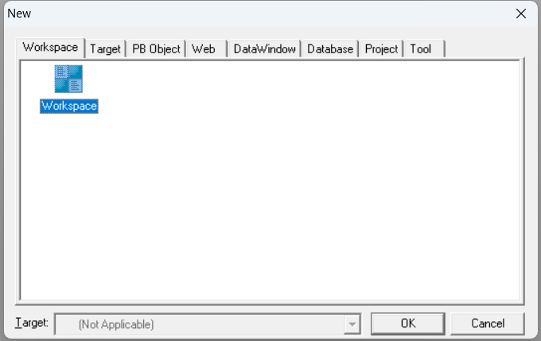

②建立应用

单击菜单栏上的File→New命令，在弹出的对话框中选择Target选项卡，在选项卡中选择Application图标，并单击OK按钮，

在弹出的Specitfy New Application and Library 对话框的Application Name 文本框中输入“ExampleApp”,单击Finish按钮，

建立一个新的应用

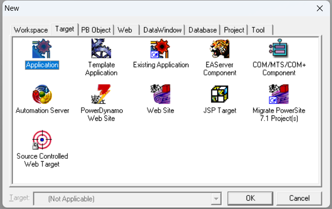


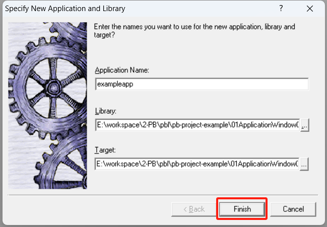

③ 建立窗口

单击菜单栏上的File→New命令，在弹出的对话框中选择PBObject选项卡，在选项卡中选择Window图标，并单击OK按钮，

建立一个新的窗口

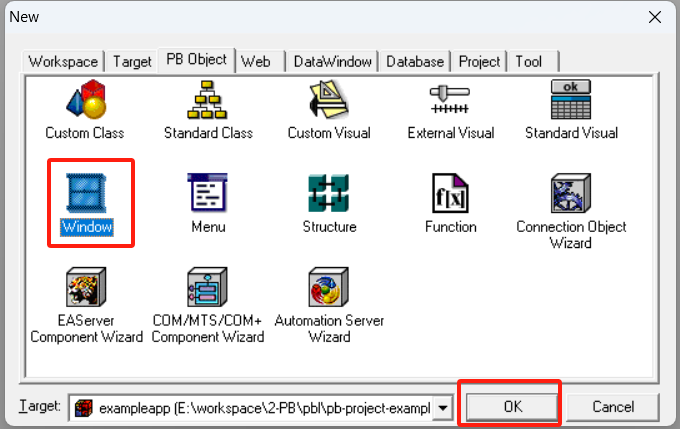

④ 建立控件

单击菜单栏上的Insert→Control命令，选择StaticText控件，单击加到窗口中，同样的方法，建立2个CommandButton

控件，并调整位置

各个控件名称依次为st_1,cb_1,cb_2

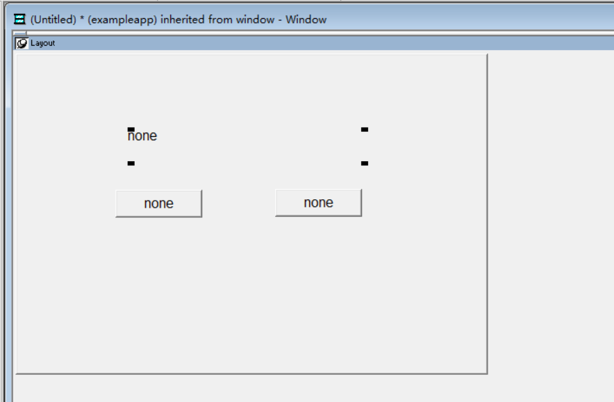

⑤保存窗口

单击工具栏中的File→Save 命令或者快捷键【Ctrl+S】,将建立的窗口保存为w_main

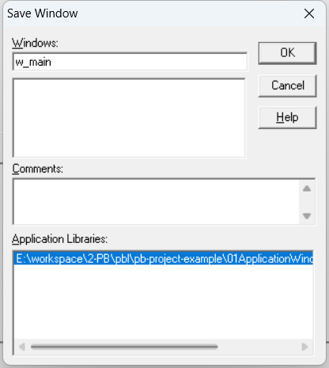

### 四、设置各个控件的外观属性

①StaticText 控件外观属性设置

- 在w_main 窗口中st_1控件上单击

- General选项卡，将st_1的Text属性改为：“学生管理系统”

- Font 选项卡，在FaceName中选择宋体，TextSize复选框中选择18，勾选Bold复选框 设置字体

  

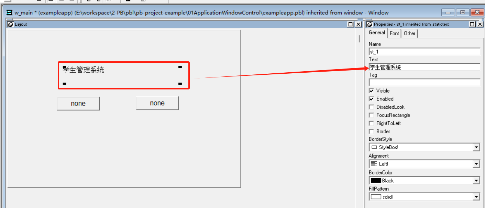

②`CommandButton`控件属性设置

- 在w_main 窗口中`cb_1`控件上单击
- **General选项卡**，将`cb_1`的Text属性改为“学生档案管理”
- 同上，将`cb_2`的Text属性改为“学生选课管理”

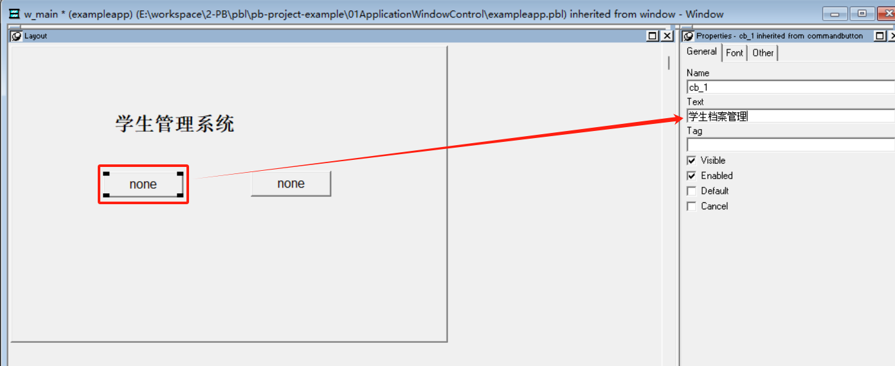

### 五、编写按钮点击事件代码

①双击`cb_1` 控件，进入`cb_1` 按钮的`Clicked` 事件，添加如下代码

```vbscript
messagebox('欢迎使用',"学生档案管理")
```

②双击`cb_1` 控件，进入`cb_2 按钮的`Clicked` 事件，添加如下代码

```vbscript
messagebox('欢迎使用',"学生选课管理")
```

③双击应用对象，在exampleapp的open中添加如下代码

```vb
open(w_main)
```

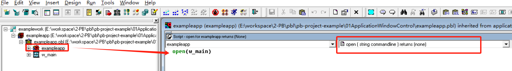

### 六、运行程序

单击菜单栏上运行按钮或者按快捷键【Ctrl+R】运行程序


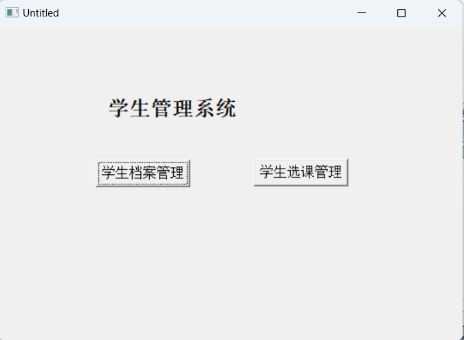

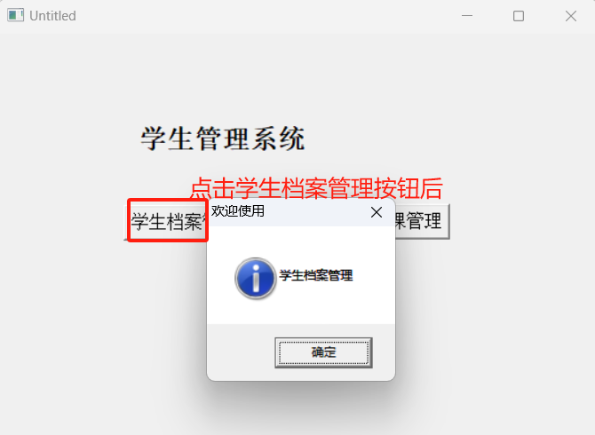


本期内容到此就结束了，希望对您有所帮助。我们下期再见，ヾ(•ω•`)o (●'◡'●)