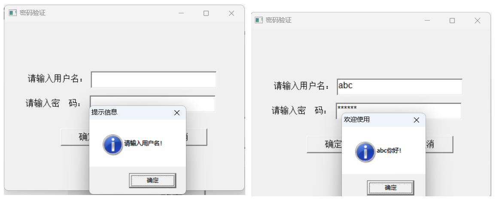
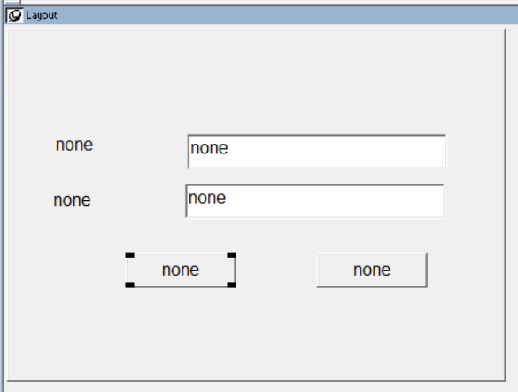
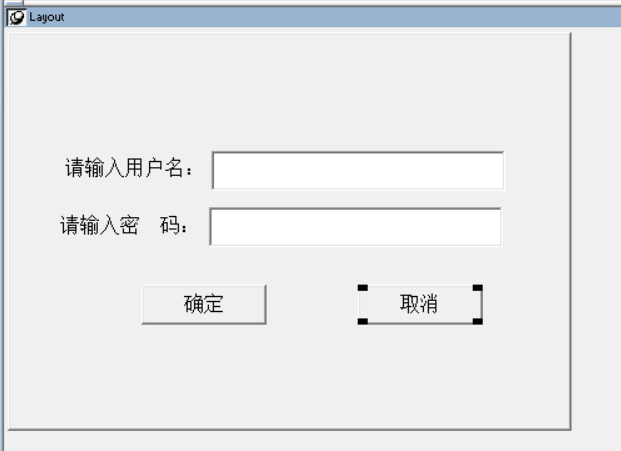
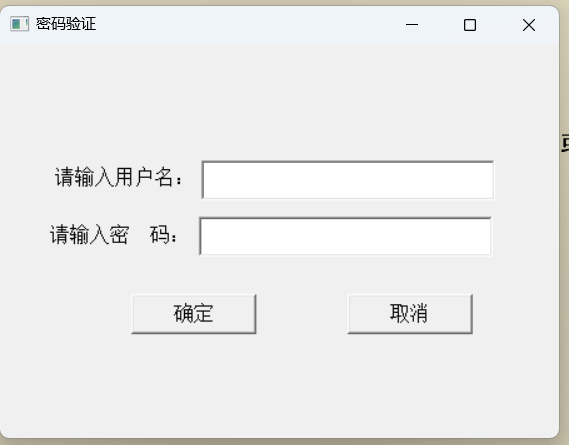

### 写在前面

通过一个个由浅入深的编程实战案例学习，提高编程技巧，以保证小伙伴们能应付公司的各种开发需求。

文章中设计到的源码，小凡都上传到了gitee代码仓库[https://gitee.com/xiezhr/pb-project-example.git](https://gitee.com/xiezhr/pb-project-example.git)


需要源代码的小伙伴们可以自行下载查看，后续文章涉及到的案例代码也都会提交到这个仓库【**[pb-project-example](https://gitee.com/xiezhr/pb-project-example)**】

如果对小伙伴有所帮助，希望能给一个小星星⭐支持一下小凡。


### 一、小目标

本小节使用了`StaticText`控件、`SingleLineEdit`控件、`CommandButton`控件、`Messagebox`函数

这小节的目的主要是学会`SingleLineEdit`控件的使用，其他控件及函数在第一小节已经设计，这里就不再重复了

最终实现如下截图效果



### 二、创建程序基本框架

① 创建`work`工作区

② 建立`app`应用

③ 建立`w_main`窗口

以上步骤如果忘记怎么操作的小伙伴，可以看看第一篇文章。这里由于篇幅原因，就不再赘述

④ 窗口中布置控件

窗口中添加两个`StaticText` 控件、两个`SingleLineEdit` 控件和两个`CommandButton` 控件。

如下图所示，各个控件名称为`st_1`、`sle_1`、`st_2`、`sle_2`、`cb_1`和`cb_2`



⑤ 设置控件属性

| 控件名称 | 属性值              | 值               |
| -------- | ------------------- | ---------------- |
| `w_main` | `title`             | 密码验证         |
| `st_1`   | `Text`              | 请输入用户名：   |
| `st_2`   | `Text`              | 请输入密    码： |
| `sle_1`  | `Text`              | 空               |
| `sle_2`  | `Text` 、`Password` | 空 \|true        |
| `cb_1`   | `Text`、`Default`   | 确定\|true       |
| `cb_2`   | `Text` 、`Cancel`   | 取消\|true       |



⑥ 保存窗口

### 三、编写事件代码

> 这里我们模拟系统密码为123456，实际密码需要去数据库查询获取

① 在按钮`cb_1` 的`Clicked`事件中添加如下代码

`sle_1.Text` 代码可以获取控件中文本内容

```java
if sle_1.Text= '' then
	messagebox('提示信息','请输入用户名！')
else
	if sle_2.text = '123456' then
		messagebox('欢迎使用', sle_1.Text+'你好！')
	else
		messagebox('提示信息','密码错误，请重新输入！')
		
	end if
	
end if
```

② 在按钮`cb_2` 的`Clicked`事件中添加如下代码进行关闭窗口

```java
close(parent)
```

③ 在左边`System Tree` 窗口中双击App应用对象，在`open` 事件中添加如下代码

```java
//程序启动打开窗口w_main
open(w_main)
```


### 四、运行程序




### 五、SingleLineEdit 控件

#### 5.1 常用属性

| 属性名称          | 描述                                                         |
| ----------------- | ------------------------------------------------------------ |
| `Visible  `       | 默认为 True。当为 False 时，该控件在窗口上隐藏               |
| `Enabled  `       | 默认为 True。当为 False 时，该控件不能获得焦点，用户不能进行编辑和选<br/>中；控件背景为灰色 |
| `DisplayOnly  `   | 默认为 False。当为 True 时，该控件中的文字不能被修改，并且也不能<br/>输入，但可以选中、复制 |
| `Password  `      | 默认为 False。当为 True 时，在该输入框中输入的内容显示为“ *”号，<br/>星号的数目等于输入的字符的数目，加密规则依赖于操作系统。其实际内容和用户输入的内<br/>容一致 |
| `AutoHScroll  `   | 默认为 True，表示当用户输入的内容显示不下时，可以自动横向滚动<br/>光标，但是不显示滚动条 |
| `HideSelection  ` | 默认为 True，表示只有当单行编辑器获得焦点时，才高亮显示选中文<br/>本。建议使用默认值，因为将该属性设置为 False，没有获得焦点时，选中的内容就高亮显示，<br/>这容易让用户造成错误 |
| `Limit  `         | 默认是 0，表示没有长度限制。可以输入其他一个数字，表示该单行编辑框中<br/>最多接受用户输入的字符个数，最大数字是 32 767 |
| `Case  `          | 有三个选项， upper 表示用户输入的内容中的字母都自动转换成大写， down<br/>表示都自动转换成小写， any 表示不做转换 |
| `Text  `          | 这是该控件运行时最经常使用的一个属性。可以给该属性赋值来将特定信息显<br/>示在单行编辑器中，也可以读取该属性而获得单行编辑器中的内容。设计状态下，在 Text<br/>属性输入框中录入的文字在窗口刚刚打开时显示在单行编辑框中 |
| `Border  `        | 是否显示边框，默认为 True                                    |

#### 5.2 事件和脚本

提供了 12 个事件， Modified 是经常使用的事件，其他事件和**命令按钮**的同名事件完全相同。

该事件的触发时机是在编辑器中输入内容后，焦点离开该编辑器时  

单行编辑器提供了很多的函数，其中需要掌握的有 10 个经常使用的函数，这 10 个常用

##### 5.2.1 CanUndo 函数

① **语法**

```java
sle_1.CanUndo ()
```

返回值：Boolean

-  如果可以撤销上一次的编辑操作，则返回True
-  如果不能撤销上一次的编辑操作，则返回False

② **功能** 

检查是否可以撤销上一次的编辑操作

##### 5.2.2 Undo 函数

① **语法**

```java
sle_1.Undo()
```

② **功能** 

撤销上一次的编辑操作，恢复到之前的文本状态

##### 5.2.3  Clear 函数

① **语法**

```java
sle_1.Clear ()
```

返回值：Integer

- 清除的文本内容长度，清除一个字符，则返回1
- 未选中内容，返回0
- 执行错误返回-1

② **功能** 

清除`SingleLineEdit`控件中选中的文本内容

**注：** 需要在文本内容选中的情况下才能清除

##### 5.2.4  Copy 函数

① **语法**

```java
sle_1.Copy()
```

返回值：Integer

- 复制到剪切板的文本内容长度
- 未选中内容，返回0
- 执行错误返回-1

② **功能** 

将`SingleLineEdit`控件中选定的文本复制到剪贴板。 


##### 5.2.5  Cut函数

① **语法**

```java
sle_1.Cut()
```

② **功能** 

将`SingleLineEdit`控件中选定的文本剪切并复制到剪贴板。 

返回值：Integer

- 剪切到剪切板的文本内容长度
- 未选中内容，返回0
- 执行错误返回-1

##### 5.2.6  Paste函数

① **语法**

```java
sle_1.Paste()
```

返回值：Integer

- 剪切板的文本内容长度

② **功能** 

将剪贴板中的内容粘贴到`SingleLineEdit`控件中
##### 5.2.7  SetFocus函数

① **语法**

```java
sle_1.SetFocus()
```

② **功能** 

将焦点设置到`SingleLineEdit`控件上

本期内容到这儿就结束了，希望对您有所帮助。
我们下期再见 ヾ(•ω•`)o (●'◡'●)