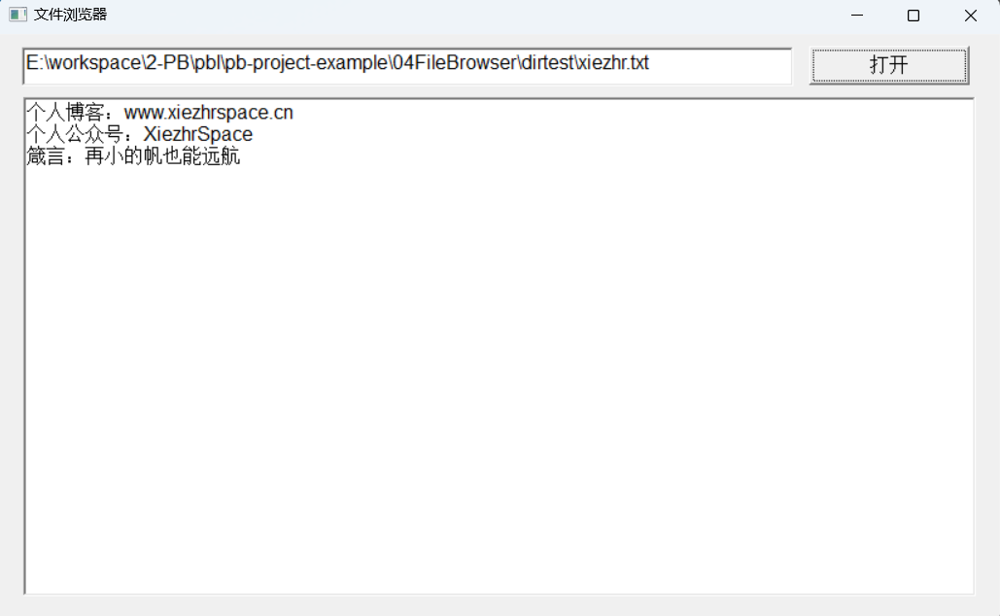
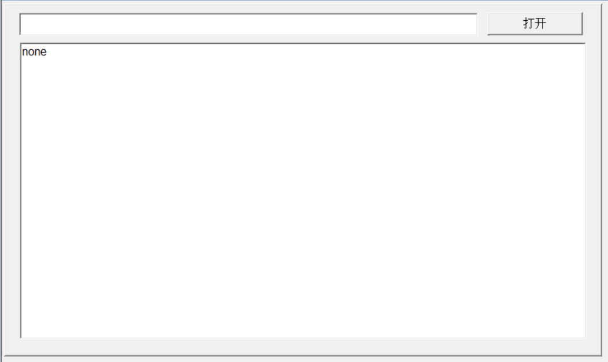

### 写在前面

通过一个个由浅入深的编程实战案例学习，提高编程技巧，以保证小伙伴们能应付公司的各种开发需求。

文章中设计到的源码，小凡都上传到了gitee代码仓库[https://gitee.com/xiezhr/pb-project-example.git](https://gitee.com/xiezhr/pb-project-example.git)


需要源代码的小伙伴们可以自行下载查看，后续文章涉及到的案例代码也都会提交到这个仓库【**[pb-project-example](https://gitee.com/xiezhr/pb-project-example)**】

如果对小伙伴有所帮助，希望能给一个小星星⭐支持一下小凡。


### 一、小目标

学会使用`MultiLineEdit`控件以及对文件操作函数的使用，最终实现一个如下图所示文件浏览器功能。



### 二、创建程序的基本框架

① 建立工作区

② 建立应用

③ 建立窗口

以上步骤忘记的小伙伴，请参照第一篇文章，[创建应用、窗口与控件](#)

④ 建立控件

在窗口中建立一个`SingleLineEdit`控件、一个`MultiLineEdit` 控件和`CommandButton`控件，各个控件的名称

依次为`sle_1`、`mle_1`和`cb_1`



⑤ 保存窗口

将新建立的窗口保存为`w_main`

### 三、设置各个控件的外观及属性

| 控件名称 | 主要属性              | 值           |
| -------- | --------------------- | ------------ |
| `w_main` | `Title`               | 文件浏览器   |
| `sle_1`  | `Text`                | （空）       |
| `cb_1`   | `Text`和`Default`     | 打开 \| True |
| `mle_1`  | `Text`和 `VScrollBar` | (空)\|True   |

### 四、编写代码

① 在按钮`cb_1` 控件的`Clicked`事件中添加如下代码

```java
integer li_filenum,li_loops,li_i
long ll_flen,ll_bytes_read,ll_new_pos
string ls_part,ls_total,ls_filename

ls_filename = sle_1.text

if ls_filename = '' or isnull(ls_filename) then
	messagebox('提示信息','请输入文件名')
	return
end if

SetPointer(HourGlass!)

ll_flen = FileLength(ls_filename)

if ll_flen<=0 then
	
	messagebox('提示信息','无法打开文件')
	return
end if

li_filenum = FileOpen(ls_filename,StreamMode!,Read!,LockRead!)

if ll_flen >32765 then
	if mod(ll_flen,32765) = 0 then
		li_loops =ll_flen/32765
	else
		li_loops = (ll_flen/32765) +1
	end if
	
else 
	li_loops =1
end if

ll_new_pos =1 

for li_i =1 to li_loops
	ll_bytes_read = FileRead(li_filenum,ls_part)
	ls_total +=ls_part
next 

FileClose(li_filenum)

mle_1.text = ls_total
```

②在开发界面左边双击`App`应用对象，在`App`的`Open` 事件中添加如下代码

```java
open(w_main)
```

### 五、运行程序

我们在`E:\workspace\2-PB\pbl\pb-project-example\04FileBrowser\dirtest`目录下新建xiezhr.txt 文件

运行程序，然后输入xiezhr.txt全路径，点击【打开】按钮便可读出xiezhr.txt文件内容


### 六、文件操作函数

#### 2.1 函数列表

| 函数名称              | 描述             |
| --------------------- | ---------------- |
| `CreateDirectory`     | 创建一个目录     |
| `ChangeDirectory`     | 改变当前目录     |
| `DirectoryExists`     | 判断目录是否存在 |
| `GetCurrentDirectory` | 获取当前目录名   |
| `GetFileOpenName`     | 获取打开文件名   |
| `GetFileSaveName`     | 获取保存文件名   |
| `RemoveDirectory`     | 删除目录         |
| `FileExists`          | 判断文件是否存在 |
| `FileLength`          | 获取文件长度     |
| `FileOpen`            | 打开文件         |
| `FileClose`           | 关闭文件         |
| `FileDelete`          | 删除文件         |
| `FileCopy`            | 复制文件         |
| `FileMove`            | 移动文件         |
| `FileSeek`            | 移动文件指针     |
| `FileRead`            | 读取文件         |
| `FileWrite`           | 写文件           |

#### 2.2 函数详细说明

##### 2.2.1  CreateDirectory 函数

① **语法**

```java
CreateDirectory (目录名称)
```

参数：

- 目录名称，可以是绝对路径，如果是绝对路径，如果是绝对路径，则在该路径下创建，否则在项目空间下创建

返回值：Integer

- 1 函数执行成功
- -1 函数执行错误。例如：目录已存在，再调用该函数会返回-1

② **功能**

创建目录

**注：** 如果目录存在会报错，所以在创建目录前一般会判断该目录是否存在，不存在再创建


##### 2.2.2  ChangeDirectory 函数

① **语法**

```java
ChangeDirectory  (目录名称)
```

返回值：Integer

- 1 函数执行成功
- -1 函数执行错误

② **功能**

改变当前目录

##### 2.2.3 DirectoryExists 函数

① **语法**

```java
DirectoryExists(目录名称)
```

返回值：boolean

- 如果目录存在，则返回true
- 如果目录不存在，则返回false
- 参数不符合规范，则返回false

② **功能**

判断某个目录是否存在

##### 2.2.4 GetCurrentDirectory 函数

① **语法**

```java
GetCurrentDirectory ()
```

返回值：string

- 当前目录字符串

② **功能**

获取当前目录名

##### 2.2.5  GetFileOpenName 函数

① **语法**

```java
GetFileOpenName(title,pathname,filename{,extension{,filter}})
```

参数：

- `title`：string类型，指定对话框的标题
- `pathname`：string类型变量，用于保存该对话框返回的文件路径及文件名
- `filename`：string类型变量，用于保存该对话框返回的文件名
- `extension`：string类型，可选项，使用1到3个字符指定缺省的扩展文件名
- `filter`：string类型，可选项，其值为文件名掩码，指定显示在该对话框的列表框中供用户选择的文件名满
  足的条件（比如*.*，*.TXT，*.EXE等）  

返回值：Integer  

- 执行成功时返回1  
- 当用户单击了对话框上的“Cancel”按钮时函数返回0  
- 发生错误时返回-1  
- 如果任何参数的值为NULL  ，返回null

② **功能**

显示打开文件对话框，让用户选择要打开的文件

③ **例子**

```java
li_Value = GetFileOpenName("打开文件", ls_DocName, ls_Named, "rtf", &
"Text Files (*.TXT),*.TXT,"&
+"Doc Files (*.DOC),*.DOC," &
+"rtf files (*.rtf),*.rtf," &
+"all files (*.*),*.*")
If li_Value = -1 Then //打开文件错误
	Beep(2) //响铃两声
	MessageBox("提示","文件打开错误!",Exclamation!) //提示错误
	Return //返回
Elseif li_Value = 0 Then //用户取消
	Return //直接返回
End If
```

##### 2.2.6  GetFileSaveName 函数

① **语法**

```java
GetFileSaveName(title,pathname,filename{,extension{,filter}})
```

参数：

- `title`：string类型，指定对话框的标题
- `pathname`：string类型变量，用于保存该对话框返回的文件路径及文件名
- `filename`：string类型变量，用于保存该对话框返回的文件名
- `extension`：string类型，可选项，使用1到3个字符指定缺省的扩展文件名
- `filter`：string类型，可选项，其值为文件名掩码，指定显示在该对话框的列表框中供用户选择的文件名满
  足的条件（比如*.*，*.TXT，*.EXE等）  

返回值：Integer  

- 执行成功时返回1  
- 单击了对话框上的“Cancel”按钮时函数返回0  
- 发生错误时返回-1  
- 如果任何参数的值为NULL，那么`GetFileSaveName()`函数返回NULL  

② **功能**

显示保存文件对话框，让用户选择要保存到的文件。

③ **例子**

```java
value = GetFileSaveName("保存文件", docname, named, "txt",&
"Text Files (*.TXT),*.TXT,")
If value <> 1 Then //要保存的文件名没有正确设定，
    Beep(2)
    MessageBox("错误","设置文件名"+docname+"错误!")
    return
End If
```

##### 2.2.7  RemoveDirectory 函数

① **语法**

```java
RemoveDirectory(directoryname)
```

参数：string 

- `directoryname`: 要删除的目录名

返回值：Integer

- 1 函数执行成功
- -1 函数执行错误

② **功能**

删除目录

##### 2.2.8  FileExists 函数

① **语法**

```java
FileExists ( filename )
```

参数：string

- `filename`：指定要检查存在性的文件的文件名，其中可以包含路径

返回值：Boolean  

- 指定文件存在时返回TRUE  
- 指定文件不存在时返回FALSE  
- 执行失败时，返回FALSE
- 参数为null，返回null

② **功能**

判断指定的文件是否存在。

##### 2.2.9 FileLength 函数

① **语法**

```java
FileLength ( filename )
```

参数：string

- `filename`：指定要得到其长度的文件的文件名，其中可以包含路径

返回值：Long

- 函数执行成功时返回指定文件的长度（以字节为单位）。
- 如果指定的文件不存在，函数返回-1。  
- 参数为null,则返回null

##### 2.2.10 FileOpen 函数

① **语法**

```java
FileOpen(filename{,filemode{,fileaccess{,filelock{,writemode,
{creator,filetype}}}}})
```

- filename：string类型，指定要打开文件的名称，其中可以包含路径

- filemode：FileMode枚举类型，可选项，指定文件打开方式。有效取值为：（LineMode! - 缺省值，行
  模式）（StreamMode! - 流模式）

- fileaccess：FileAccess枚举类型，可选项，指定文件访问方式。有效取值为：（Read! - 缺省值，只
  读方式，这样打开的文件只能进行读操作；）（Write! - 只写方式，这样打开的文件只能进行写操作）

- filelock：FileLock枚举类型，可选项，指定文件加锁方式。有效取值为：

  - n LockReadWrite! - 缺省值，只有打开该文件的用户能够访问该文件，其它用 户对该文件的访问均被拒
    绝；

  - n LockRead! - 只有打开该文件的用户能够读该文件，但其它任何用户均可写该文件；

  - n LockWrite! - 只有打开该文件的用户能够写该文件，但其它任何用户均可读该文件

  - n Shared! - 所有用户均可读写该文件

    

- writemode：WriteMode枚举类型，可选项，当fileaccess参数指定为Write!时，该参数指定在指定文件
  已经存在时数据的添加方式。
  有效取值为：

  - Append! - 缺省值，将数据添加到原文件尾部；
  - Replace! - 覆盖原有数据
  - creator：可选项，用于Macintosh机，使用四个字符的字符串指定文件的创建者。指定该参数后，必须同时
    指定filetype参数
  - filetype：可选项，用于Macintosh机，使用四个字符的字符串指定文件类型  

返回值：Integer  

-  执行成功时，返回1
-  执行失败时，返回-1
-  参数为null时，返回null

② **功能**

以指定的读写方式打开指定的文件，同时返回该文件的句柄。

##### 2.2.11  FileClose 函数

① **语法**

```java
FileClose ( fileno )
```

参数：integer

- `fileno`：指定要关闭文件的文件句柄，该句柄使用FileOpen()函数打开文件时得到

返回值：Integer  

- 函数执行成功时返回打开文件的句柄  文件操作函数利用该句柄完成对文件的操作  
- 发生错误时返回-1  
- 如果fileno参数的值为NULL，那么FileClose()函数返回NULL  

② **功能**

关闭先前用FileOpen()函数打开的文件。

##### 2.2.12  FileDelete 函数

① **语法**

```java
FileDelete ( filename )
```

参数：string

- `filename`：指定要得到其长度的文件的文件名，其中可以包含路径

返回值：Boolean  

- 函数执行成功时返回TRUE  
- 发生错误时返回FALSE  
- 如果filename参数的值为NULL，那么FileDelete()函数返回NULL。

② **功能**

删除指定的文件

##### 2.2.13  FileCopy 函数

① **语法**

```java
FileCopy ( Sourcefile, Targetfile{, replace } )
```

参数：

- `Sourcefile`:要复制的文件的名称的字符串
- `Targetfile`: 复制到的文件的名称的字符串
- `replace `:指定是否替换目标文件的布尔值(true),为true时替换目标文件，为false时不替换（默认值为false）

返回值：Integer

- 执行成功返回1
- 打开源文件出错-1
- 写入目标文件出错 -2

**注：**如果没有为 源文件 或 目标文件 指定完全限定的路径，则该函数将相对于当前目录工作。如果没有指定replace参数，则FileCopy函数不会替换目标目录中与在targetfile参数中指定的名称相同的文件(这相当于将replace值设置为false)。

② **功能**

复制文件

③ **例子**

> 将文件从当前目录复制到另一个目录，并将返回值保存在一个变量中

```java
integer li_FileNum
li_FileNum = FileCopy ("jazz.gif" , &
   "C:\emusic\jazz.gif", FALSE)
```

##### 2.2.14  FileMove 函数

① **语法**

```java
FileMove ( Sourcefile,Targetfile)
```

参数：

- `Sourcefile`:要移动的文件的名称的字符串
- `Targetfile`:要移动文件的位置的名称的字符串

返回值：

- 执行成功 1
- 打开源文件出错 -1
- 写入目标文件出错 -2

**注：**如果目标目录中已经存在同名文件，则无法写入目标文件。如果要复制目标文件，可以使用FileCopy并将replace参数设置为true。

② **功能**

将当前文件移动到另一目录

③ **例子**

> 将文件从当前目录移动到另一个目录，并将返回值保存在li_FileNum变量中

```java
integer li_FileNum
li_FileNum = FileMove ("xiezhr.csv", &
   "D:/project/xiezhr2024.csv" )
```

##### 2.2.15  FileSeek函数

① **语法**

```java
FileSeek ( fileno, position, origin )
```

参数：

- `fileno`：integer类型，指定文件句柄（由FileOpen()函数得到）
- `position`：long类型，指定相对于origin参数指定位置的新位置偏移量，以字节为单位
- `origin`：`SeekType`枚举类型，指定从哪里开始移动文件指针，即指针移动的基准。有效取值为：
  - `FromBeginning!` - 缺省值，从文件开头移动指针；
  - `FromCurrent! `- 从当前位置移动文件指针；
  - `FromEnd!` - 从文件结尾处移动文件指针  

返回值：Long

- 函数执行成功时返回指针移动后的指针位置
- 参数为null,则返回null

② **功能**

将文件指针移动到指定位置。读写文件时相应函数会自动移动文件指针。

##### 2.2.16  FileRead 函数

① **语法**

```java
FileRead ( fileno, variable )
```

参数：

- `fileno`：integer类型，指定文件句柄（由FileOpen()函数得到）
- `variable`：string或blob类型的变量，用于保存读取的数据  

返回值：Integer  

- 函数执行成功时返回读取的字符数或字节数  
- 如果在读取任何字符前读到了文件结束符（EOF），则FileRead()函数返回-100  
- 指定文件以行模式打开时，如果在读取任何字符之前遇到了回车（CR）或换行（LF）字符，则FileRead()
  函数返回0  
- 执行错误，函数返回-1  

② **功能**

从指定文件中读取数据

##### 2.2.17 FileWrite 函数

① **语法**

```java
FileWrite (fileno , variable )
```

参数：

- `fileno`：integer类型，指定文件句柄（由`FileOpen()`函数得到）
- `variable`：string或blob类型，其值将写入`fileno`参数指定的文件  

返回值：Integer

- 执行成功时返回写入文件的字符或字节数  
- 发生错误时返回-1  
- 任何参数的值为NULL  函数返回NULL  

② **功能**

向指定文件中写数据。


### 七、MultiLineEdit 控件

#### 3.1 常用属性

| 属性                    | 描述                                                         |
| ----------------------- | ------------------------------------------------------------ |
| `Visible  `             | 默认为 True。当为 False 时，该控件在窗口上隐藏               |
| `Enabled  `             | 默认为 True。当为 False 时，该控件不能获得焦点，用户不能进行编辑和选<br/>中；控件背景为灰色 |
| `DisplayOnly  `         | 默认为 False。当为 True 时，该控件中的文字不能被修改，并且也不能<br/>输入，但可以选中、复制 |
| `AutoHScroll  `         | 默认为 True，表示当用户输入的内容显示不下时，可以自动横向滚动<br/>光标，但是不显示滚动条 |
| `HideSelection  `       | 默认为 True，表示只有当单行编辑器获得焦点时，才高亮显示选中文<br/>本。建议使用默认值，因为将该属性设置为 False，没有获得焦点时，选中的内容就高亮显示，<br/>这容易让用户造成错误 |
| `RightToLeft  `         |                                                              |
| `Border  `              | 是否显示边框，默认为 True                                    |
| `Case  `                | 有三个选项， upper 表示用户输入的内容中的字母都自动转换成大写， down<br/>表示都自动转换成小写， any 表示不做转换 |
| `Limit  `               | 默认是 0，表示没有长度限制。可以输入其他一个数字，表示该单行编辑框中<br/>最多接受用户输入的字符个数，最大数字是 32 767 |
| `HscrollBar  `          | 是否显示横向滚动条，默认为 False。当该属性为 True 时，显示横向滚<br/>动条， 某行文字的宽度大于控件的宽度， 则滚动条可用， 否则灰色显示不可用。 当属性为 False<br/>时，输入的文字大于控件宽度，则自动换行 |
| `VscrollBar  `          | 是否显示纵向滚动条，默认为 False。当该属性为 True 时，显示纵向滚<br/>动条， 如果文字的高度大于控件的高度， 则滚动条可用， 否则灰色显示不可用。 当属性为 False<br/>时，输入的文字大于控件高度时，就不允许再增加新的数据行 |
| `AutoVScroll  `         | 是否在需要时自动显示纵向滚动条，默认为 False。如果设置为 True，<br/>在当前内容显示满控件时，增加新的数据行将会出现纵向滚动条 |
| `IgnoreDefaultButton  ` | 是否忽略 Enter 键，默认为 False。如果属性为 True 并且当前焦<br/>点在多行编辑器中， 这时使用 Enter 键则会在多行编辑器中增加一个新行； 如果属性为 False，<br/>则会触发窗口上“ Default”按钮的 Clicked 事件 |
| `Alignment  `           | 文本的对齐方式，是一个枚举型取值，有 Center!、 Justify!、 Left!、 Right!4<br/>个取值，默认为 Left!。 |

#### 3.2 事件和脚本

多行编辑器提供了 12 个默认事件，触发时机和单行编辑器的 12 个事件完全相同  （忘记的小伙伴可以翻一翻前面文章的内容）经常
使用的事件也是 Modified

多行编辑器也提供了很多的函数，和单行编辑器的同名函数的用法及注意事项完全相同，需要注意的是两个单行编辑器没有的函数 `LineCount` 和 `LineLength`。这两个函数经常配合使用，对多行编辑器中的文本逐个字符处理  

① LineCount 函数

> 获取editname 中数据的实际行数，不管每行后面是否有回车或换行符号  

返回值：Integer

- 执行成功，返回正确行数
- 执行错误返回-1
- `editname` 为 Null，则返回 Null  

② LineLength  函数

> 可以获取 editname 中当前光标所在行,包括空格在内的字符数，

返回值：Integer

- 正确执行，返回光标所在行字符数
- 执行错误，返回-1
- 当 editname 为 Null 时返回 Null  


本期内容到这儿就结束了，希望对你有所帮助。

我们下期再见 ヾ(•ω•`)o (●'◡'●)