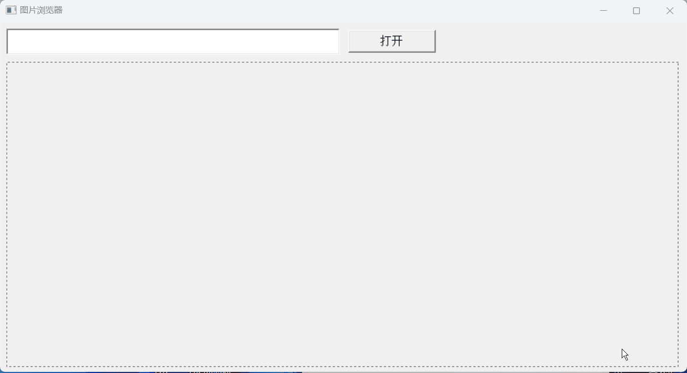
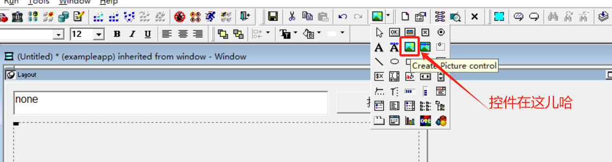
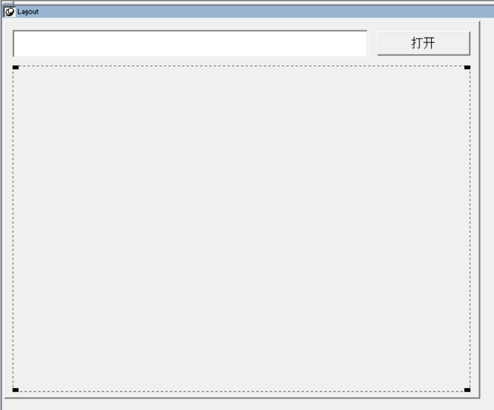

### 写在前面

这是PB案例学习笔记系列文章的第5篇，该系列文章适合具有一定PB基础的读者。

通过一个个由浅入深的编程实战案例学习，提高编程技巧，以保证小伙伴们能应付公司的各种开发需求。

文章中设计到的源码，小凡都上传到了gitee代码仓库[https://gitee.com/xiezhr/pb-project-example.git](https://gitee.com/xiezhr/pb-project-example.git)


需要源代码的小伙伴们可以自行下载查看，后续文章涉及到的案例代码也都会提交到这个仓库【**[pb-project-example](https://gitee.com/xiezhr/pb-project-example)**】

如果对小伙伴有所帮助，希望能给一个小星星⭐支持一下小凡。

### 一、小目标

本篇文章的小目标主要是利用图片框（Picture）控件及其函数来对图片进行打开、读取等操作。

图片支持的格式有`bmp`、`jpg`、`gif`、`rle`、`wmf`



本实例中我们实用到了控件的如下属性，一些没用到的，我们会在实例后面具体说明，感兴趣的小伙伴可以在实例结束后查看

| 属性          | 数据类型  | 描述                                                         |
| ------------- | --------- | ------------------------------------------------------------ |
| `PictureName` | `String`  | 指定图片框显示的图片的文件名，要求扩展名为`bmp`、`jpg`、`gif`、`rle`、`wmf` |
| `Height`      | `Integer` | 指定控件的高度                                               |
| `Width`       | `Integer` | 指定控件的宽度                                               |

### 二、创建程序基本框架

① 建立工作区

② 建立应用

③ 建立窗口

④ 建立控件

在窗口中建立一个`SingleLineEdit`控件，一个`CommandButton`控件和一个`Picture`控件（下图所示位置），各个控件名称依次为

`sle_1`、`cb_1`和`p_1`





⑤ 保存窗口

将建立的窗口保存为`w_main`

### 三、设置各个控件的外观属性

| 控件名称 | 主要属性 | 值             |
| -------- | -------- | -------------- |
| `w_main` | `Title`  | 图片浏览器     |
| `sle_1`  | `Text`   | (空)           |
| `cb_1`   | `Text`   | `Default`      |
| `p_1`    | `Border` | `OriginalSize` |

### 四、编写代码

① 在按钮`cb_1`控件的`clecked`事件中添加如下代码

```java
if sle_1.text <> '' or isnull(sle_1.text) then
	if fileExists(sle_1.text) then
		p_1.picturename = sle_1.text
		p_1.height = 1500
		p_1.width = 2000
	else
		messagebox('提示信息','图片文件不存在',Exclamation!)
	end if
	
else
	messagebox('提示信息','请输入图像文件名',Exclamation!)
end if
```

代码中用到`fileExists` 函数，我们在之前的文件浏览器文章中说到过，作用时判断文件是否存在

② 在开发界面左边的`System Tree` 窗口中双击`exampleapp`应用对象，并在`Open`中添加如下代码

```java
open(w_main)
```

### 五、运行程序

运行程序，在`sle_1`控件内输入要浏览图片的完整名称，点击打开就可以看到


### 六、Picture 控件常用属性

| 属性             | 数据类型  | 描述                                                         |
| ---------------- | --------- | ------------------------------------------------------------ |
| `Border`         | `Boolean` | 指定控件是否有边框 True-有边框；False-无边框                 |
| `BorderStyle`    | `Border`  | 指定控件的边框风格，有效值有：`StyleBox! `、`StyleLowered!`、`StyleRaised!`、`StyleShadowBox` |
| `FocusRectangle` | `Boolean` | 指定当控件得到焦点时，是否在控件周围显示一个由虚线组成的方框。True -显示 False-不显示 |
| `Invert`         | `Boolean` | 指定控件是否以反转颜色显示图片。True - 反转颜色；False -不反转颜色 |
| `OriginalSize`   | `Boolean` | 指定是否以图片的原始大小显示图片。True -以原始图片大小显示，此时修改图片框控件的Width和Height属性；False- 以图片框控件大小显示图片。注：代码中不能修改该属性 |
| `PictueName`     | `String`  | 指定图片框显示的图片的文件名，要求扩展名为`bmp`、`jpg`、`gif`、`rle`、`wmf` |
| `Height`         | `Integer` | 指定该控件的高度                                             |
| `Width`          | `Integer` | 指定该控件的宽度                                             |


本期内容到这儿就结束了，希望对您有所帮助。

我们下期再见 ヾ(•ω•`)o  (●'◡'●)