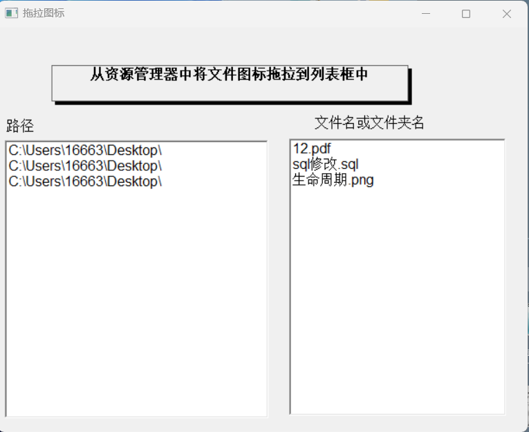
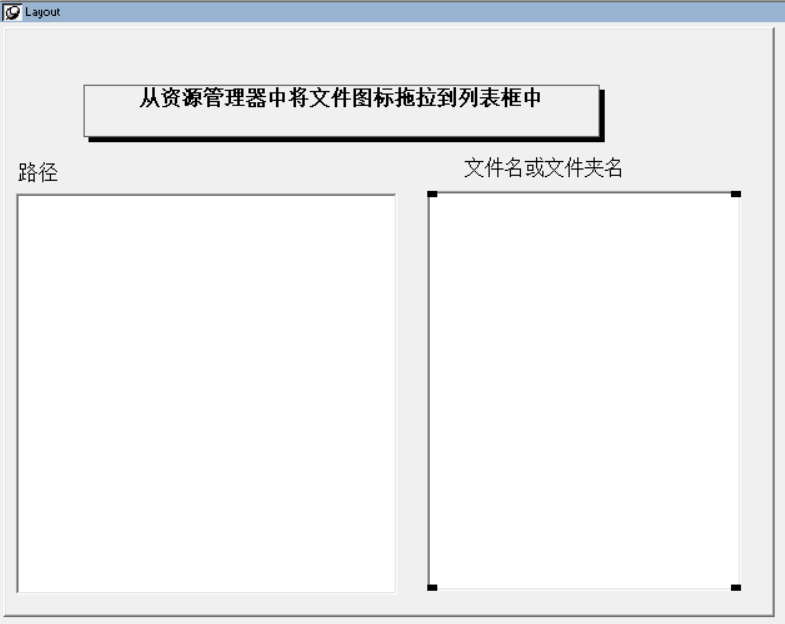
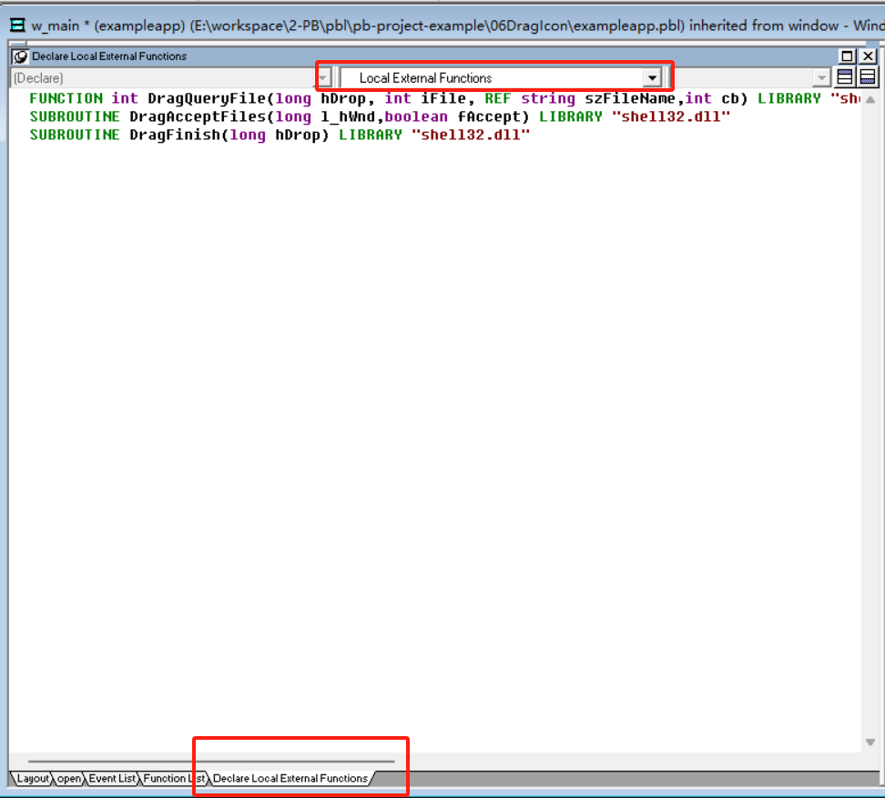
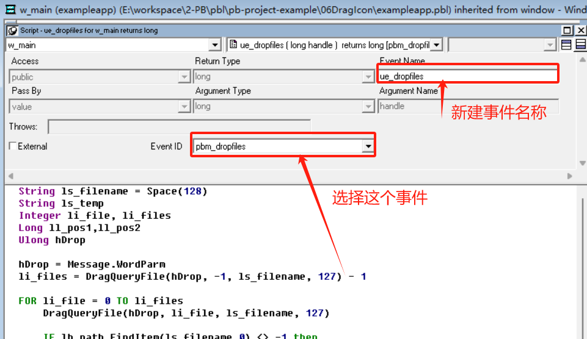
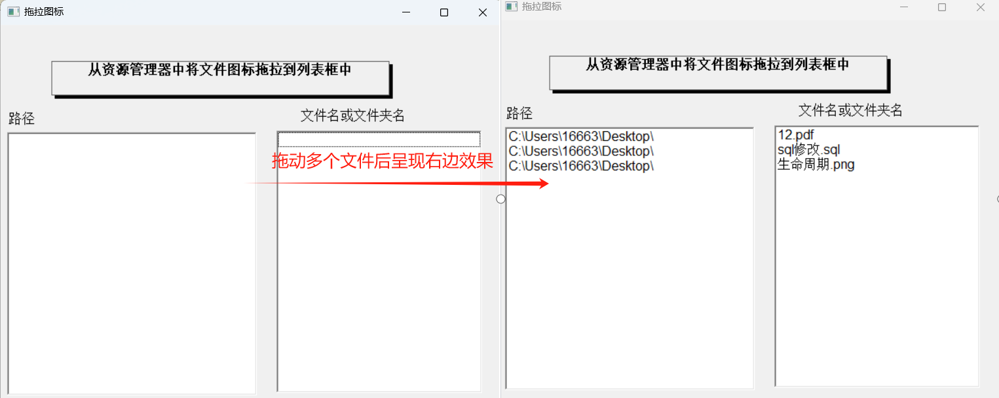

### 写在前面

这是PB案例学习笔记系列文章的第6篇，该系列文章适合具有一定PB基础的读者。

通过一个个由浅入深的编程实战案例学习，提高编程技巧，以保证小伙伴们能应付公司的各种开发需求。

文章中设计到的源码，小凡都上传到了gitee代码仓库[https://gitee.com/xiezhr/pb-project-example.git](https://gitee.com/xiezhr/pb-project-example.git)


需要源代码的小伙伴们可以自行下载查看，后续文章涉及到的案例代码也都会提交到这个仓库【**[pb-project-example](https://gitee.com/xiezhr/pb-project-example)**】

如果对小伙伴有所帮助，希望能给一个小星星⭐支持一下小凡。

### 一、小目标

这篇文章我们需要引入外部动态库的函数来实现文件的拖动。

所以我们的目标就是学会使用外部动态库的引入，函数申明及调用。以后遇到其他扩展功能性的动态库就可以参照这个，

都是一样的调用方式

### 二、本例实现的效果

本例实现图标在窗口之间拖动，如下图所示，窗口中有两个列表框，当任何文件或者文件夹的图标拖入窗口中时，

左边的列表框会显示文件或文件夹的路径，右边列表框会显示文件或文件夹名




### 三、动态库及函数介绍

本例使用了windows提供的动态库`Shell32.dll`的`DragQueyFile`、`DragAcceptFiles` 和`DragFinish` 外部函数实现

#### 3.1 DragQueyFile函数

① 定义

```java
FUNCTION int DragQueryFile(long hDrop, int iFile, REF string szFileName,int cb) LIBRARY "shell32.dll"
```

② 参数说明

| 参数         | 类型     | 说明                                                         |
| ------------ | -------- | ------------------------------------------------------------ |
| `hDrop`      | `Long`   | 拖动文件的句柄                                               |
| `iFile`      | `Int`    | 拖动文件的索引号。<br />参数为-1，函数返回拖动文件的数字；<br />参数为0到拖动文件的数字，则将相应文件名保存到`szFileName`字符串中 |
| `szFileName` | `String` | 保存文件名的字符串的缓冲区                                   |
| `cb`         | `Int`    | 指定`szFileName` 缓冲区的大小                                |

#### 3.2 DragAcceptFiles 函数

① 定义

```java
SUBROUTINE DragAcceptFiles(long l_hWnd,boolean fAccept) LIBRARY "shell32.dll"
```

② 参数说明

| 参数      | 类型      | 说明                                                        |
| --------- | --------- | ----------------------------------------------------------- |
| `l_hWnd`  | `Long`    | 指定窗口的句柄                                              |
| `fAccept` | `boolean` | 指定窗口是否接收拖动文件<br />True-接收；<br />False-不接收 |

#### 3.3 DragFinish函数

① 定义

```java
SUBROUTINE DragFinish(long hDrop) LIBRARY "shell32.dll"
```

② 功能

释放之前操作分配的内存

### 四、创建程序基本框架

通过上面小节的介绍之后，我们对需要使用的这些外部函数有了初步认识，接下来，就通过具体代码来实现其功能

① 新建`examplework`工作区

② 新建`exampleapp`应用

③ 新建`w_main` 窗口

以上步骤如果还不知道怎么建立的小伙伴，请参照第一篇文章

④ 布置控件

在窗口中，新建三个`StaticText` 控件和两个`ListBox`控件，各个控件名称依次为`st_1`、`st_2`、`st_3`、`lb_path`和`lb_file`

具体属性如下

| 控件名称 | 主要属性 | 值               |
| -------- | -------- | ---------------- |
| `w_main` | `Title`  | 拖拉图标         |
| `st_1`   | `Text`   | `Border`         |
| `st_2`   | `Text`   | 路径：           |
| `st_3`   | `Text`   | 文件名或文件夹名 |
| `lb_1`   | `Border` | `BorderStyle`    |
| `lb_2`   | `Border` | `BorderStyle`    |





### 五、编写代码

① 定义外部扩展函数

在窗口`w_main` 中的`Declare Local External Functions` 选项卡中添加如下代码

```java
FUNCTION int DragQueryFile(long hDrop, int iFile, REF string szFileName,int cb) LIBRARY "shell32.dll"
SUBROUTINE DragAcceptFiles(long l_hWnd,boolean fAccept) LIBRARY "shell32.dll"
SUBROUTINE DragFinish(long hDrop) LIBRARY "shell32.dll"
```



② 在窗口`w_main`中的`Open`事件中添加如下代码

```java
//指定窗口接收拖动文件
DragAcceptFiles(handle(this), true)
```

 ③ 在窗口`w_main`中的`Event List`选项卡中添加`ue_dropfiles(long handle) returns long [pbm_dropfiles]` 事件

`pbm_dropfiles`是一个与系统拖放操作相关的事件，它在用户将一个或多个文件从资源管理器中拖放到可接收拖放操作的控件（`w_main`）上时触发。

这个事件允许开发者编写代码来处理拖放过来的文件，比如读取文件内容、显示文件信息或者执行其他与文件相关的操作。



```java
//初始化一个长度为128的空字符串，用于存储文件路径
String ls_filename = Space(128)
//用于临时存储文件路径或文件名的部分信息
String ls_temp
//分别用来遍历文件索引和存储文件总数
Integer li_file, li_files
//用于定位文件路径中的目录分隔符\的位置    
Long ll_pos1,ll_pos2
//用于存储从消息中获取的句柄，该句柄指向拖放操作的数据结构
Ulong hDrop
//从当前消息中获取拖放操作的句柄
hDrop = Message.WordParm
//使用DragQueryFile函数获取拖放操作中文件的总数，减1是因为计数从0开始。
li_files = DragQueryFile(hDrop, -1, ls_filename, 127) - 1

//循环遍历所有拖放的文件，通过索引li_file获取每个文件的完整路径
FOR li_file = 0 TO li_files
    DragQueryFile(hDrop, li_file, ls_filename, 127)
	//使用lb_path.FindItem检查文件路径是否已经在lb_path列表框中存在，如果存在则弹出错误消息。
    IF lb_path.FindItem(ls_filename,0) <> -1 then
       MessageBox("添加文件出错", "文件 " + ls_filename + " 已经存在")
	 ELSE
      /*
      1、找到文件路径中最后一个\的位置，然后分割出目录路径(ls_temp)和文件名。
	  2、分别将目录路径添加到lb_path列表框，将文件名添加到lb_file列表框。
      */
       ll_pos2= pos(ls_filename,"\",1)
			ll_pos1 = ll_pos2 
 			DO WHILE ll_pos1 <> 0
          ll_pos1 = Pos(ls_filename,"\",ll_pos2+1)
          IF ll_pos1 <> 0 THEN
             ll_pos2 = ll_pos1
			 END IF
		 LOOP
       
       ls_temp = left(ls_filename,ll_pos2)
		 lb_path.AddItem(ls_temp)
		 ls_temp = mid(ls_filename,ll_pos2 + 1)
		 lb_file.AddItem(ls_temp)
	 END IF
NEXT
//最后，使用DragFinish函数清理与拖放操作相关的资源。
DragFinish(hDrop)
```

④ 在左边开发界面`System Tree` 窗口中双击`exampleapp`应用对象，在`exampleapp` 的`Open`事件中添加如下代码

```java
open(w_main)
```

### 六、运行程序

