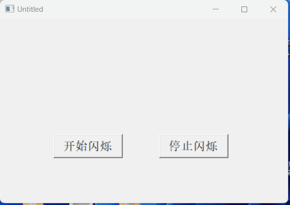
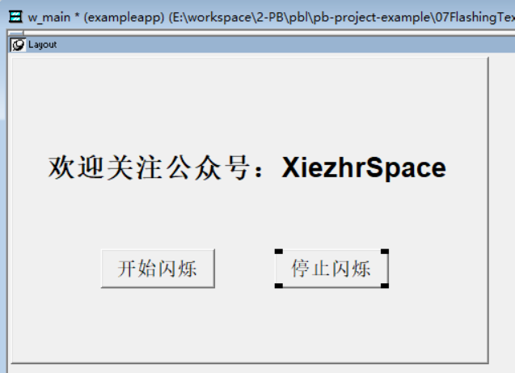
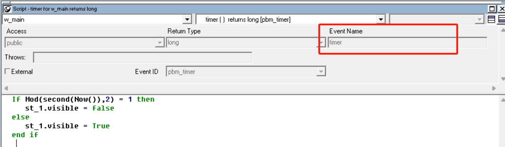

### 写在前面

这是PB案例学习笔记系列文章的第7篇，该系列文章适合具有一定PB基础的读者。

通过一个个由浅入深的编程实战案例学习，提高编程技巧，以保证小伙伴们能应付公司的各种开发需求。

文章中设计到的源码，小凡都上传到了gitee代码仓库[https://gitee.com/xiezhr/pb-project-example.git](https://gitee.com/xiezhr/pb-project-example.git)


需要源代码的小伙伴们可以自行下载查看，后续文章涉及到的案例代码也都会提交到这个仓库【**[pb-project-example](https://gitee.com/xiezhr/pb-project-example)**】

如果对小伙伴有所帮助，希望能给一个小星星⭐支持一下小凡。

### 一、小目标

有时候，我们需要特别醒目（闪烁）的文字来提示用户关注信息时，我们可以借助`PB`中`Timer`事件控制`StaticEdit`，

的`Visible`属性来实现闪烁特效。



### 二、Timer事件简介

> Timer 函数可以实现在指定时间间隔内反复触发指定窗口的定时事件

① 语法

```java
Timer(interval{,windowname})
```

② 参数解释

| 参数         | 说明                                                         |
| ------------ | ------------------------------------------------------------ |
| `interval`   | 指定两次触发Timer事件之间的时间间隔，有效值在0~65 之间<br />如果参数值为0，表示关闭定时器，不在触发窗口的`Timer`事件 |
| `windowname` | 窗口名，指定时间间隔到时要触发那个窗口的`Timer`事件          |

### 三、创建程序基本框架

① 创建`examplework` 工作区

② 创建`exampleapp` 应用

③ 新建`w_main` 窗口，`Title` 设置为闪烁文字

④ 建立控件

在窗口`w_main`中添加一个`StaticEdit` 控件和两个`ComandButton` 按钮控件。控件分别命名为

`st_1`、`cb_1`和`cb_2`

各个控件属性设置如下

| 控件名称 | 属性   | 值                          |
| -------- | ------ | --------------------------- |
| `st_1`   | `Text` | 欢迎关注公众号：XiezhrSpace |
| `cb_1`   | `Text` | 开始闪烁                    |
| `cb_2`   | `Text` | 停止闪烁                    |



### 四、编写代码

① 在窗口`w_main`的`Timer`事件中添加如下代码



```java
If Mod(second(Now()),2) = 1 then
	st_1.visible = false
else
	st_1.visible = True
end if
 
```

② 在按钮`cb_1`的`Clicked`事件中添加如下代码

```java
timer(0.5)
```

③ 在按钮`cb_2`的`Clicked`事件中添加如下代码

```java
timer(0)
```

④ 在开发界面左边的`System Tree` 窗口中双击`exampleapp`应用对象，在`Open`事件中添加如下代码

```java
open(w_main)
```

### 五、运行程序

