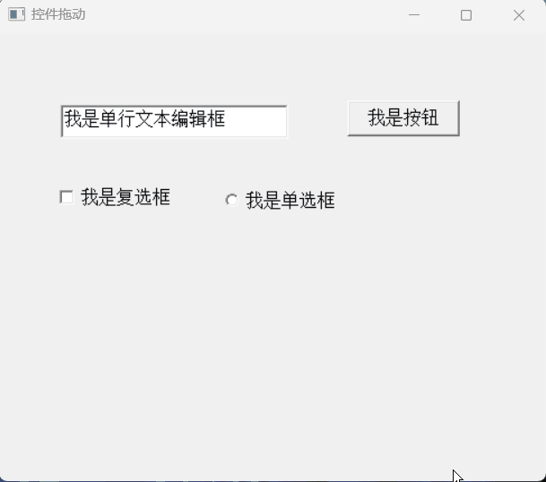
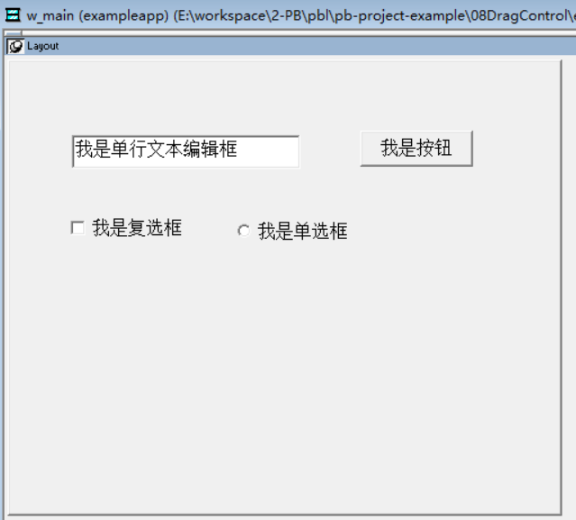
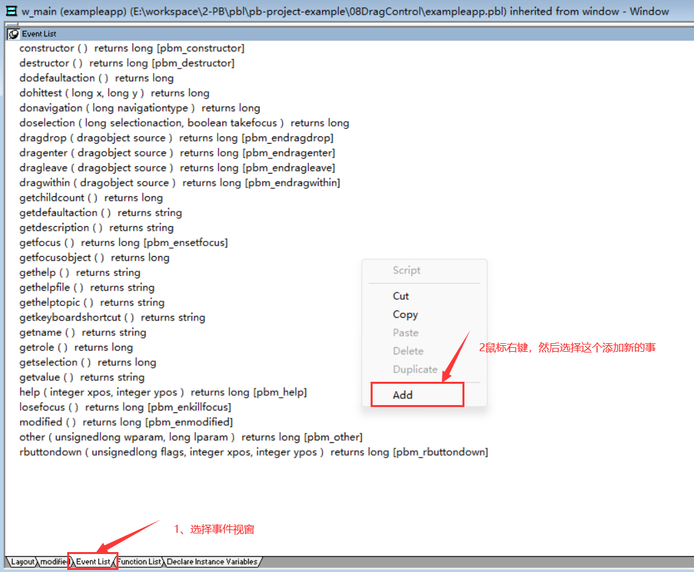
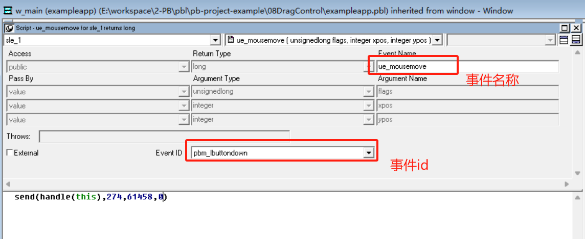

### 写在前面

这是PB案例学习笔记系列文章的第8篇，该系列文章适合具有一定PB基础的读者。

通过一个个由浅入深的编程实战案例学习，提高编程技巧，以保证小伙伴们能应付公司的各种开发需求。

文章中设计到的源码，小凡都上传到了gitee代码仓库[https://gitee.com/xiezhr/pb-project-example.git](https://gitee.com/xiezhr/pb-project-example.git)


需要源代码的小伙伴们可以自行下载查看，后续文章涉及到的案例代码也都会提交到这个仓库【**[pb-project-example](https://gitee.com/xiezhr/pb-project-example)**】

如果对小伙伴有所帮助，希望能给一个小星星⭐支持一下小凡。

### 一、小目标

本篇文章，我们通过`Send`函数，实现各种控件的拖动，即按住鼠标不放，将控件在窗口内任意移动。

最终实现效果如下



### 二、Send函数简介

> Send 函数用于向窗口发送消息，并立即被执行。这种方式无论是窗口中的控件还是窗口本事都适用

① 语法

```java
Send(handle,messageno,word,long)
```

② 参数说明

| 参数        | 类型              | 说明                                                         |
| ----------- | ----------------- | ------------------------------------------------------------ |
| `handle`    | `Long`            | 指定窗口的系统句柄，将向该窗口发送消息                       |
| `messageno` | `UnsignedInteger` | 指定要发送消息号                                             |
| `word`      | `Long`            | 指定与消息一起发送的Word类参数值。如果messageno参数指定的消息不适用该参数，那么将这个参数的值设置为0 |
| `long`      | `Long`或`String`  | 指定与消息一起发送的Long型参数值活字符串                     |

### 三、创建程序基本框架

① 创建`examplework` 工作区

② 创建`exampleapp`应用

③ 新建`w_main` 窗口，`Title` 设置为“拖动控件”

如果以上步骤忘记的小伙伴，克参照第一篇文章

④ 添加控件，进行窗口布局

在窗口中新建一个`SingleLineEdit`控件、一个`ComandButton` 控件、一个`CheckBox`控件和一个`RadioButton`控件，

各个控件名称依次为`sle_1`、`cb_1`、`cbx_1`和`rb_1`，调整控件，并设置控件属性如下图所示



⑤ 保存窗口

### 四、编写代码

① 在窗口中选择`sle_1`控件，为控件添加【`pbm_lbuttondown`】 事件，事件起名为`ue_mousemove ` 并添加如下代码





```java
send(handle(this),274,61458,0)
```

② 按照上面的方法，为控件`cb_1`、`cbx_1` 和`rb_1`添加事件，添加如下代码

```java
send(handle(this),274,61458,0)
```

③ 在窗口`w_main` 的`MouseDown`事件中添加如下代码

```java
send(handle(this),274,61458,0)
```

④ 在开发界面左边的`System Tree` 中双击`exampleapp`应用对象，在其`Open`事件中添加如下代码

```java
open(w_main)
```

### 五、运行程序

运行程序后，我们鼠标选择窗口上的任意一个控件，按住不放即可拖动控件


本期内容到这儿就结束了，希望对您有所帮助。

我峨嵋你下期再见 ヾ(•ω•`)o  (●'◡'●)