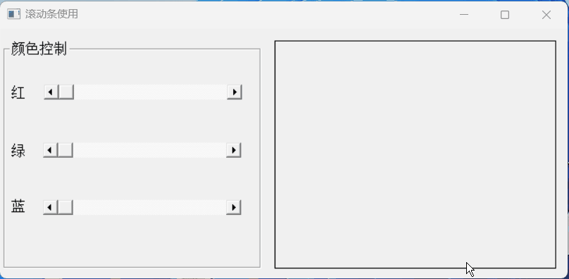
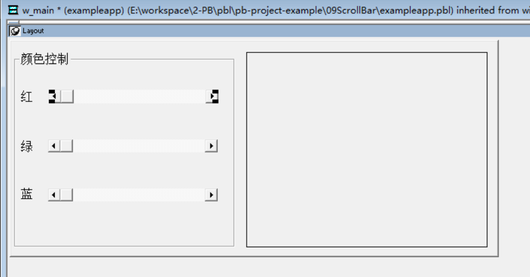
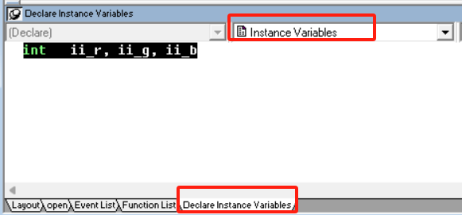

### 写在前面

这是PB案例学习笔记系列文章的第8篇，该系列文章适合具有一定PB基础的读者。

通过一个个由浅入深的编程实战案例学习，提高编程技巧，以保证小伙伴们能应付公司的各种开发需求。

文章中设计到的源码，小凡都上传到了gitee代码仓库[https://gitee.com/xiezhr/pb-project-example.git](https://gitee.com/xiezhr/pb-project-example.git)


需要源代码的小伙伴们可以自行下载查看，后续文章涉及到的案例代码也都会提交到这个仓库【**[pb-project-example](https://gitee.com/xiezhr/pb-project-example)**】

如果对小伙伴有所帮助，希望能给一个小星星⭐支持一下小凡。

### 一、小目标

通过本篇文章的学习，我们将掌握怎么使用`PB`提供的滚动条控件。

本示例中，我们通过控制滚动条来实现图框中不同颜色的显示



### 二、滚动条简介

当用户需要指定连续值而进行滑动控制时，就需要用到滚动条。而在`PB`中滚动条一共有两种，① `HScrollBar ` ② `VScrollBar`。

我们只需要要指定滚动条的`MinPosition`、`MaxPosition` 和`Position`就可以来控制滚动条

### 三、创建程序的基本框架

① 创建`examplework` 工作区

② 创建`exampleapp` 应用

③ 创建`w_main` 窗口，`Title` 设置为使用滚动条

以上步骤如果忘记了的小伙伴可以翻一翻第一篇文章

④ 创建控件，进行页面布局

向窗口中添加1个`GroupBox` 控件、4个`StaticText`控件和三个`HScrollBar` 滚动条。

控件名依次为` gb_1`、`st_1`、`st_2`、`st_3`、`st_4`、`hsb_r`、`hsb_g`和`hsb_b`

具体布局及属性设置如下

| 控件名称 | 属性          | 值            |
| -------- | ------------- | ------------- |
| `gb_1`   | `Text`        | 颜色控制      |
| `st_1`   | `Text`        | 红            |
| `st_2`   | `Text`        | 绿            |
| `st_3`   | `Text`        | 蓝            |
| `st_4`   | `Border`      | True          |
| `hsb_r`  | `MinPosition` | `MaxPosition` |
| `hsb_g`  | `MinPosition` | `MaxPosition` |
| `hsb_b`  | `MinPosition` | `MaxPosition` |




### 四、编写代码

① 设置实例变量

在下图视窗下设置实例变量



```java
int	ii_r, ii_g, ii_b
```

② 在滚动条控件`hsb_r` 的`lineleft` 事件中输入如下代码

> `lineleft` 事件是在用户点击滚动条上的左箭头按钮时触发的。用于处理用户向左滚动滚动条时的操作。

```java
if ii_r<10 then
	ii_r = 0
else
    // 每次向左滚动滚动条时，实例变量ii_r 减10
	ii_r = ii_r - 10
end if
//设置滚动条的位置    
this.position = ii_r
//设置控件st_4 背景颜色
st_4.backcolor = RGB(ii_r,ii_g,ii_b)
```

③ 同理在滚动条控件`hsb_r` 的`lineright` 事件中添加如下代码

> `lineright` 事件是在用户点击滚动条上的右箭头按钮时触发的。用于处理用户向右滚动滚动条时的操作。

```java
if ii_r>245 then
	ii_r =255
else
	ii_r = ii_r + 10
end if 
this.position = ii_r
st_4.backcolor = RGB(ii_r,ii_g,ii_b)
```

④ 在滚动条控件`hsb_r` 的`pageleft` 事件中输入如下代码

> `pageleft` 事件在左翻页的时候触发

```java
if ii_r<50 then
	ii_r = 0
else
	ii_r = ii_r - 50
end if
this.position = ii_r
st_4.backcolor = RGB(ii_r,ii_g,ii_b)
```

⑤ 同上在滚动条控件`hsb_r` 的`pageright` 事件中输入如下代码

> `pageright` 事件在右翻页的时候触发

```java
if ii_r>205 then
	ii_r = 255
else
	ii_r = ii_r + 50
end if
this.position = ii_r
st_4.backcolor = RGB(ii_r,ii_g,ii_b)
```

⑥ 在滚动条控件`hsb_r` 的`moved`事件中添加如下版本

>  `moved`  事件是在滚动条移动时触发。我们在该事件中设置滚动条位置和设置控件`st_4` 的背景颜色

```java
ii_r = this.position
st_4.backcolor = RGB(ii_r,ii_g,ii_b)
```

⑦ 我们在控件`hsb_g` 和`hsb_b` 同样的事件（`lineleft`,`lineright`,`pageleft`,`pagerigth`,`moved`）中，添加同样的代码

⑧ 在开发界面左边的`System Tree` 窗口中双击`exampleapp`应用，在其`Open`事件中添加如下代码

```java
open(w_main)
```

### 五、运行程序

运行程序后，我们就可以通过拉动滚动条配置出不同颜色

