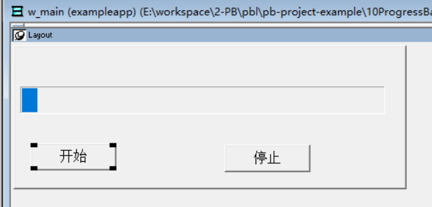
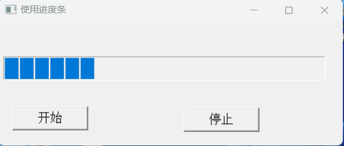

### 写在前面

这是PB案例学习笔记系列文章的第10篇，该系列文章适合具有一定PB基础的读者。

通过一个个由浅入深的编程实战案例学习，提高编程技巧，以保证小伙伴们能应付公司的各种开发需求。

文章中设计到的源码，小凡都上传到了gitee代码仓库[https://gitee.com/xiezhr/pb-project-example.git](https://gitee.com/xiezhr/pb-project-example.git)


需要源代码的小伙伴们可以自行下载查看，后续文章涉及到的案例代码也都会提交到这个仓库【**[pb-project-example](https://gitee.com/xiezhr/pb-project-example)**】

如果对小伙伴有所帮助，希望能给一个小星星⭐支持一下小凡。


### 一、小目标

在项目中，我们有时候会遇到检索大数据，文件下载等耗时比较长的功能。

这时候进度条就排上用场了，使用了进度条可以使交互界面比较友好。

`PB`中一共有`HProgressBar`和`VProgressBar`两种进度条，本篇文章，我们的目的就是创建一个进度条，模拟一个任务进度情况。

 最终效果如下图所示


### 二、创建程序基本框架

① 新建`examplework` 工作区

② 新建`exampleapp`应用

③ 新建`w_main`窗口。`Title`设置为进度显示

以上步骤如果忘记的小伙伴，可以翻一下第一篇文章复习一下

④ 添加控件，进行页面布局

在窗口中添加一个`HProgressBar`控件和两个`CommandButton` 控件。控件名称依次为`hpb_1`、`cb_1`和`cb_2`

将`hpb_1` 的`setstep`属性设置为2

| 控件名称 | 属性         | 值           |
| -------- | ------------ | ------------ |
| `hpb_1`  | `MinPositon` | `MaxPositon` |
| `cb_1`   | `Text`       | 开始         |
| `cb_2`   | `Text`       | 停止         |




### 三、编写代码

① 编写实例变量

```java
boolean ib_stop
```

② 在按钮`cb_1`的`clicked`事件中添加如下脚本

```java
long ll_step, ll_max
long ll_start, ll_used
ll_max = hPB_1.MaxPosition   //获取进度条的最大位置
for ll_step = 1 to ll_max
	Yield()                   //交出CPU控制权
	if ib_stop then           //根据实例变量，判断用户是否中断
		ib_stop = false
		Return
	end if
		hPB_1.stepIt()        //进度条前进一个步长
		ll_start = Cpu()      //获取当前时间，存入ll_start 变量
		ll_used = Cpu() - ll_start  //计算使用时间
		do while ll_used < 50       //延时
			ll_used = Cpu() - ll_start
		loop
Next
```

③ 在按钮`cb_2`的`clicked`事件中添加如下代码

```java
ib_stop = true
```

④ 在开发界面左边的`System Tree`窗口中双击 `exampleapp` 应用，在其`Open`事件中添加如下代码

```java
open(w_main)
```

### 四、运行程序

运行程序，点击开始按钮后如下图所示



### 五、进度条控件

#### 5.1 常用属性

① `MinPosition` 和`MaxPosition`属性

默认值分别是0和100，用来指定进度条上滑块最左（最上）最右（最下）位置时所代表的数值

② `Position`属性

这是一个非常中药的属性，决定进度条当前的位置

③ `SetStep`属性

指每次前进或者后退的幅度，默认值为10

④ `SmoothScroll` 属性

指定进度条是否平滑前进，默认为`False`,实际使用中建议将该值设置为`True`,这样界面显示效果会更好

#### 5.2 常用函数

① `OffsetPos` 函数  

语法：

```java
control.OffsetPos(Increment)
```

功能：

使进度条 control 中的光亮条前进 increment 长度 。当到达或超过进度条的最大值时不能自动重新开始。

例如，当前高亮条长度为 70，进度条 `hpb_1` 的最大值为 100，

使用函数 `hPB_1.OffsetPos(40)`只能使高亮条宽度为 100，而不是 10  

② `StepIt` 函数  

语法：

```java
control.StepIt()
```

功能：

使进度条 control 中的光亮条前进 `SetStep` 长度。当到达或超过进度条的最大值时可以重新开始。

例如，当前高亮条长度为 70，进度条 `hPB_1` 的最大值为 100，使用函数
`hPB_1.StepIt(40)`可以使高亮条宽度达到 100 后再到达 10 的位置。  

本期内容到这儿就结束了，希望对您有所帮助 *★,°*:.☆(￣▽￣)/$:*.°★* 。

我们下期再见 ヾ(•ω•`)o (●'◡'●)