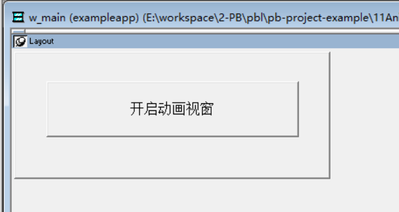
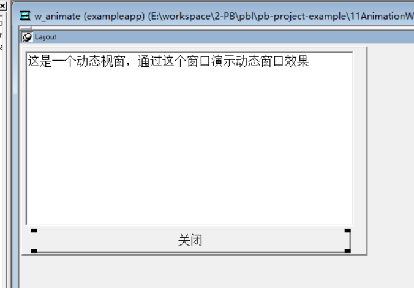
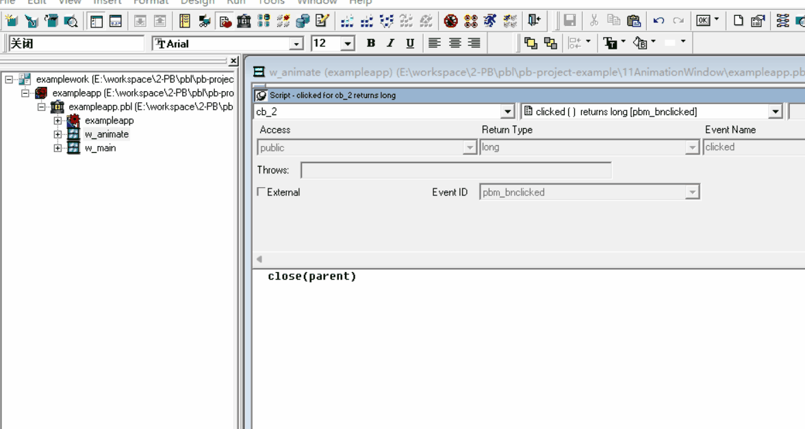

### 写在前面

这是PB案例学习笔记系列文章的第11篇，该系列文章适合具有一定PB基础的读者。

通过一个个由浅入深的编程实战案例学习，提高编程技巧，以保证小伙伴们能应付公司的各种开发需求。

文章中设计到的源码，小凡都上传到了gitee代码仓库[https://gitee.com/xiezhr/pb-project-example.git](https://gitee.com/xiezhr/pb-project-example.git)


需要源代码的小伙伴们可以自行下载查看，后续文章涉及到的案例代码也都会提交到这个仓库【**[pb-project-example](https://gitee.com/xiezhr/pb-project-example)**】

如果对小伙伴有所帮助，希望能给一个小星星⭐支持一下小凡。

### 一、小目标

本篇文章，我们要实现通过`user32`动态库的`AnimateWindow` 函数实现窗口的动画效果。

用`Randomize` 函数实现动画效果的随机控制。最终效果如下


### 二、AnimateWindow 函数简介

① 语法

```vb
function boolean AnimateWindow ( long hwnd, long dwtime, long dwflags ) library "user32" 
```

② 参数说明

**`hWnd`**:

- 类型：`HWND`
- 描述：指向要进行动画效果的窗口的句柄。获取窗口句柄可能需要通过特定的函数或属性，比如对于顶级窗口，可以使用`Open`事件的`Parent`参数或者窗口对象的句柄属性。

**`dwTime`**:

- 类型：`DWORD`
- 描述：动画持续的时间，单位为毫秒。例如，500表示动画持续半秒。

**`dwFlags`**:

- 类型：`DWORD`
- 描述：指定动画类型和方向的标志。可以是以下值的组合：
  - `AW_HOR_POSITIVE`（水平从左到右）
  - `AW_HOR_NEGATIVE`（水平从右到左）
  - `AW_VER_POSITIVE`（垂直从上到下）
  - `AW_VER_NEGATIVE`（垂直从下到上）
  - `AW_CENTER`（窗口从中心扩大或缩小）
  - `AW_HIDE`（隐藏窗口，缺省则显示窗口）
  - `AW_ACTIVATE`（激活窗口）
  - `AW_SLIDE`（滑动效果）
  - `AW_BLEND`（淡入淡出效果，需要Windows 2000或更高版本）


### 三、创建程序基本框架

① 新建工作区

② 新建`exampleapp`应用

③ 新建`w_main` 窗口。`Title` 设置为动画视窗

以上步骤如果忘记了的小伙伴可以翻一翻第一篇文章

④ 往窗口中添加控件

在`w_main`窗口中添加一个按钮控件`cb_1`,调整位置，将`Text`属性设置成开启动画视窗



⑤ 新建`w_animate` 窗口

将窗口`Title` 设置为动画窗口，并将其`Center`属性设置为`False`


⑥ 往`w_animate` 窗口 中添加控件

在`w_animate` 窗口中添加一个`MultiLineEdit`控件和一个`CommandButton`控件，分别命名为`mle_1` 和`cb_2`

将`mle_1` 的`Text`值设置为：这是一个动态视窗，通过这个窗口演示动态窗口效果，将`cb_2`的`Text`值设置为关闭



⑦ 保存窗口

### 四、编写代码

① 在`w_main`窗口中的`cb_1`按钮的`Clicked`事件中添加如下代码

```vb
open(w_animate)
```

② 在`w_animate`窗口的`Declare Instance Variables` 选项卡中添加如下实例变量

```vb
constant long AW_HOR_POSITIVE = 1 
constant long AW_HOR_NEGATIVE = 2 
constant long AW_VER_POSITIVE = 4 
constant long AW_VER_NEGATIVE = 8 
constant long AW_CENTER = 16 
constant long AW_HIDE = 65526 
constant long AW_ACTIVATE  = 131072 
constant long AW_SLIDE = 262144 
constant long AW_BLEND = 524288 

```

③ 在本地外部扩展函数(`Local External Functions`) 选项中添加如下代码

```vb
function boolean AnimateWindow ( long hwnd, long dwtime, long dwflags ) library "user32" 
```

④ 在`w_animate`窗口的`open`事件中添加如下代码

```vb
long ll_handle  
//获取当前窗口的句柄
ll_handle = Handle ( This ) 
//初始化随机数种子，确保每次运行都有不同的动画效果
Randomize ( 0 ) 
// 根据随机数选择不同的动画效果
Choose Case rand ( 6 ) 
	Case 1 
		  // 淡入并从底部向上滑动窗口
        // AW_SLIDE启用滑动效果
        // AW_VER_POSITIVE表示垂直方向从下到上
        // AW_ACTIVATE激活窗口
		AnimateWindow(ll_handle,1000,AW_SLIDE+AW_VER_POSITIVE+AW_ACTIVATE) 
	Case 2 
		// 淡入并从顶部向下滑动窗口
        // 同上，但AW_VER_NEGATIVE表示垂直方向从上到下
		AnimateWindow(ll_handle,1000,AW_SLIDE+AW_VER_NEGATIVE+AW_ACTIVATE) 
	Case 3 
		// 淡入并向右滑动窗口
        // 同上，但AW_HOR_POSITIVE表示水平方向从左到右
		AnimateWindow(ll_handle,1000,AW_SLIDE+AW_HOR_POSITIVE+AW_ACTIVATE) 
	Case 4 
		// 淡入并向左滑动窗口
        // 同上，但AW_HOR_NEGATIVE表示水平方向从右到左
		AnimateWindow(ll_handle,1000,AW_SLIDE+AW_HOR_NEGATIVE+AW_ACTIVATE) 
	Case 6,5 
		// 淡入并从中心展开窗口
        // 同上，但AW_CENTER表示窗口从中心扩大或缩小
		AnimateWindow(ll_handle,1000,AW_SLIDE+AW_CENTER+AW_ACTIVATE) 
End Choose 

```

⑤ 在`w_animate` 窗口的`Close`事件中添加如下代码

```vb
long ll_handle  
//获取该窗口句柄
ll_handle = Handle(This) 
//动画关闭窗口
AnimateWindow(ll_handle,300,AW_SLIDE+AW_HIDE+AW_CENTER) 

```

⑥ 在`w_animate`窗口的`Clicked`事件中添加如下代码

```vb
Close(w_animate)
```

⑦ 在开发界面左边的`System Tree` 窗口中双击`exampleapp`应用对象，在其`Open`事件中添加如下代码

```vb
open(w_main)
```

### 五、运行程序

运行程序，最终效果如下所示



本期内容到这儿就结束了，希望对您有所帮助。 *★,°*:.☆(￣▽￣)/$:*.°★* 。
我们下期再见 ヾ(•ω•`)o (●'◡'●)