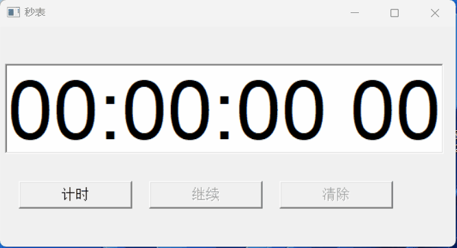
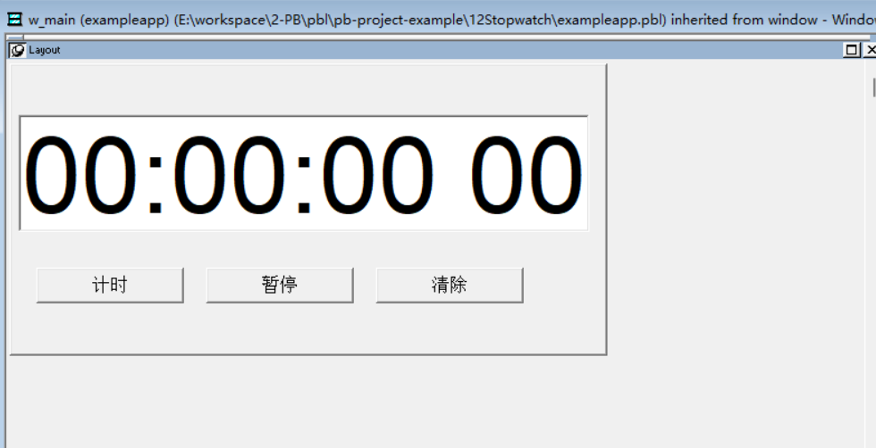
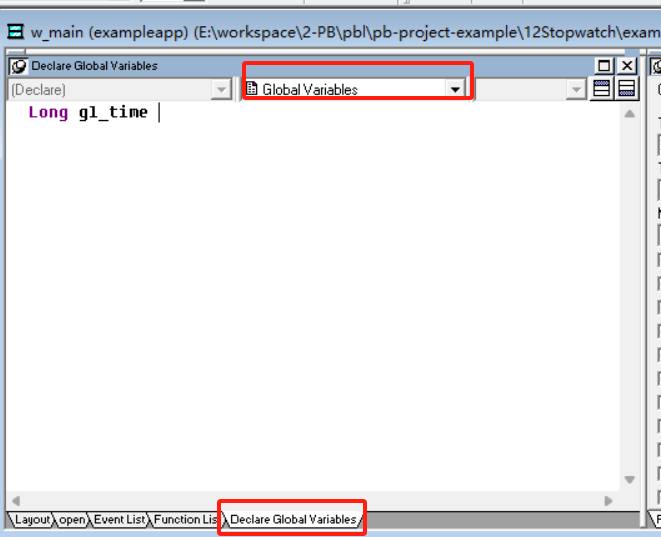
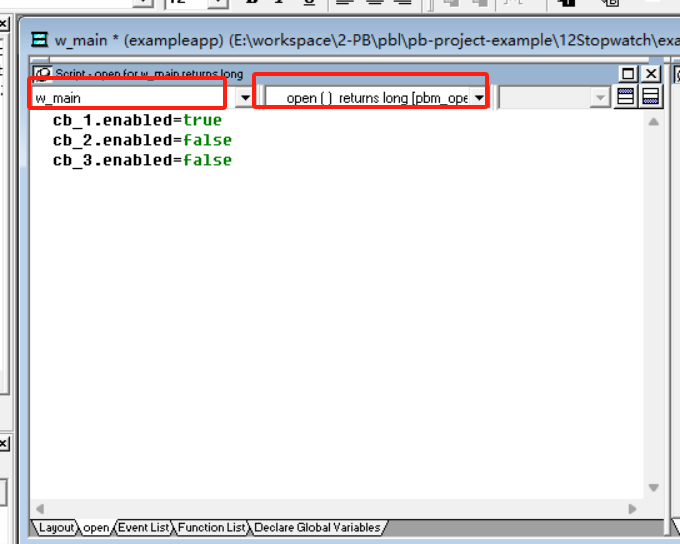
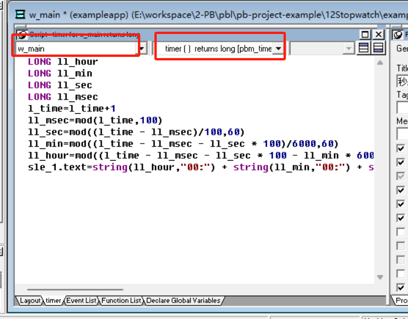

### 写在前面

这是PB案例学习笔记系列文章的第11篇，该系列文章适合具有一定PB基础的读者。

通过一个个由浅入深的编程实战案例学习，提高编程技巧，以保证小伙伴们能应付公司的各种开发需求。

文章中设计到的源码，小凡都上传到了gitee代码仓库[https://gitee.com/xiezhr/pb-project-example.git](https://gitee.com/xiezhr/pb-project-example.git)


需要源代码的小伙伴们可以自行下载查看，后续文章涉及到的案例代码也都会提交到这个仓库【**[pb-project-example](https://gitee.com/xiezhr/pb-project-example)**】

如果对小伙伴有所帮助，希望能给一个小星星⭐支持一下小凡。

### 一、小目标

这篇文章，我们将回顾`Time`事件得使用。最终实现一个计时秒表功能。

具体功能为界面上有【计时】、【暂停】、【清除】三个按钮，单击【计时】按钮，文本框中时间开始计时；

单击【暂停】按钮，文本框计时暂停，此时按钮文本变成【继续】字样；单击【继续】按钮，计时继续；

单击【清除】按钮，文本框数字归零，具体效果如下



### 二、创建程序基本框架

① 新建`examplework` 工作区

② 新建`exampleapp` 应用

③ 新建`w_main`窗口

以上步骤如果忘记的小伙伴可以翻一翻该系列的第一篇文章

④ 在`w_main`窗口中添加控件

在窗口中建立一个`SingleLineEdit`控件和3个`CommandButton`控件，各个控件名称依次为`sle_1`,`cb_1`，`cb_2`,`cb_3`

调整位置后布局如下图所示



⑤ 保存窗口

### 三、编写代码

> 为了实现秒表中的清零功能，我们需要用到一个全局变量

说到全局变量，我们这里列举出各种变量的作用域及使用说明

| 变量类型   | 中文名称 | 说明                                                         |
| ---------- | -------- | ------------------------------------------------------------ |
| `Global`   | 全局变量 | 在应用的任何地方都可以访问，可以在`Application`、`Window`、`UserObject`、`Function`、`Menu`中定义全局变量 |
| `Instance` | 实例变量 | 如同一个对象的属性，可以在``Application`、`Window`、`UserObject`、`Menu`中定义实例变量 |
| `Shared`   | 共享变量 | 共享变量在一个对象中定义，存在于这个对象的不同实例可以在``Application`、`Window`、`UserObject`、`Menu`中定义共享变量 |
| `Local`    | 局部变量 | 只能在定义的脚本中访问变量，可以在任何控件和对象的脚本中定义 |

① 定义全局变量

我们在`w_main`窗口中的`Declare Global Variables`选项卡中添加如下全局变量

```java
Long gl_time
```



② 窗口打开时，【计时】按钮可操作，【暂停】【清除】按钮不可以操作

在`w_main`窗口的`open`中添加如下代码

```java
cb_1.enabled=true
cb_2.enabled=false
cb_3.enabled=false
```



③ 编辑`Timer`事件代码

**这一步时最关键的,这段代码的主要功能是将一个表示总毫秒数的变量 `l_time` 更新为增加1毫秒后的新时间，并将更新后的时、分、秒和毫秒格式化为字符串显示在一个文本控件 `sle_1.text` 上。**

```java
// 定义了四个长整型变量，分别表示时、分、秒和毫秒
LONG ll_hour   // 小时
LONG ll_min    // 分钟
LONG ll_sec    // 秒
LONG ll_msec   // 毫秒

// 假设 `l_time` 是一个包含总毫秒数的变量，这里将其加1
gl_time = gl_time + 1

// 计算新的毫秒数，使用取模运算得到当前毫秒数
ll_msec = mod(gl_time, 100)

// 计算新的秒数，先减去毫秒部分，然后对100取模，再除以60得到秒数
ll_sec = mod((gl_time - ll_msec) / 100, 60)

// 计算新的分钟数，从剩余的时间中减去秒数，然后对60取模
ll_min = mod((gl_time - ll_msec - ll_sec * 100) / 6000, 60)

// 计算新的小时数，从剩余的时间中减去分钟和秒数，然后对3600取模
ll_hour = mod((gl_time - ll_msec - ll_sec * 100 - ll_min * 6000) / 360000, 60)

// 将时间格式化为字符串，如 "00:00:00 00"，并显示在控件 `sle_1.text` 上
sle_1.text = string(ll_hour, "00:") + string(ll_min, "00:") + string(ll_sec, "00") + string(ll_msec, " 00")
```



④ 添加【计时】按钮`Clicked`事件代码

```java
// 设置控件 `cb_1` 的启用状态为 false，使其不可用
cb_1.enabled = false

// 设置控件 `cb_2` 的启用状态为 true，使其可用
cb_2.enabled = true

// 设置控件 `cb_3` 的启用状态为 false，使其不可用
cb_3.enabled = false

// 修改 `cb_2` 的文本内容为 "暂停"
cb_2.text = "暂停"

// 将变量 `l_time` 设为0，可能用于记录某种计时或状态
gl_time = 0

// 调用 `timer` 函数，参数为0.01，这通常意味着设置一个定时器，每隔0.01秒执行一次回调函数
timer(0.01)
```

这段代码的解释如下：

1. 首先，用户点击了【计时】后禁用了 【计时】`cb_1` 按钮
2. 然后，启用了【暂停】 `cb_2` 按钮
3. 接着，禁用了【清除】 `cb_3` 控件，是为了防止在特定条件下使用
4. 修改【暂停】`cb_2` 按钮的文本为 "暂停"
5. `l_time` 变量被重置为0，用于初始化一个计时器或者表示某种状态的清零
6. 最后，调用 `timer` 函数，设置了一个定时器，每0.01秒触发一次回调函数

⑤ 添加【暂停】按钮`Clicked`事件代码

```java
// 设置控件 `cb_1` 的启用状态为 false，使其不可用
cb_1.enabled = false

// 设置控件 `cb_2` 的启用状态为 true，使其可用
cb_2.enabled = true

// 设置控件 `cb_3` 的启用状态为 true，使其可用
cb_3.enabled = true

// 判断 `cb_2` 的文本是否为 "暂停"
if cb_2.text = "暂停" then
	// 如果是，将 `cb_2` 的文本更改为 "继续"
	cb_2.text = "继续"
	
	// 停止定时器，可能停止之前的0.01秒定时器
	timer(0)
else
	// 如果不是（即文本为 "继续"），将 `cb_2` 的文本恢复为 "暂停"
	cb_2.text = "暂停"
	
	// 启动定时器，设置为每0.01秒执行一次
	timer(0.01)
end if
```

这段代码的功能是根据 `cb_2` 控件的文本内容来切换其状态和定时器的行为：

1. 首先，将【计时】`cb_1` 和 【暂停】`cb_2` 按钮被设置为可用状态，【清除】 `cb_3` 也是可用的。
2. 然后，检查 `cb_2` 的文本是否为 "暂停"。
3. 如果是 "暂停"，则将 `cb_2` 的文本更改为 "继续"，并停止计数
4. 如果不是 "暂停"（即当前文本是 "继续"），则将 `cb_2` 的文本改回 "暂停"，并重新启动定时器，设置为每0.01秒执行一次

**注意**，这里的 `timer(0)` 表示停止定时器，而 `timer(0.01)` 表示设置定时器每0.01秒触发一次

⑥ 添加【清除】按钮`Clicked`事件代码

```java
// 设置控件 `cb_1` 的启用状态为 true，允许用户与其交互
cb_1.enabled = true

// 设置控件 `cb_2` 的启用状态为 false，禁止用户交互
cb_2.enabled = false

// 设置控件 `cb_3` 的启用状态也为 false，同样不允许用户操作
cb_3.enabled = false

// 将控件 `sle_1`的文本设置为初始时间值 "00:00:00 00"，表示0小时0分钟0秒0毫秒
sle_1.text = "00:00:00 00"

// 重置变量 `l_time` 的值为0，这通常用于开始一个新的计时周期或作为时间累计的起点
gl_time = 0
```

代码解释：

1. 点击【清除】按钮后，**启用控件 `cb_1`**：允许用户点击【计时】 `cb_1`按钮继续操作
2. **禁用控件 `cb_2` 和 `cb_3`**：这两个控件暂时不允许用户操作
3. **重置时间显示**：将显示时间的控件 `sle_1` 的文本设置为 "00:00:00 00"，表示时间被重置为零
4. **重置计时变量**：将 `gl_time` 变量设置为0，这是计时的基础变量，用于累计时间

⑦ 在开发界面左边的`System Tree` 窗口中双击`exampleapp`并在其`Open`事件中添加如下代码

```java
open(w_main)
```


### 四、运行程序

以上代码添加完成后，我们运行程序，来测试一下是否达到了我们预期的效果


效果很好，达到了我们预期的效果，完结撒花  *★,°*:.☆(￣▽￣)/$:*.°★* 。*★,°*:.☆(￣▽￣)/$:*.°★* 。


本期内容到这儿就结束了，希望对您有所帮助。

我们下期再见 ヾ(•ω•`)o (●'◡'●)