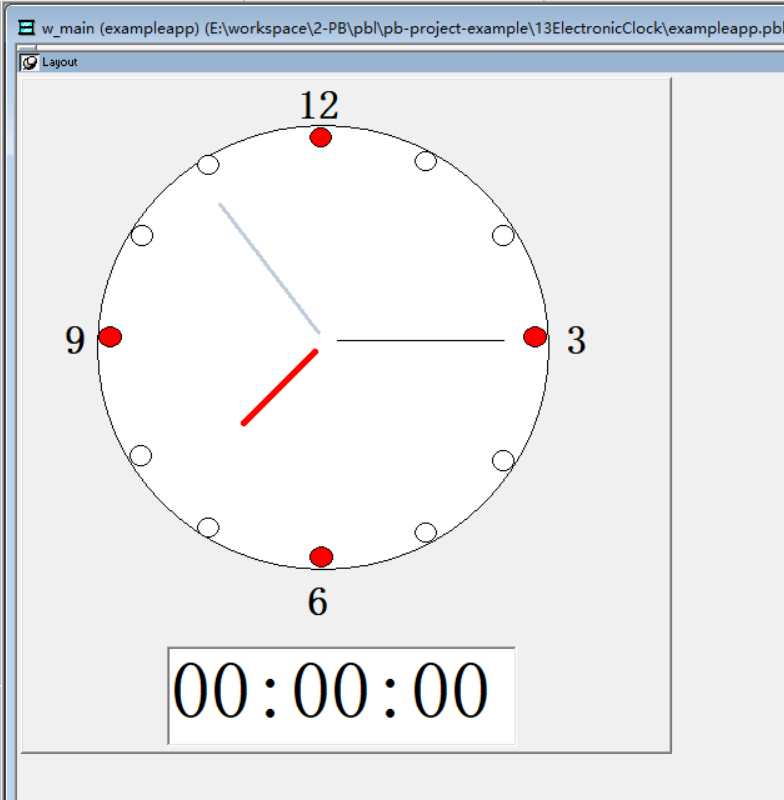
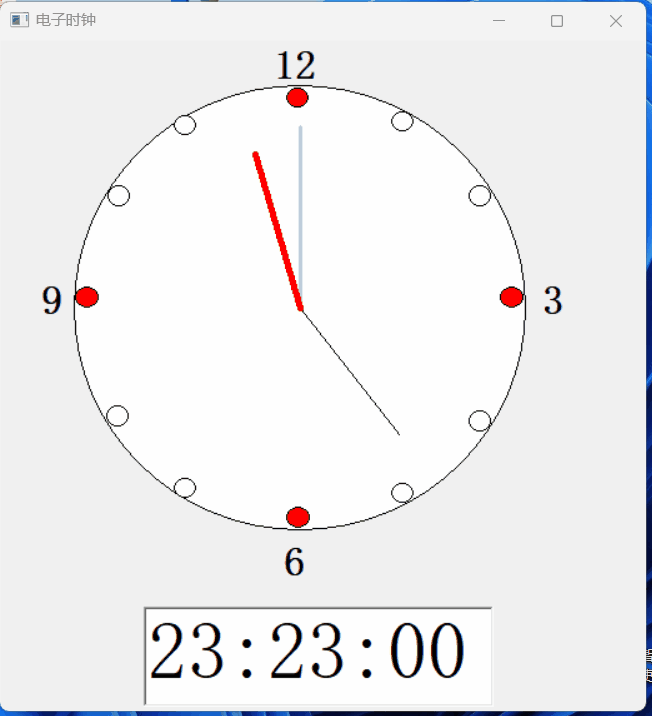

### 写在前面

这是PB案例学习笔记系列文章的第11篇，该系列文章适合具有一定PB基础的读者。

通过一个个由浅入深的编程实战案例学习，提高编程技巧，以保证小伙伴们能应付公司的各种开发需求。

文章中设计到的源码，小凡都上传到了gitee代码仓库[https://gitee.com/xiezhr/pb-project-example.git](https://gitee.com/xiezhr/pb-project-example.git)


需要源代码的小伙伴们可以自行下载查看，后续文章涉及到的案例代码也都会提交到这个仓库【**[pb-project-example](https://gitee.com/xiezhr/pb-project-example)**】

如果对小伙伴有所帮助，希望能给一个小星星⭐支持一下小凡。

### 一、小目标

上一篇中我们使用`Timer`时间制作了一个秒表，之后就有小伙伴问了，秒表都做了，能不能做个电子时钟呢？

当然可以了，这就安排上。这篇文章我们将使用到新的控件`Oval`来做一个钟表框，

利用`Now()`、`Hour`()、`Minute()`、`Second()`等日期时间函数将系统时间显示在文本框中；

利用`Sin()`、`Cos()`、`Pi()`等数学函数来来控制时针、分针、秒针实现下图所示的电子时钟；

利用`Window`的`Timer`时间让时钟走起来。最终实现下面的效果


### 二、时间日期函数

在之前的案例中我们并没有接触过日期时间函数，而这些函数在日常开发中也是使用比较频繁的。

现在我们来具体说说这些函数都是怎么用的。

| 函数名称       | 返回值    | 功能描述                       |
| -------------- | --------- | ------------------------------ |
| `Day`          | `Integer` | 返回日期的天数值               |
| `DayName`      | `String ` | 返回日期的星期值               |
| `DayNumber`    | `Integer` | 返回日期为该周的第几天         |
| `DaysAfter`    | `Long`    | 返回两个日期的间隔天数         |
| `Hour`         | `Integer` | 返回时间的小时值               |
| `Minute`       | `Integer` | 返回时间的分钟值               |
| `Month`        | `Integer` | 返回日期的月份值               |
| `Now`          | `Time`    | 返回系统的当前时间             |
| `RelativeDate` | `Date`    | 返回日期之后指定天数的日期     |
| `RelativeTime` | `Time`    | 返回指定时间前后指定秒数的时间 |
| `Second`       | `Integer` | 返回时间的秒数值               |
| `SecondAfter`  | `LOng`    | 返回两个时间的间隔秒数         |
| `Today`        | `Date`    | 返回系统当前日期               |
| `Year`         | `Integer` | 返回日期的年份                 |

### 三、Oval控件简介

> Oval控件是一种图形控件，用于在窗口或用户界面上绘制椭圆或圆形。

在这篇文章中我们就通过该控件绘制了一个表盘及各个时刻点

### 四、创建程序基本框架

① 建立`examplework`工作区

② 建立`exampleapp`应用

③ 新建`w_main`窗口，标题`Title`设置为电子时钟

以上步骤如果忘记的小伙伴可以翻一翻该系列的第一篇文章

④ 新建控件

在`w_main`窗口中新建一个`SingleLineEdit`控件、13个`Oval`控件和4个`StaticText`控件和3个`Line`控件

`SingleLineEdit`控件用来显示数字时间，一个`Oval`控件用来做钟表盘，其他12个`Oval`控件指示小时位置，

4个`StaticText`分别显示3、6、9、12 四个小时数值，3个`Line`控件分别作为时针、分针和秒针



⑤ 将上面画好的窗口保存为`w_main`

### 五、编写事件代码

① 定义全局变量

> 定义三个全局变量，分别表示小时、分钟、秒

```java
long  l_hour, l_Min,l_Sec
```

② 在`w_main`窗口的`open`事件中添加如下代码

```java
// 获取当前时间的秒数，并赋值给变量l_sec
l_sec = Second(Now())

// 获取当前时间的分钟数，并赋值给变量l_Min
l_Min = Minute(Now())

// 获取当前时间的小时数，并赋值给变量l_hour
l_hour = Hour(Now())

// 如果小时数大于12，将小时数转换为12小时制
if l_hour > 12 then
  l_hour = l_hour - 12
end if

// 设置线条ln_1的起始Y坐标为ov_1对象的Y坐标加上ov_1高度的一半
ln_1.BeginY = ov_1.y + ov_1.height / 2

// 设置线条ln_1的起始X坐标为ov_1对象的X坐标加上ov_1宽度的一半
ln_1.BeginX = ov_1.x + ov_1.width / 2

// 计算线条ln_1的结束Y坐标，基于当前秒数和角度45度，使用正弦函数
ln_1.EndY = ln_1.BeginY + 580 * Sin(Pi(l_sec + 45) / 30)

// 计算线条ln_1的结束X坐标，基于当前秒数和角度45度，使用余弦函数
ln_1.EndX = ln_1.BeginX + 580 * Cos(Pi(l_sec + 45) / 30)

// 设置线条ln_2的起始X和Y坐标与ln_1相同
ln_2.BeginX = ln_1.BeginX
ln_2.BeginY = ln_1.BeginY

// 计算线条ln_2的结束X坐标，基于当前分钟数和角度45度，使用正弦函数
ln_2.EndX = ln_2.BeginX + 550 * Sin(Pi(l_Min + 45) / 30)

// 计算线条ln_2的结束Y坐标，基于当前分钟数和角度45度，使用余弦函数
ln_2.EndY = ln_2.BeginY + 550 * Cos(Pi(l_Min + 45) / 30)

// 设置线条ln_3的起始X和Y坐标与ln_1相同
ln_3.BeginX = ln_1.BeginX
ln_3.BeginY = ln_1.BeginY

// 计算线条ln_3的结束X坐标，基于12小时制的小时数、分钟数和角度，使用正弦函数
ln_3.EndX = ln_3.BeginX + 520 * Sin(Pi(((12 - l_hour) * 60 - l_Min - 360) / 360))

// 计算线条ln_3的结束Y坐标，基于12小时制的小时数、分钟数和角度，使用余弦函数
ln_3.EndY = ln_3.BeginY + 520 * Cos(Pi(((12 - l_hour) * 60 - l_Min - 360) / 360))

// 调用定时器，通常会触发周期性执行这段代码
Timer(1)
```

③ 在`w_main`窗口的`Timer`事件中添加如下代码

```java
// 声明一个time类型变量t_now，用于存储当前时间
time t_now

// 获取当前系统时间，并赋值给t_now
t_now = Now()

// 提取当前时间的小时数，并赋值给整型变量l_hour
l_hour = Hour(t_now)

// 提取当前时间的分钟数，并赋值给整型变量l_min
l_min = Minute(t_now)

// 提取当前时间的秒数，并赋值给整型变量l_sec
l_sec = Second(t_now)

// 如果小时数大于12，将小时数转换为12小时制
if l_hour > 12 then
  l_hour = l_hour - 12
end if

// 将当前时间t_now转换为字符串，并设置滑块sle_1的文本
sle_1.text = String(t_now)

// 更新线条ln_1的结束Y坐标，基于当前秒数和角度45度，使用正弦函数
ln_1.EndY = ln_1.BeginY + 580 * Sin(Pi((l_Sec + 45) / 30))

// 更新线条ln_1的结束X坐标，基于当前秒数和角度45度，使用余弦函数
ln_1.EndX = ln_1.BeginX + 580 * Cos(Pi((l_Sec + 45) / 30))

// 更新线条ln_2的结束Y坐标，基于当前分钟数和角度45度，使用正弦函数
ln_2.EndY = ln_2.BeginY + 550 * Sin(Pi((l_Min + 45) / 30))

// 更新线条ln_2的结束X坐标，基于当前分钟数和角度45度，使用余弦函数
ln_2.EndX = ln_2.BeginX + 550 * Cos(Pi((l_Min + 45) / 30))

// 更新线条ln_3的结束X坐标，基于12小时制的小时数、分钟数和角度，使用正弦函数
ln_3.EndX = ln_3.BeginX + 520 * Sin(Pi(((12 - l_hour) * 60 - l_Min - 360) / 360))

// 更新线条ln_3的结束Y坐标，基于12小时制的小时数、分钟数和角度，使用余弦函数
ln_3.EndY = ln_3.BeginY + 520 * Cos(Pi(((12 - l_hour) * 60 - l_Min - 360) / 360))
```

③ 在开发界面左边的`System Tree`窗口中双击`exampleApp`应用对象，并在其`open`事件中添加如下代码

```java
open(w_main)
```

### 六、运行程序

到此大功告成了，一个简单的电子时钟基本完成了，我们来看看能不能达到我们预期的效果



本期内容到这儿就结束了，希望对您有所帮助*★,°*:.☆(￣▽￣)/$:*.°★* 。

我们下期再见    ヾ(•ω•`)o    (●'◡'●)