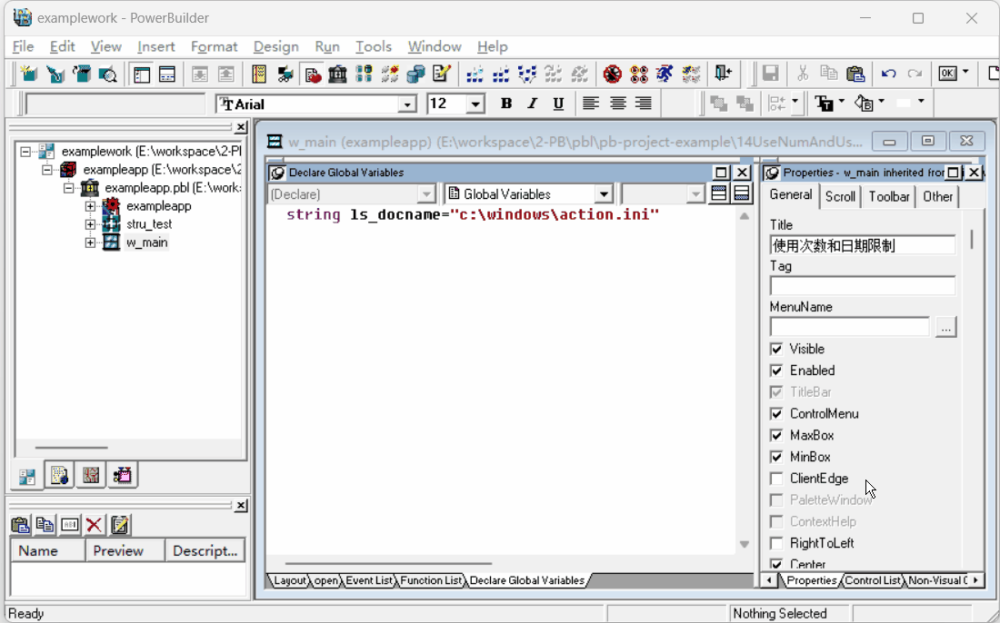
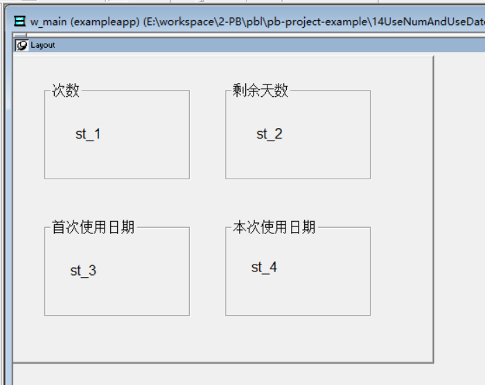
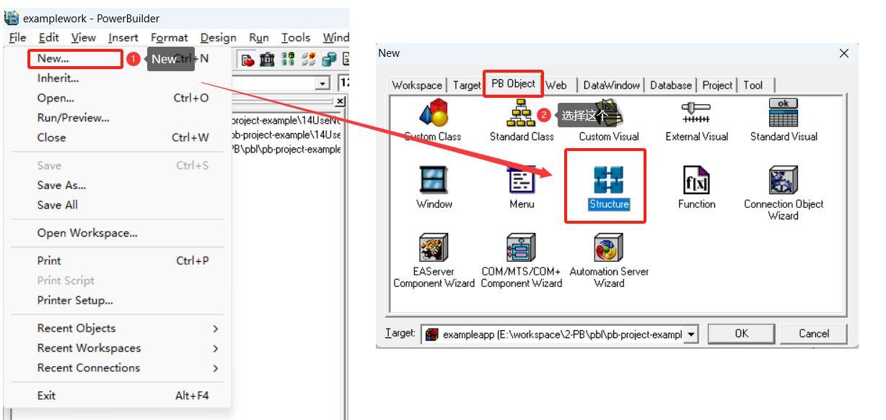
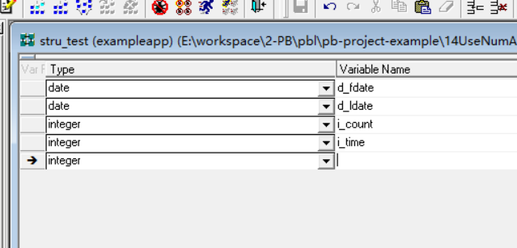

### 写在前面

这是PB案例学习笔记系列文章的第14篇，该系列文章适合具有一定PB基础的读者。

通过一个个由浅入深的编程实战案例学习，提高编程技巧，以保证小伙伴们能应付公司的各种开发需求。

文章中设计到的源码，小凡都上传到了gitee代码仓库[https://gitee.com/xiezhr/pb-project-example.git](https://gitee.com/xiezhr/pb-project-example.git)


需要源代码的小伙伴们可以自行下载查看，后续文章涉及到的案例代码也都会提交到这个仓库【**[pb-project-example](https://gitee.com/xiezhr/pb-project-example)**】

如果对小伙伴有所帮助，希望能给一个小星星⭐支持一下小凡。

### 一、小目标

这篇文章我们制作一个限制使用次数和日期的窗口。在实际工作中的使用场景是：当我们程序完成后需要将它提供给

客户试用时可以用到。用户通过试用，觉得程序🆗了，再进行购买。

案例中我们需要用到`Profilestring()` 和 `Profileint()` 读取和操作配置文件来记录使用次数和时间。

然后利用`结构`来进行数据交互。用到的这些我们会在后面的小节中详细介绍



### 二、 配置文件读取函数

#### 2.1 ProfileString函数

> 获取配置文件中指定节点内容

① 语法

```ini
ProfileString(filename,nodename,default_value)
```

② 参数

- `filename`–> 配置文件名称
- `nodename`–> 配置文件中的节点名称
- `default_value`–> 未找到指定的节或键，则返回的默认值

③ 返回

- 返回值：string
- 如果找到指定的节和键，则返回对应的值
- 如果未找到指定的节或键，则返回默认值default_value

④ 举个栗子

我们来获取项目根目录下xiezhr.in配置文件中的数据库用户名、密码、连接信息

```java
ls_username = ProfileString("xiezhr.ini","transaction","username","scott")
ls_password = ProfileString("xiezhr.ini","transaction","password","tiger")
ls_servername = ProfileString("xiezhr.ini","transaction","servername","127.0.0.1:1521/orcl")
```

#### 2.2 SetProfileString 函数

> 设置配置文件中指定节点内容

① 语法

```ini
SetProfileString(filename,nodename,sourcename,value)
```

② 参数

- `filename`–> 配置文件名称
- `nodename`–>节点名称
- `sourcename`–>节点下目标位置名称
- `value-->` 需要设置的值

③ 返回

- 返回值：`Integer`
- 如果成功写入值，则返回0
- 如果写入失败，则返回-1

④ 举个栗子

我们修改项目更目录下xiezhr.ini配置文件内容,将username值设置成xiezhr

```ini
SetProfileString('xiezhr.ini','transaction','username',xiezhr')
```


### 三、结构介绍

> 结构是多个相关变量的集合，这些变量可以具有相同的数据类型也可以具有不同的数据类型。
>
> 结构的所有元素可以作为一个整体引用

**结构类型**

- 全程结构

	不与应用程序中的任何具体对象相关联，并且可以在应用程序的任何地方使用

- 对象级结构

  与待定的窗口、菜单、用户对象或应用对象相关联，是对象定义的一部分。可以在对象本身的脚本中使用

**注：** 在定义结构时，如果定义的结构具有通用性并且在应用程序的任何地方都可以用到它，则把它定义为全程结构

如果要定义的结构只是用于某一特殊类型的对象，则定义为对象级结构即可


### 四、创建程序基本框架

> 在前面小节中已经把案例用到的相关知识做了简单介绍，还有一些文件打开`FileOpen()`，文件写入`FileWrite()`
>
> 在之前的文章中已经提到过，这里就不赘述了。接下来，我们就开始实操了

① 新建`examplework`工作区

② 新建`exampleapp`应用

③ 新建`w_main`窗口

④ 控件布局

在窗口中建立4个`GroupBox`控件和4个`StaticEdit`控件，调整控件大小位置，并修改`text`属性内容

修改完如下图所示，控件分别命名为`gb_1 ~ gb_4 ` 和`st_1  ~ st_4`



⑤ 保存窗口

### 五、建立结构

① 添加结构

单击工具栏`File`--->`New` 命令，在弹出的New对话框中选择`PB Object` 选项卡中的`Structure`图标，单击【ok】按钮完成创建



② 定义结构

上一步中单击【ok】按钮之后，会出现结构定义画版，具体如下图所示，在滑板中定义结构




③ 保存为结构`stru_test`

定义完成后将结构命名为`stru_test`

### 六、编写代码

① 定义全局变量

双击系统视窗中`exampleapp`应用图标，在`Declare Global Variables`选项卡中输入如下代码

```java
string ls_docname="c:\windows\action.ini"
```

② 定义实例变量

在`Declare Instance Variables` 选项卡中添加如下代码

```java
date id_firstdate  //首次使用日期
date id_lastdate //本次使用日期
integer ii_CanUseDays   //限制使用天数
integer ii_count  //统计启动次数
stru_test stru      //向主窗口传递参数
```

③ 在`exampleapp` 应用中添加`u_openwin(integer ai_usedays) return boolean` 函数，代码如下

```java
/*
函数:u_openwin
功能:如果剩余天数<=0，返回false;否则向结构赋值,返回true
*/

if ai_usedays>ii_canusedays then
	return false
else
	stru.d_fdate=id_firstdate
	stru.d_ldate=id_lastdate
	stru.i_time=ii_canusedays - ai_usedays
	stru.i_count=ii_count
	return true
end if
```

④ 在`exampleapp`应用中添加`u_lastdays() return integer` 函数，代码如下

```java
/* 
 function: u_lastdays
 功能：
		1.判断系统日期是否被推后,系统日期被推后,返回-1  
		2.正常,返回剩余天数
		3.将last_data设位当前日期
*/
boolean lb_exist
int li_ret

id_lastdate=date(profilestring(ls_docname, "data", "last_data", string(today())))
id_firstdate=date(profilestring(ls_docname, "data", "first_data", string(today())))
ii_CanUseDays=profileint(ls_docname, "data", "times", 30)

li_ret=DaysAfter(id_lastdate,today())

if li_ret < 0 then   
	return li_ret   
else 	
	id_lastdate=today()
	setprofilestring(ls_docname, "data", "last_data", string(id_lastdate))
	li_ret=DaysAfter(id_firstdate,id_lastdate)
	return li_ret     
end if
```

⑤  在`exampleapp`应用中添加`u_newfile() return integer` 函数，代码如下

```java
/* 
 function: u_newfile
 功能：
	 1."c:\windows\SYSTEM\action.ini"文件存在，返回软件已经使用的次数；
	 2.如果action.ini文件不存在，创建该文件，设置软件使用次数为0，设置
	 软件初始使用日期为当前日期
*/
integer li_FileNum
boolean lb_exist

lb_exist = FileExists(ls_docname)

IF lb_exist THEN 
	ii_count=Profileint ( ls_docname, "data", "count", 0 )
	ii_count++
	SetProfileString(ls_docname, "data", "count", string(ii_count))
	return ii_count
else
	li_FileNum = FileOpen(ls_docname,LineMode!, Write!, Shared! , Append!)
	FileWrite(li_FileNum, "[data]~r~nfirst_data = "+string(today())+"~r~n"+&
	"last_data = "+string(today())+"~r~ntimes = 30~r~ncount = 0")
	return 0
end if

```

⑥ 在`exampleapp` 应用的`open` 时间中添加如下代码

```java
/*
功能：1、判断软件使用天数，如果软件使用天数小于0，说明用户推迟了系统日期,提示用户并返回；
		2、软件使用天数大于0，判断软件是否到期，如果到期提示用户并返回；
		3、打开主窗口，通过结构stru_test向主窗口传递参数
*/

int li_usedays       

this.u_newfile()              //软件使用的次数
li_usedays=this.u_lastdays()  //软件已经使用的天数

if li_usedays < 0 then 
	messagebox("提示信息","您推迟了系统日期"+string(abs(li_usedays))+"天,系统无法加载!",stopsign!)
	return
else
	
	if this.u_openwin(li_usedays) then
		openwithparm(w_main,stru)
	else
		messagebox("提示信息","请原谅,您的软件已经到期!")
	end if
end if

```

⑦ 在`w_main`窗口的`open`事件中添加如下代码

```java
stru_test stru
string ls_days
stru=message.PowerObjectparm
st_1.text=string(stru.i_count)
st_2.text=string(stru.i_time)
st_3.text=string(stru.d_fdate)
st_4.text=string(stru.d_ldate)
```

### 七、运行程序

> 代码写完了，我们验证一下看看程序能不能达到我们的预期效果


本期内容到这儿就结束了，希望对您有所帮助 *★,°*:.☆(￣▽￣)/$:*.°★* 。

我们下期再见