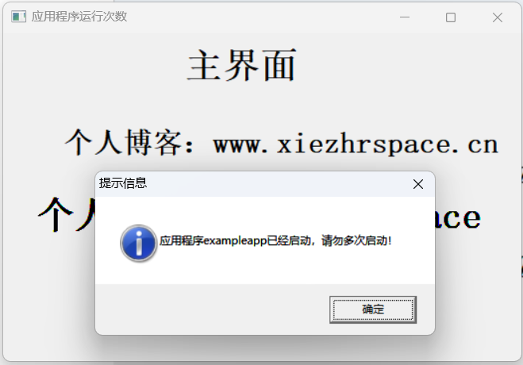
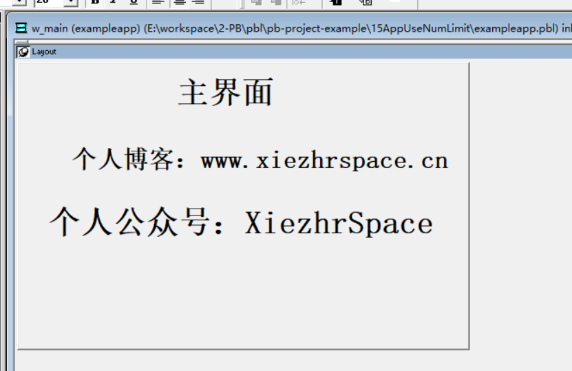
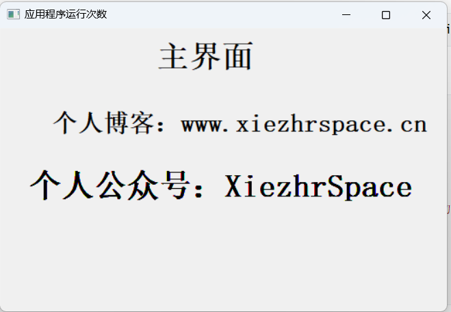

### 写在前面

这是PB案例学习笔记系列文章的第15篇，该系列文章适合具有一定PB基础的读者。

通过一个个由浅入深的编程实战案例学习，提高编程技巧，以保证小伙伴们能应付公司的各种开发需求。

文章中设计到的源码，小凡都上传到了gitee代码仓库[https://gitee.com/xiezhr/pb-project-example.git](https://gitee.com/xiezhr/pb-project-example.git)


需要源代码的小伙伴们可以自行下载查看，后续文章涉及到的案例代码也都会提交到这个仓库【**[pb-project-example](https://gitee.com/xiezhr/pb-project-example)**】

如果对小伙伴有所帮助，希望能给一个小星星⭐支持一下小凡。

### 一、小目标

本次案例中，我们实现这么一个需求。应用程序已经在运行的时候，若再次双击应用程序运行程序，

则弹出提示框提示：应用程序已启动，请勿多次启动。

这样的需求在日常开发中也是经常遇到的，其实这个功能实现起来非常简单。



### 二、实现思路

程序运行时，窗口一般是由`Application`的`Open`事件打开，如果在`Open`事件中以系统主窗口的标题`Title`作为依据，

若有其他与此`Title`同名应用程序运行，再想启动此程序就可以判断出程序是否在运行，从而实现限制程序运行次数功能了


### 三、创建程序基本框架

① 新建`examplework` 工作区

② 新建`exampleapp`应用

③ 建立`w_main` 窗口，`Title`设置为"应用程序运行次数"

由于篇幅原因，以上步骤不详细展开，如果忘记了的小伙伴可以翻一翻之前的文章

④ 简单进行界面布局

我们在`w_main`窗口上新建3个`StaticText`,分别命名为`st_1`、`st_2`、`st_3`。修改3个控件的`Text`属性如下



### 四、编写代码

双击开发界面左边的`System Tree`中的`exampleapp`应用对象

① 在`Declare Global External Functions`选项卡中添加动态库user32引用

```java
FUNCTION long FindWindowA( ulong Winhandle, string wintitle ) Library "user32" 
```

②在其`Open`事件中添加如下代码

```java
ulong l_handle,lu_class
string ls_name
ls_name = "应用程序运行次数"
l_handle = FindWindowA(lu_class,ls_name)
if l_handle > 0 then
	MessageBox("提示信息","应用程序" + This.AppName + "已经启动，请勿多次启动！")
	halt close
else
	open(w_main)
end if
```

### 五、运行程序

我们只用添加上述代码即可实现需求功能，是不是很简单。接下来，程序是否达到我们预期效果

① 我们先运行程序，正常出现下面



② 我们在打开一个`PB`,在同样的方法运行程序，结果会有下面弹框提示。

达到了应用程序只能运行一次的效果，完结撒花 *★,°*:.☆(￣▽￣)/$:*.°★* 。


本期内容到这儿就要结束了，希望对您有所帮助。*★,°*:.☆(￣▽￣)/$:*.°★* 。
我们下期再见 (●'◡'●) ヾ(•ω•`)o