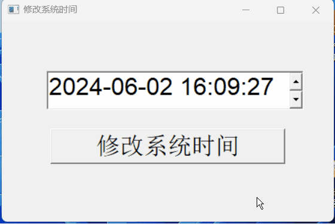
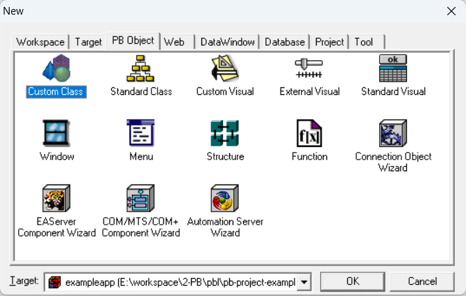
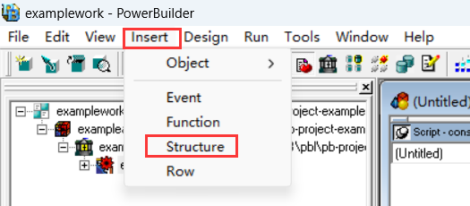
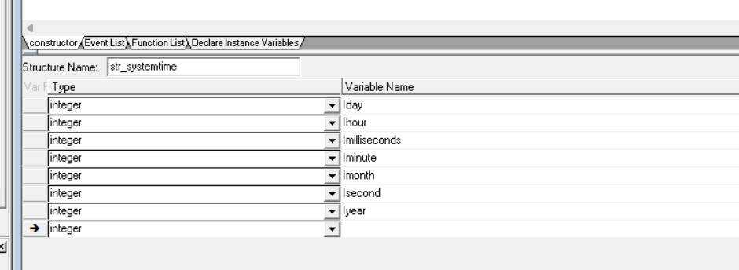
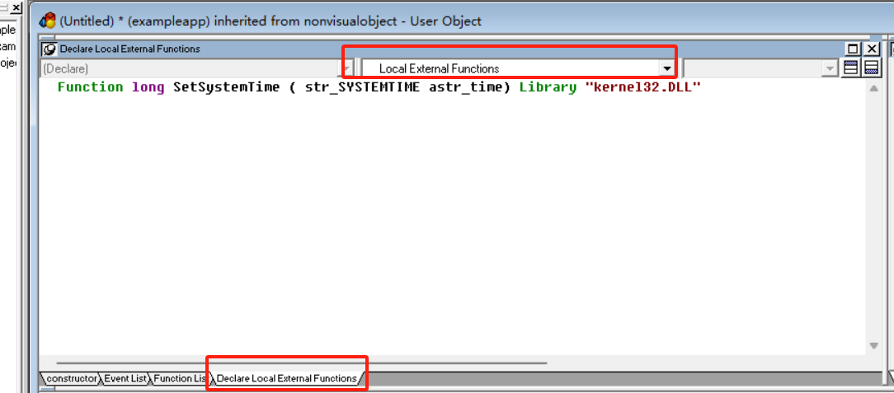
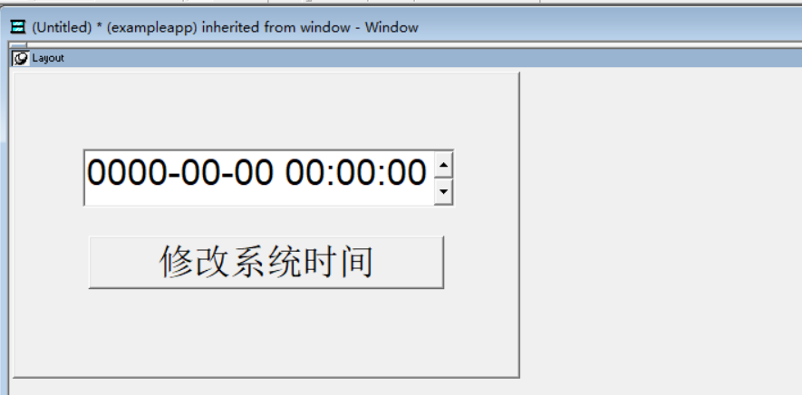
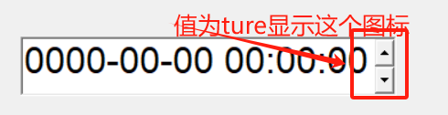

### 写在前面

这是PB案例学习笔记系列文章的第16篇，该系列文章适合具有一定PB基础的读者。

通过一个个由浅入深的编程实战案例学习，提高编程技巧，以保证小伙伴们能应付公司的各种开发需求。

文章中设计到的源码，小凡都上传到了gitee代码仓库[https://gitee.com/xiezhr/pb-project-example.git](https://gitee.com/xiezhr/pb-project-example.git)


需要源代码的小伙伴们可以自行下载查看，后续文章涉及到的案例代码也都会提交到这个仓库【**[pb-project-example](https://gitee.com/xiezhr/pb-project-example)**】

如果对小伙伴有所帮助，希望能给一个小星星⭐支持一下小凡。

### 一、小目标

本案例中我们要制作一个修改系统时间的程序。程序运行后，会弹出一个显示当前系统时间的编辑框。

我们可以对编辑框中日期时间进行修改，然后点击【修改系统时间】按钮，对系统时间进行修改。



在程序中我们需要调用外部函数`SetSystemTime`函数来实现日期时间修改，在函数使用过程中

我们将引入新的知识点**类用户对象** （Custom Class）,它在日常开发中也是使用频率很高的


### 二、类用户对象

① 含义：

用于定义作为整体使用的业务准则和标准处理过程，使用**类用户对象**时，我们通过创建该对象的实例，然后通过实例调用它的函数

② 类型：

- 标准类用户对象

  继承`PowerBuilder`内置非可视对象定义，通过编写代码扩展出新功能，以满足程序的特殊需求

- 定制类用户对象

       用于封装不需要可视性的处理过程，不继承某个`PowerBuilder`对象，完全由设计人员通过定义实例变量、函数、事件来完成

### 三、创建程序基本框架

① 新建`examplework` 工作区

② 新建`exampleapp`应用

由于篇幅原因，以上步骤不再赘述，如果忘记了的小伙伴可以翻一翻该系列的第一篇文章

### 四、建立`uo_settime`用户类

① 单击工具栏上的`File-->New`命令，在弹出的对话框中选择`PB Object`选项卡中的`Custom Class`图标，

然后点击【OK】按钮建立类用户对象



② 建立结构`str_systemtime`

在工具栏上的`Insert-->Structure`命令，然后按下表建立结构





③ 引入外部函数

在`Custom Class`的`Declare Local External Function` 选项卡中添加如下代码引入外部函数

```java
Function long SetSystemTime ( str_SYSTEMTIME astr_time) Library "kernel32.DLL"
```



④ 在`Function List`选项卡中，添加`of_settime`函数，函数代码如下

```java
// 设置系统时间
date ld_date
time ld_time 
str_systemtime lstr_stru 

// 从当前系统时间中获取日期和时间
ld_date = date(ad_time) 
ld_time = time(ad_time) 

// 将时间调整为UTC时间（减去8小时）
lstr_stru.iHour = Hour(ld_time) 
lstr_stru.iMinute = Minute(ld_time) 
lstr_stru.iSecond = Second(ld_time) 
If lstr_stru.iHour - 8 < 0 Then 
    ld_date = RelativeDate(ld_date, -1) 
    lstr_stru.iHour = 24 - abs(lstr_stru.iHour - 8) 
Else 
    lstr_stru.iHour -= 8 
End If 

// 将日期和时间存储在结构体中的相应字段中
lstr_stru.iYear = year(ld_date) 
lstr_stru.iMonth = month(ld_date) 
lstr_stru.iDay = day(ld_date) 
lstr_stru.iDayOfWeek = dayNumber(ld_date) 
lstr_stru.iMilliseconds = 1 

// 调用setsystemtime函数设置系统时间
If setsystemtime(ref lstr_stru) <> 0 Then 
    // 设置成功
    Return 1 
Else 
    // 设置失败
    Return -1 
End If
```

⑤ 报错用户对象为`uo_settime`

### 五、建立`w_main`窗口

① 建立窗口

② 布局控件

在`w_main`窗口上新建一个`EditMask`控件和一个`CommandButton`控件，调整布局如下



③ 设置控件属性

| 控件名称     | 属性           | 值                    |
| ------------ | -------------- | --------------------- |
| `w_main`窗口 | `Title`        | 设置系统时间          |
| `em_1`       | `Mask`         | `yyyy-mm-dd hh:mm:ss` |
| `em_1`       | `MaskDateType` | `Datetimemask!`       |
| `em_1`       | `Spin`         | `True`                |
| `cb_1`       | `Text`         | 修改系统时间          |

- `MaskDateType` :设置格式类型为日期时间

- `Mask`: 设置日期格式化

- `Spin`: 显示出上下小图标调整时间

  

④ 保存窗口为`w_main`

### 六、编写代码

① 在`w_main`窗口的`Open`中添加如下代码

```java
em_1.text = string(today(),'yyyy/mm/dd') + " " + string(now(),"hh:mm:ss")
```

② 在按钮【修改系统时间】`cb_1` 的`clicked`事件中添加如下代码

```java
uo_settime luo_settime
datetime 	ld_time

ld_time = datetime(date(left(em_1.text, 10)), & 
							time(right(em_1.text, 8)))
If luo_settime.of_settime(ld_time) = 1 Then
	Messagebox("确认","设置时间成功！")
Else
	MessageBox("错误","时间设置失败，请检查格式是否正确，应该是yyyy-mm-dd hh:mm:ss")
End If

```

③ 在开发界面左边的`System Tree`窗口中单击`exampleapp`应用对象，在其`Open`事件中输入如下代码

```java
open(w_main)
```

### 七、运行程序

到此，程序开发完成了 *★,°*:.☆(￣▽￣)/$:*.°★* 。 我们来运行程序看看是否达到预期效果


本期内容到这儿就结束了，希望对您有所帮助*★,°*:.☆(￣▽￣)/$:*.°★* 。

我们下期再见 ヾ(•ω•`)o (●'◡'●)