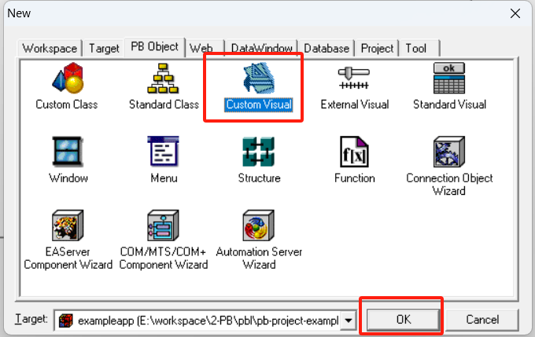
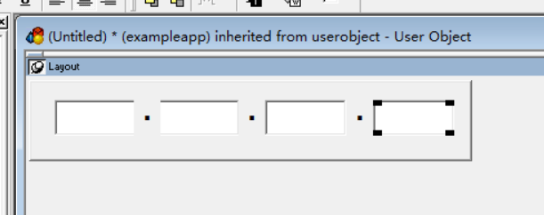
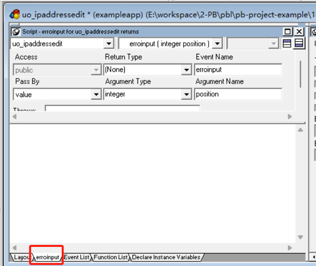
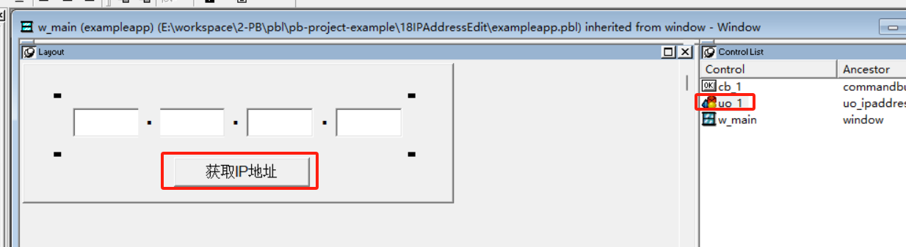
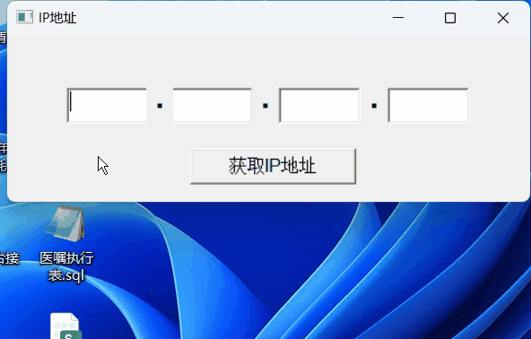

### 写在前面

这是PB案例学习笔记系列文章的第18篇，该系列文章适合具有一定PB基础的读者。

通过一个个由浅入深的编程实战案例学习，提高编程技巧，以保证小伙伴们能应付公司的各种开发需求。

文章中设计到的源码，小凡都上传到了gitee代码仓库[https://gitee.com/xiezhr/pb-project-example.git](https://gitee.com/xiezhr/pb-project-example.git)


需要源代码的小伙伴们可以自行下载查看，后续文章涉及到的案例代码也都会提交到这个仓库【**[pb-project-example](https://gitee.com/xiezhr/pb-project-example)**】

如果对小伙伴有所帮助，希望能给一个小星星⭐支持一下小凡。

### 一、小目标

在许多应用程序中，经常需要用户输入网络中某个节点的IP地址，而且IP地址需要符合一定的格式。

在本案例中我们将创建一个IP编辑框来提供用户输入，并且在控件失去焦点时校验用户输入的是否合法，如果不合法给出错误提示。

在程序中会用到几个新知识点①`LoseFous` 事件 ② 可视化对象创建

最终实现如下效果


### 二、思路分析

由于IP地址每个数字应该在 0~255 之间，一个框输入完之后，我们按`Enter`键光标会跳到下一个输入框。这是输入框控件的

`LoseFous`事件会被触发，我们只需将数字校验写在该事件中即可


### 三、创建程序基本框架

有个基本思路之后，我们就可以动手写程序了

① 新建`examplework`工作区

② 新建`exampleapp` 应用

③ 新建`w_main`窗口，`Title`设置为`IP`地址

由于篇幅原因，以上步骤就不在重复写了。如果忘记了的小伙伴可以翻一翻该系列的第一篇文章

### 四、创建定制可视化用户对象

① 新建定制可视化用户对象

单击菜单栏上的`File-->New`命令，在`New`对话框的`PB Object`选项卡中选择`Custom Visual`图标，

单击`OK`按钮，完成可视化用户对象创建



② 在用户对象中添加控件

在新建的用户对象中添加4个`StaticText`控件和4个`SingleLineEdit`控件，控件分别命名为`st_1 ~st_3` 和`sle_1 ~sle_4`.

`st_1 ~st_3`控件的`Text`值设置为"."。

具体如下图所示



③ 保存对象为`uo_ipaddressedit`


### 五、编写代码

① 在`uo_ipaddressedit` 对象中添加`of_checkpart(string part) return integer`函数

校验输入值是否符合规范，代码如下

```java
integer ret
setnull(ret)
if isnull(part) then return ret
if not isnumber(part) then return -1
if integer(part) < 0 then return -1
if integer(part) > 255 then return -1
return 1
```

② 在`uo_ipaddressedit` 对象中添加`of_getipaddress() return string` 函数，具体代码如下

```java
if of_checkpart(sle_1.text) = -1 then return ""
if of_checkpart(sle_2.text) = -1 then return ""
if of_checkpart(sle_3.text) = -1 then return ""
if of_checkpart(sle_4.text) = -1 then return ""
string ls_ip
ls_ip = sle_1.text
ls_ip = ls_ip + "." + sle_2.text
ls_ip = ls_ip + "." + sle_3.text
ls_ip = ls_ip + "." + sle_4.text
return ls_ip
```

③ 在在`uo_ipaddressedit` 对象中添加`erroinput`事件，代码为空



④ 在`sle_1`控件的`LoseFocus` 事件中添加如下代码

```java
if of_checkpart(sle_1.text)= -1 then
	sle_1.setfocus()
	event erroinput(1)
end if
return 0
```

⑤ 在`sle_2`控件的`LoseFocus` 事件中添加如下代码

```java
if of_checkpart(sle_2.text)= -1 then
	sle_2.setfocus()
	event erroinput(2)
end if
return 0
```

⑥ 在`sle_3`控件的`LoseFocus` 事件中添加如下代码

```java
if of_checkpart(sle_3.text)= -1 then
	sle_3.setfocus()
	event erroinput(3)
end if
return 0
```

⑦ 在`sle_4`控件的`LoseFocus` 事件中添加如下代码

```java
if of_checkpart(sle_4.text)= -1 then
	sle_4.setfocus()
	event erroinput(4)
end if
return 0
```

### 六、设置`w_main` 窗口控件

在`w_main`窗口中添加一个`uo_ipaddressedit` 对象和一个`CommandButton`控件。分别命名为`u0_1`和`cb_1`

其中`cb_1`按钮的`Text`值设置为"获取IP地址"，各个控件布局如下图所示




### 七、编写w_main 窗口中相关代码

① 在`w_main`窗口的`u0_1`控件的`errinput`事件中输入如下代码

```java
MessageBox("错误消息","IP地址的第" + string(Position) +"部分出现了格式错误！")
```

② 在`cb_1`按钮的`Clicked`事件中添加如下代码

```java
MessageBox("提示信息","IP地址为：" + uo_1.of_getipaddress())
```

③ 在开发界面左边的`System Tree` 窗口中双击`exampleapp`应用对象，并在其`Open`事件中添加如下代码

```java
open(w_main)
```

### 八、运行程序

代码添加完成，看看我们的劳动成果如何




本期内容到这儿就结束了，希望对您有所帮助。*★,°*:.☆(￣▽￣)/$:*.°★* 。

我们下期再见 (●'◡'●) ヾ(•ω•`)o