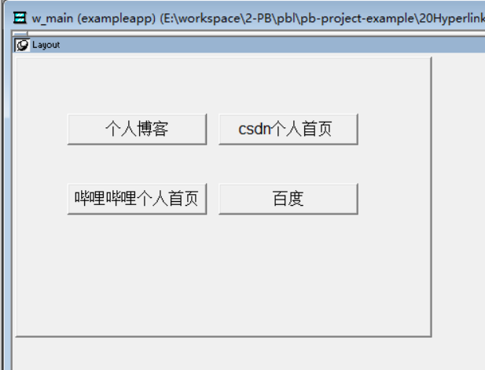

### 写在前面

这是PB案例学习笔记系列文章的第19篇，该系列文章适合具有一定PB基础的读者。

通过一个个由浅入深的编程实战案例学习，提高编程技巧，以保证小伙伴们能应付公司的各种开发需求。

文章中设计到的源码，小凡都上传到了gitee代码仓库[https://gitee.com/xiezhr/pb-project-example.git](https://gitee.com/xiezhr/pb-project-example.git)


需要源代码的小伙伴们可以自行下载查看，后续文章涉及到的案例代码也都会提交到这个仓库【**[pb-project-example](https://gitee.com/xiezhr/pb-project-example)**】

如果对小伙伴有所帮助，希望能给一个小星星⭐支持一下小凡。

### 一、小目标

在pb中提供了`Inet`对象，这个对象的作用是能在默认浏览器中显示网页、访问指定的ＨＴＭＬ页面。本案例中我们需要学会怎么使用这个对象。然后制作出点击按钮跳转到指定网页的功能。功能完成后，效果如下


### 二、HyperlinkToURL 函数简介

本案例中我们要通过HyperlinkToURL ()函数，打开浏览器并显示指定网页。所以，我们就得来学一学这个函数怎么使用

① 函数定义

```java
servicereference.HyperlinkToURL(url)
```

- `servicereference`: Inet对象实例或引用
- `url`: 需要在默认浏览器中打开的URL地址

② 使用案例

```java
//定义一个Inet 是一个接口对象
Inet  iinet_base
//获取Internet服务对象
THIS.GetContextService("Internet", iinet_base)
//默认浏览器中打开www.xiezhrspace.cn 网站
iinet_base.HyperlinkToURL("https://www.xiezhrspace.cn")
```

### 三、创建程序基本框架

① 新建`examplework`工作区

② 新建`exampleapp` 应用

③ 新建`w_main`窗口，并将`Title`属性设置成“超链接按钮”

由于文章篇幅原因，以上步骤不再赘述。如果忘记的小伙伴可以翻一翻该系列文章的第一篇

④ 在窗口上添加超链接按钮

在`w_main`窗口中添加4个`CommandButton`控件。依次为`cb_1`，`cb_2`、`cb_3`、`cb_4`

其`Text`值分别设置为①个人博客 ② csdn个人首页 ③ 哔哩哔哩个人首页④ 百度




### 四、编写代码

① 在`cb_1`按钮的`Clicked`事件中添加如下代码

```java
Inet  iinet_base
THIS.GetContextService("Internet", iinet_base)
iinet_base.HyperlinkToURL("https://www.xiezhrspace.cn")
```

② 在`cb_2`按钮的`Clicked`事件中添加如下代码

```java
Inet  iinet_base
THIS.GetContextService("Internet", iinet_base)
iinet_base.HyperlinkToURL("https://blog.csdn.net/rong09_13")
```

③ 在`cb_3`按钮的`Clicked`事件中添加如下代码

```java
Inet  iinet_base
THIS.GetContextService("Internet", iinet_base)
iinet_base.HyperlinkToURL("https://space.bilibili.com/305330347")
```

④ 在`cb_4`按钮的`Clicked`事件中添加如下代码

```java
Inet  iinet_base
THIS.GetContextService("Internet", iinet_base)
iinet_base.HyperlinkToURL("https://www.baidu.com")
```

⑤ 在开发界面左边的`System Tree`窗口中双击`exampleapp`应用对象，并在其`Open`事件中添加如下代码

```java
open(w_main)
```

### 五、运行程序

代码写完了，接下来就该来运行程序看看有没有达到预期效果


本期内容到这儿就要结束了，*★,°*:.☆(￣▽￣)/$:*.°★* 。 希望对您有所帮助

我们下期再见 ヾ(•ω•`)o (●'◡'●)