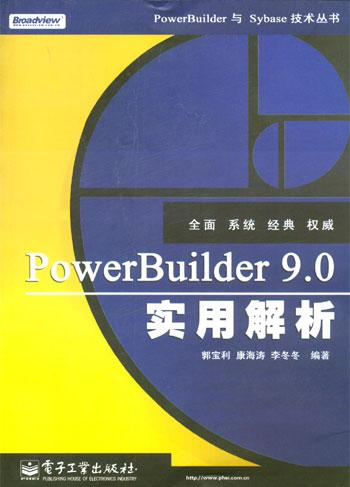
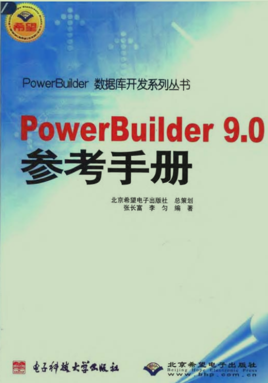
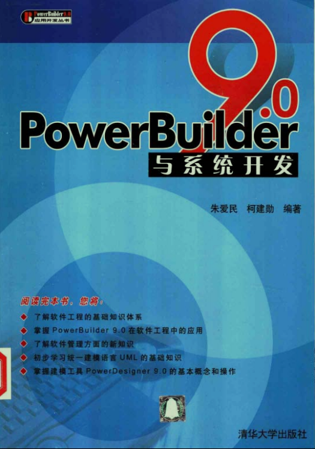
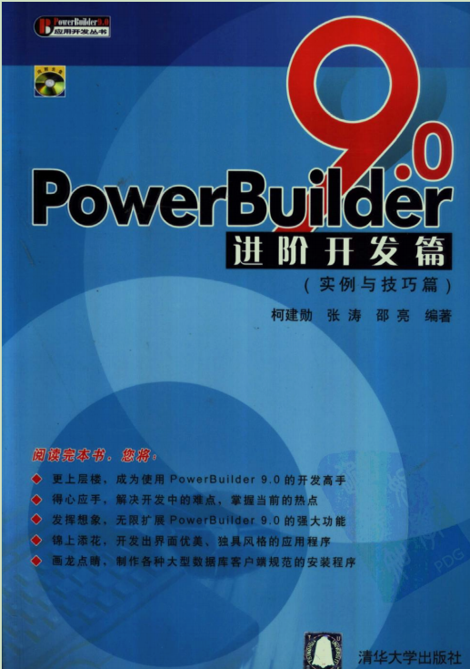
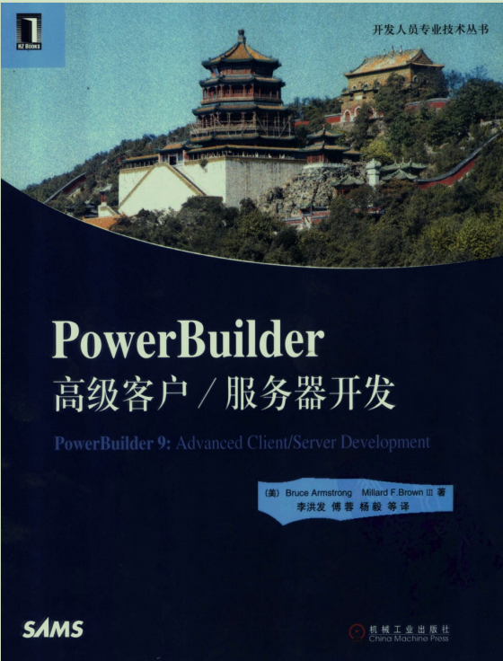
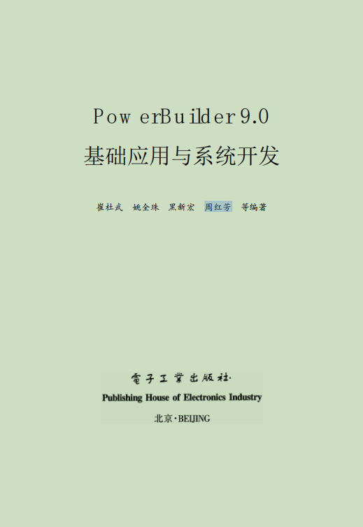
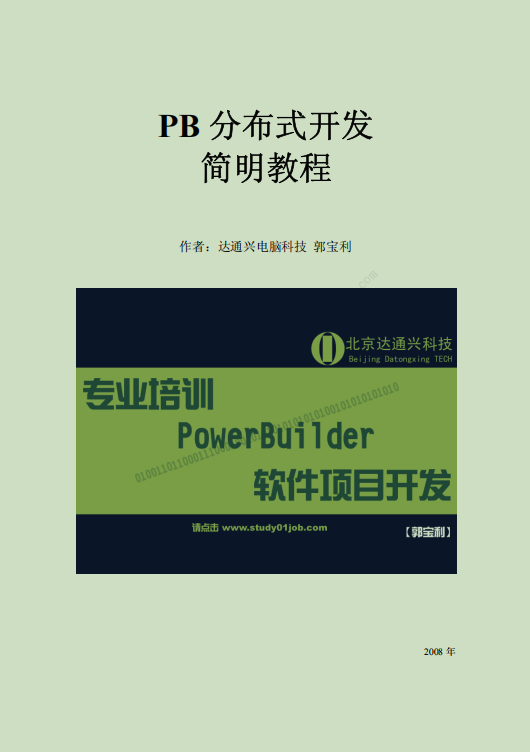
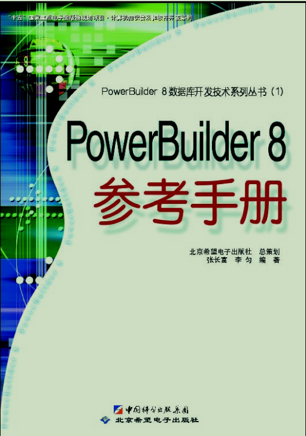
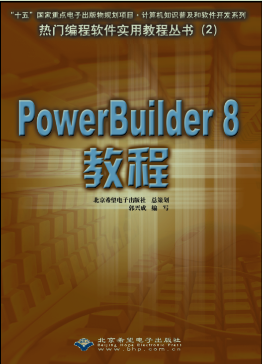

> 本页汇总了 PB 各版本安装包、常用工具及书籍资源，全部来自社区收集整理，使用夸克网盘存储。

## 一、各版本 PB 安装包下载

### 安装步骤

1. 根据软件版本对应链接下载安装包
2. 下载后将文件解压到指定目录
3. **关闭杀毒软件、QQ 等**，能关的尽量关
4. 运行根目录下的 `Autorun.exe`，默认安装即可
5. 安装根目录下带有 `EBF` 的补丁包

::: warning 注意
安装前务必关闭杀毒软件，否则可能导致安装失败或文件被误删。
:::

### 下载链接

| 序号 | 软件版本 | 夸克网盘链接 | 提取码 |
|------|----------|--------------|--------|
| 1 | PB 2025 | [点击下载](https://pan.quark.cn/s/303af6e869aa) | `7iRf` |
| 2 | PB 2022 | [点击下载](https://pan.quark.cn/s/653ef0154e46) | `fEb8` |
| 3 | PB 2021 | [点击下载](https://pan.quark.cn/s/694cd1c30899) | `fdzX` |
| 4 | PB 2019 | [点击下载](https://pan.quark.cn/s/2a1f6a9cd646) | `sQyr` |
| 5 | PB 12.6 | [点击下载](https://pan.quark.cn/s/c4d15459c9af) | `TULc` |
| 6 | PB 2018 | [点击下载](https://pan.quark.cn/s/57410aca35f5) | `Vawu` |
| 7 | PB 2017 | [点击下载](https://pan.quark.cn/s/ff6a4b777d5c) | `zsk1` |
| 8 | PB 15 | [点击下载](https://pan.quark.cn/s/bbd516c91a89) | `fPEH` |
| 9 | PB 12.52 | [点击下载](https://pan.quark.cn/s/a8b3266f52b5) | `cVwU` |
| 10 | PB 12 | [点击下载](https://pan.quark.cn/s/9fb2e41cee82) | `aF5G` |
| 11 | PB 11.5 | [点击下载](https://pan.quark.cn/s/9ab41ec68a30) | `Q8n3` |
| 12 | PB 11 | [点击下载](https://pan.quark.cn/s/19f06afd8164) | `DEqN` |
| 13 | PB 10.5 | [点击下载](https://pan.quark.cn/s/1bf75efa76cb) | `WGTU` |
| 14 | PB 10 | [点击下载](https://pan.quark.cn/s/72685fe52ecb) | `xgrp` |
| 15 | PB 9.03 | [点击下载](https://pan.quark.cn/s/ee6ff1c143a9) | `51iU` |
| 16 | PB 8 | [点击下载](https://pan.quark.cn/s/04233bbba764) | `SWk1` |
| 17 | PB 7.03 | [点击下载](https://pan.quark.cn/s/9727b1c27a29) | `cq13` |
| 18 | PB 6.51 | [点击下载](https://pan.quark.cn/s/45e933911e94) | `SgBc` |
| 19 | PB 5 | [点击下载](https://pan.quark.cn/s/101c687aa7c2) | `W7Qx` |
| 20 | PB 4 | [点击下载](https://pan.quark.cn/s/785a6f90308f) | `gYgu` |
| 21 | PB 3.0 | [点击下载](https://pan.quark.cn/s/01f04857f270) | `kxnn` |
| 22 | PB 1.0 | [点击下载](https://pan.quark.cn/s/cc8f2892fafe) | `3xda` |

::: tip 新手推荐版本
推荐从 **PB 9.03**、**PB 11.5** 或 **PB 12.52** 开始学习，这几个版本资料多、稳定性好。
:::

---

## 二、PB 相关工具

| 序号 | 工具名称 | 简介 | 夸克网盘链接 | 提取码 |
|------|----------|------|--------------|--------|
| 1 | 各版本 pbhelper | PB 帮助文档查看器，内置 API 说明与示例，开发必备 | [点击下载](https://pan.quark.cn/s/e1c158885ffe) | `njSm` |
| 2 | PB 代码比对工具 | 对比两份 PB 源码的差异，便于版本合并与代码审查 | [点击下载](https://pan.quark.cn/s/414ca89c4905) | `fdxb` |
| 3 | PB 反编译工具 | 将 PB 编译后的 `.pbd` / `.exe` 还原为可读源码 | [点击下载](https://pan.quark.cn/s/77171ae606f4) | `sdwS` |
| 4 | PB_IDE_plugin | PB IDE 增强插件，提供代码格式化、快捷操作等功能 | [点击下载](https://pan.quark.cn/s/fbdfa4f3401b) | `WEFh` |
| 5 | PB 11.0～12.5 破解补丁 | 解除 PB 11～12.5 各版本的授权限制 | [点击下载](https://pan.quark.cn/s/3da9da09db67) | `Sv8T` |
| 6 | pbFind | 在 PB 工程中全局搜索对象、函数、变量，快速定位代码 | [点击下载](https://pan.quark.cn/s/7d642cd05939) | `77Hx` |
| 7 | pbtools | PB 综合辅助工具集，包含常用开发小工具 | [点击下载](https://pan.quark.cn/s/8d348be59a27) | `RQ1Z` |
| 8 | PB小助手 V3.1 注册机 | 用于生成 PB 小助手激活码 | [点击下载](https://pan.quark.cn/s/94e396ddf795) | `ELF4` |
| 9 | WinHlp32 补丁（Win10） | 修复 Win10 下无法打开 `.hlp` 格式帮助文件的问题 | [点击下载](https://pan.quark.cn/s/9e57545352b8) | `bfa1` |
| 10 | PB 帮助补丁（Win7） | 修复 Win7 下 PB 帮助文件无法正常显示的问题 | [点击下载](https://pan.quark.cn/s/a8994e7bc738) | `kTdj` |

---

## 三、PB 书籍推荐

| 封面 | 书名 | 作者 | 夸克网盘链接 | 提取码 |
|------|------|------|--------------|--------|
| {width=80} | PowerBuilder 9.0 实用解析 | 郭宝利、康海涛、李冬冬 | [点击下载](https://pan.quark.cn/s/50b56b643d16) | `Ph21` |
| {width=80} | PowerBuilder 9.0 精彩编程百例 | 黄浩、赵宏杰 | [点击下载](https://pan.quark.cn/s/7f641c0b2425) | `UDEH` |
| {width=80} | PowerBuilder 9.0 参考手册 | 张长富、李匀 | [点击下载](https://pan.quark.cn/s/4d0d1a0f116a) | `dQ8h` |
| {width=80} | PowerBuilder 9.0 与系统开发 | 朱爱民、柯建勋 | [点击下载](https://pan.quark.cn/s/623c7902c661) | `t21d` |
| {width=80} | PowerBuilder 9.0 进阶开发篇 | 柯建勋、张涛、邵亮 | [点击下载](https://pan.quark.cn/s/756703ec83b3) | `3w8m` |
| {width=80} | PowerBuilder 9.0 程序设计一周通 | 鲁炎、彭木根 | [点击下载](https://pan.quark.cn/s/9e2d304d5113) | `axJ9` |
| {width=80} | PowerBuilder 高级客户服务器开发 | 李洪发等译 | [点击下载](https://pan.quark.cn/s/1bebb37687e2) | `fkWK` |
| {width=80} | PowerBuilder 9.0 基础应用与系统开发 | 崔杜武等 | [点击下载](https://pan.quark.cn/s/9515b03205e5) | `QuB9` |
| {width=80} | PB 分布式开发简明教程 | 郭宝利 | [点击下载](https://pan.quark.cn/s/571057f93878) | `R6yk` |
| {width=80} | PowerBuilder 8.0 中文参考手册 | 张长富、李匀 | [点击下载](https://pan.quark.cn/s/4279a79c1906) | `DP7D` |
| {width=80} | PowerBuilder 8 教程 | 郭兴成 | [点击下载](https://pan.quark.cn/s/eeef8b7e28e4) | `d7xR` |
| {width=80} | PowerBuilder 基础类库技术详解 | 杨志鸿 | [点击下载](https://pan.quark.cn/s/4e222b8ffaba) | `7hTM` |
| {width=80} | PowerBuilder 高级编程及项目应用开发 | 陈刚、董威、李存斌 | [点击下载](https://pan.quark.cn/s/61c368756097) | `Kk89` |

---

## 四、PBIdea 下载

> PBIdea 是专为 PowerBuilder 开发者打造的 IDE 增强插件，提供代码提示、AI 辅助等功能。

| 版本 | 夸克网盘链接 | 提取码 |
|------|------------|--------|
| PbIdea_20250429 | [点击下载](https://pan.quark.cn/s/85538e7ea7e3) | `1gGF` |

**v20250429 更新内容：**
- 增加 Python 调用接口 `uo_python`
- 集成 AI 辅助编码能力
